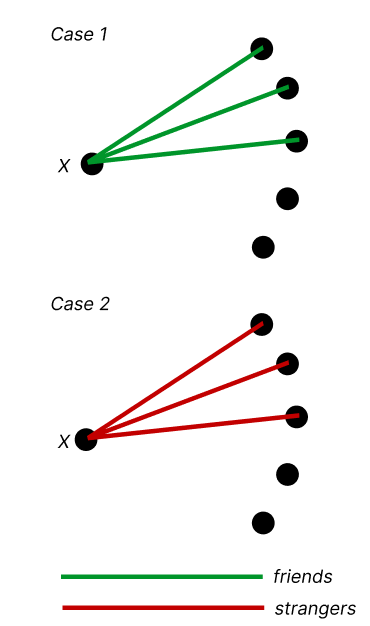
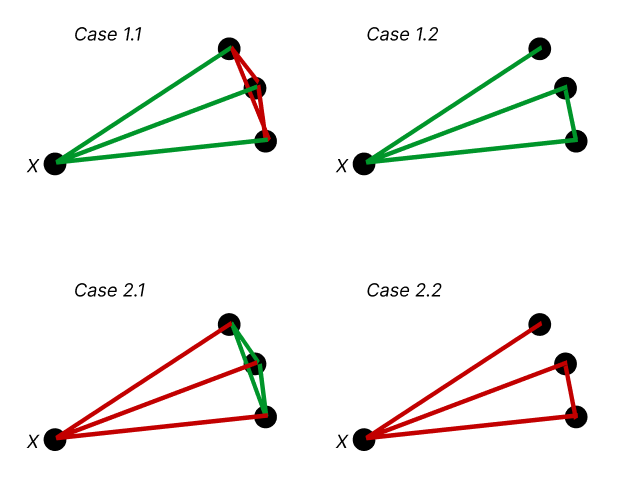
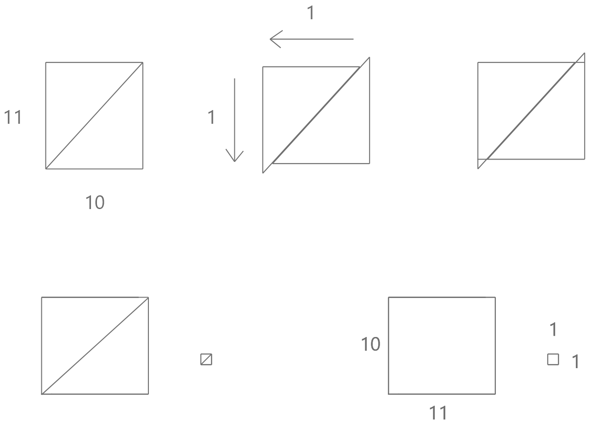
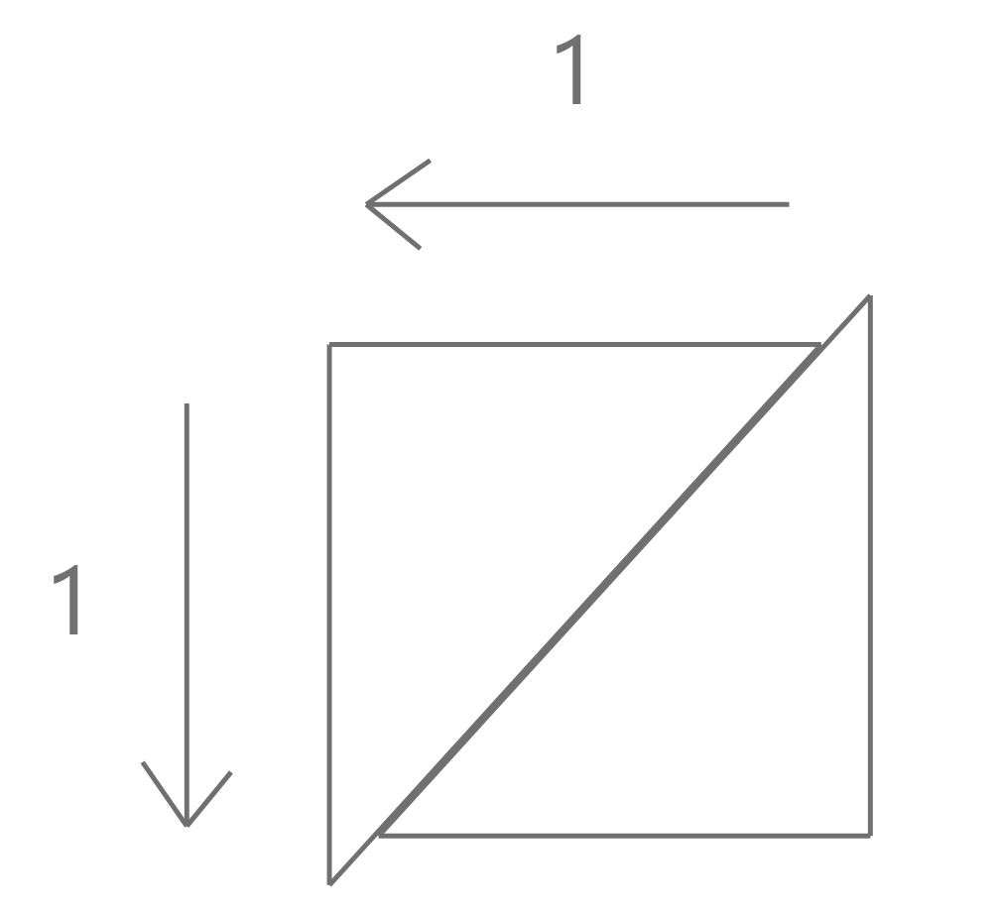
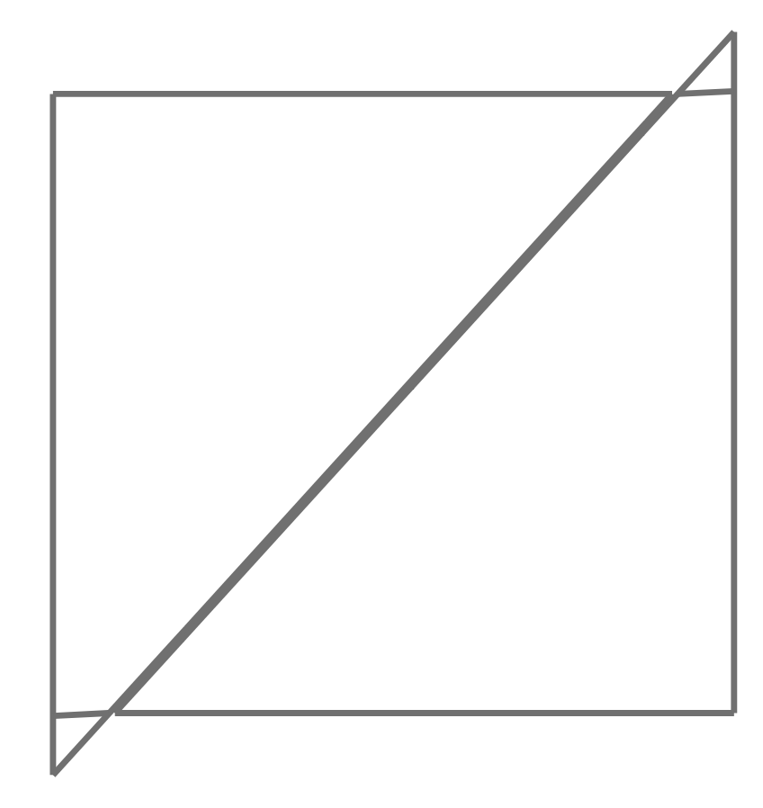
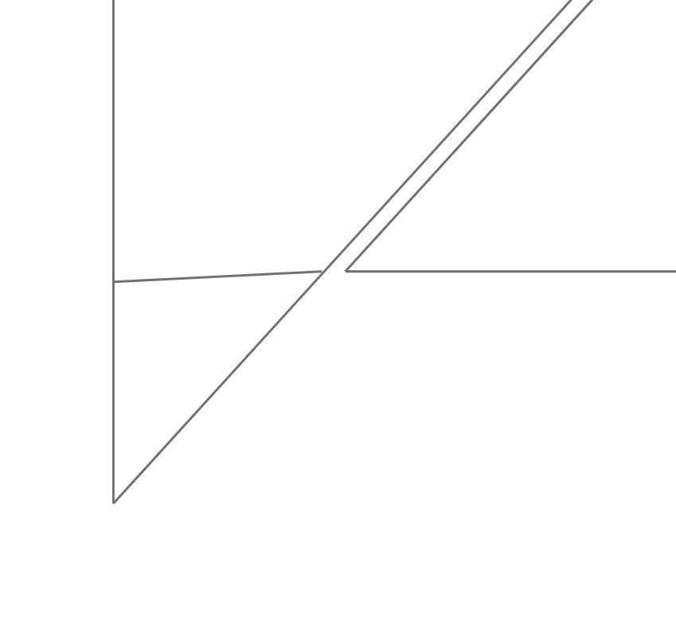

name: inverse
layout: true
class: center, middle, inverse
---
# ENSE 350: Math for Software Eng.

### Lecture 2: Patterns of Proof

$\cdot$ Adam Tilson, M.A.Sc., P.Eng

---
layout: false
.left-column[
    ## Agenda

]
.right-column[
1. Review: Lecture 1 Highlights
1. Axioms
1. Logical Deductions
1. Proof by Case
1. Direct Proof (Assume P)
1. Proving an IFF
1. Proof by Contraposition
1. Proof by Contradiction
1. Tips and Pitfalls
1. "Proof" by Picture
]
---
.left-column[
## Review
### Parts of Proof
]
.right-column[
- A verification of a **proposition**
- starting from a set of **axioms**
- through a chain of **logical deductions**
]
???
We looked at (1) last time
We'll look at (2,3) today

---
.left-column[
## Review
### Implies
]
.right-column[
$$ P, Q := \text{Some propositions} $$

$ P $ | $ Q $ | $ P \Rightarrow Q $  
---|---|---
T | T | T
T | F | F
F | T | T
F | F | T

- Tricky. P is the premise, Q is the conclusion.
- Both parts are propositions, can be T or F
- We're evaluating if the implication is true, not either part!
- "If you get 100% in this course, I will buy you a pizza."
]

---
.left-column[
## Review
### Iff
]
.right-column[
$$ \text{If and only if} := \text{IFF} := \iff $$

$$ P \iff Q \equiv (P \Rightarrow Q) \wedge (Q \Rightarrow P) $$

$P$|$Q$|$P \Rightarrow Q$ | $Q \Rightarrow P$ | $P \iff Q $
---|---|---|---|---
T|T|T|T|T
T|F|F|T|F
F|T|T|F|F
F|F|T|T|T
Examples (Are these iff's T or F?):
- e.g. "You pass the class $\iff$ you get a grade above 50%"
]

---
.left-column[
## Review
### Contra- positive
]
.right-column[
$$ (P \Rightarrow Q) \equiv (\neg Q \Rightarrow \neg P) $$

$P$ | $Q$ | $\neg P$ | $\neg Q$ | $P \Rightarrow Q$ | $\neg Q \Rightarrow \neg P$ |  $\equiv$
---|---|---|---|---|---|---
F|F|T|T|T|T|$\checkmark$
F|T|T|F|T|T|$\checkmark$
T|F|F|T|F|F|$\checkmark$
T|T|F|F|T|T|$\checkmark$

With implications, sometimes it's easier to prove the contrapositive!
- e.g. "If I don't buy you a pizza, you didn't get 100% in the course."
]

---
.left-column[
## Review
### Predicate Logic
]
.right-column[
"Every American has a Dream"

let D be the set of all possible Dreams

let A be the set of all Americans

$H(a,d) :=$ American, $a$, has Dream, $d$

$$ \forall a \in A, \exists d \in D, H(a,d). $$
$$ \exists d \in D, \forall a \in A, H(a,d). $$
$$ \exists a \in A, \exists d \in D, H(a,d). $$
$$ \forall a \in A, \forall d \in D, H(a,d). $$

]

---

## Proofs - Why do programmers care?
- Proofs have various applications in the field of computer science
    - Verifying programs are correct
    - Ensuring security
    - Ensuring specifications are consistent
    - Advances in AI
---
## Formal vs Informal Proofs
- With formal proofs, we don't skip ANY steps
    - Explicitly lay out the rules for every decision made
    - Include every axiom and inference rule
    - These are complex, hard to follow
- Informal proofs allow multiple rules to be combined
    - Easier for humans to understand and follow
    - Still, No massive leaps in logic allowed!
---
## Axioms
- Propositions we assume to be true
- The base set of assumptions we make when doing math
    - e.g. 2+2=4
    - if you make wild assumptions, better explain them!
- If I agree with your axioms, and I agree with your logical deduction, I must agree with your proof! 

---
## Ideal Set of Axoims
- Should be *complete* and *consistent*

Consistent - an axiom cannot be proven to be both true and false
  - Absolutely required

Complete - an atomic set of axidioms which can be used to prove all other axioms
  - Unfortunately this doesn't exist
  - People have dedicated their careers to finding them

---
## Axiomatic Method
- Proof should only use atomic axioms

- i.e. Zermelo-Frankel set theory (ZFC)
    - Too strong for some proofs, too weak for others
    - e.g 2+2=4.
    - What does 2 mean? 4? +? =? ~2000 steps.

- We can go higher level than this, like programming in Python rather than programming in Assembly
    - More built in functions, more proven propositions

---
## Our practical Set of Axioms
- Typically, anything that would be deemed reasonable
- Keep track of axioms used in examples, these and similar variations will all be fair game
    - You may not use anything you are being asked to prove (obviously)
    - No wild leaps of faith!

---
## Logical Deduction
- A proof is a set of small, logical steps
- We can further structure our longer proofs with:
    - Theorems (Thm) - An important proposition
    - Lemma - A preliminary proposition used in proving later propositions (like a subroutine)
    - Corollary - A proposition that follows, in a few logical steps, from a lemma or theorem
---
## Logical Deductions / Inference Rules
- Logical Deductions or inference rules are used to prove new propositions using previously proved ones
    - How we progress from axioms through the proof
- The process of reasoning from one or more statements to reach a logically certain conclusion
---
## Writing Rules of Logic
$$ \frac{\text{Premises (Antecedents)}}{\text{Conclusion (Consequent)}}$$
- Sound rules: A logical rule is sound if any assignment of truth values that make all the antecedents true must also make the consequent true
- e.g. Modus Ponens
$$ \frac{P, P\Rightarrow Q}{Q}$$
- "if P is true, and P implies Q is true, then Q is true"
???
In your mind it's like a big old truth table. Each step you add a column to it, and recompute the T's and F's. They can't ever change from the previous column!

---
## Modus Ponens

$$ \frac{P, P\Rightarrow Q}{Q}$$

$ P $ | $ P \Rightarrow Q$ |  $ Q $ 
---|---|---
**T** | **T** | **T**
T | F | F
F | T | T
F | T | F

We care only about where P is true, and $ {P\Rightarrow Q} $ is true.

- This is the axiomatic inference rule
???
You could do a proof using only this rule. However, it would suuuuck.

---
## Modus Ponens

If used in a very verbose proof, this rule could be used as:

$$ \frac{P, P\Rightarrow Q}{Q}$$

1. $ {P} $
2. $ {P\Rightarrow Q} $
3. Therefore, $ {Q} $, by _modus ponens_ from 1 and 2.

---
## Inference vs. Implication

Consider the implication:

"If you get 100% in the class, then I will buy you a pizza"

Inference, e.g. Modus ponens takes this one step further:

"If you get 100% in the class, then I will buy you a pizza". "You got 100%".

"Therefore, I will buy you a pizza"

---

## Example: A Wrong Inference

$$ \dfrac{\neg P\Rightarrow \neg Q}{P \Rightarrow Q}$$

$P$ | $Q$ | $\neg P$ | $\neg Q$ | $\neg P \Rightarrow \neg Q$ | $P \Rightarrow Q$  |  $\equiv$
---|---|---|---|---|---|---
T|T|F|F|T|T|$\checkmark$
T|F|F|T|T|F|$\times$
~~F~~|~~T~~|~~T~~|~~F~~|~~F~~|~~T~~|Don't care
F|F|T|T|T|T|$\checkmark$

This inference does not hold for all cases, thus is not sound.
- If you make use of this inference, your proof is incorrect!
---

## Example: A Wrong Inference

$$ \dfrac{\neg P\Rightarrow \neg Q}{P \Rightarrow Q}$$

In practice - remember: This is wrong!

"If you don't get 100% in the class, then I will not buy you a pizza".

Therefore: "If you get 100% in the class, I will buy you a pizza."

That conclusion _does not follow_ from that premise!
---

## Patterns of Proof

- Now that we understand the basics of proofs (axioms, inference rules), let's look at some common patterns and strategies we may wish to use in our proofs
- You can think of these as templates, a starting place 

---
.left-column[
## Methods of Proof
### Proof by Cases
]
.right-column[
Breaking a complicated proof into cases and proving each case separately.
- e.g. The truth table 
    - analyze every state that the problem can be in, and if each state is correct, the proof must be correct by cases.

]
---
.left-column[
## Methods of Proof
### Proof by Cases
]
.right-column[
Theorem: Every party of 6 people includes a group of 3 peoples who, pairwise, have already met (friends), or a group of 3 strangers, who, pairwise, have never met (strangers).
- Proof: By case analysis.
- Let $x :=$ one of the six people
- There are two cases:
- Case 1. Among the other 5 people besides $x$, at least 3 have met $x$
- Case 2. Among the other 5 people besides $x$, at least 3 have not met $x$.
]
---
.left-column[
## Methods of Proof
### Proof by Cases
]
.right-column[

]
---
.left-column[
## Methods of Proof
### Proof by Cases
]
.right-column[
- Case 1: Among the other 5 people besides $x$, at least 3 have met $x$
    - Case 1.1: Among the three who have met $x$, none have met eachother (strangers)
    - Case 1.2: Among the three who have met $x$, at least one pair has met (friends)
- Case 2: Among the other 5 people besides $x$, at least 3 have not met $x$.
    - Case 2.1: At least one pair has not met before (strangers)
    - Case 2.2: Every pair has met each other (friends) 
- The proof holds for all sub-cases. $\square$
]
???

~32,000 combinations can be broken down into 4 cases, and that's pretty cool!

https://en.wikipedia.org/wiki/Theorem_on_friends_and_strangers

https://www.youtube.com/watch?v=xdiL-ADRTxQ

---
.left-column[
## Methods of Proof
### Proof by Cases
]
.right-column[

]
---
.left-column[
## Methods of Proof
## Proving an Implication
### Direct Proof (Assume P)
]
.right-column[
We wish to prove $P \Rightarrow Q$
- Two cases:
- Case 1: P is False
- Case 2: P is True
---
- Case 1: P is False
    - $P \Rightarrow Q$ is True.
    - This is by the definition of $\Rightarrow$
- Case 2: If $P$ is True, and we prove that $Q$ is True, then $P \Rightarrow Q$ is True.  
    - Also by the definition of $\Rightarrow$
- Consider this reasoning axiomatic, and start our proof here without re-proving this explicitly!
]
---
.left-column[
## Methods of Proof
## Proving an Implication
### Direct Proof (Assume P)
]
.right-column[
Theorem: $\forall n \in \mathbb{N},$ if $n$ is even then $n^2$ is even.
- $P(n):=$ "$n$ is even", $Q(n):= $"$n^2$ is even"
- $P(n) \Rightarrow Q(n)$
]
---
.left-column[
## Methods of Proof
## Proving an Implication
### Direct Proof (Assume P)
]
.right-column[
Theorem: $\forall n \in \mathbb{N},$ if $n$ is even then $n^2$ is even.
- $P(n):=$ "$n$ is even", $Q(n):= $"$n^2$ is even"
- $P(n) \Rightarrow Q(n)$

Proof: Assume P, i.e. we assume that $n$ is even
- $n = 2k, k \in \mathbb{N}$
- $n^2 = (2k)^2$
- $n^2 = 4k^2$
- $n^2 = 2(2k^2)$
- $n^2 = 2m, m \in \mathbb{N}$
- $\because n^2 = 2m, m \in \mathbb{N}, \therefore n^2$ is even. $\square$
]
---
.left-column[
## Methods of Proof
## Proving an Implication
### Direct Proof (Assume P)
]
.right-column[
Theorem: $\forall n \in \mathbb{N},$ if $n$ is odd then $n^2$ is odd.
- $P(n):=$ "$n$ is odd", $Q(n):= $"$n^2$ is odd"
- $P(n) \Rightarrow Q(n)$
]
---
.left-column[
## Methods of Proof
## Proving an Implication
### Direct Proof (Assume P)
]
.right-column[
Theorem: $\forall n \in \mathbb{N},$ if $n$ is odd then $n^2$ is odd.
- $P(n):=$ "$n$ is odd", $Q(n):= $"$n^2$ is odd"
- $P(n) \Rightarrow Q(n)$

Proof: Assume P, i.e. we assume that $n$ is odd
- $n = 2k+1, k \in \mathbb{N}$
- $n^2 = (2k+1)^2$
- $n^2 = 4k^2+4k+1$
- $n^2 = 2(2k^2+2k)+1$
- $n^2 = 2m+1, m \in \mathbb{N}$
- $\because n^2 = 2m+1, m \in \mathbb{N}, \therefore n^2$ is odd. $\square$
]
---
.left-column[
## Methods of Proof
## Proving an Implication
### Direct Proof (Assume P)
]
.right-column[
Theorem: $\forall n \in \mathbb{N},$ if $n^2$ is odd then $n$ is odd.
- $P(n):= $"$n^2$ is odd", $Q(n):=$ "$n$ is odd"
- $P(n) \Rightarrow Q(n)$
]
---
.left-column[
## Methods of Proof
## Proving an Implication
### Direct Proof (Assume P)
]
.right-column[
Theorem: $\forall n \in \mathbb{N},$ if $n^2$ is odd then $n$ is odd.
- $P(n):= $"$n^2$ is odd", $Q(n):=$ "$n$ is odd"
- $P(n) \Rightarrow Q(n)$

Proof: Assume P, i.e. we assume that $n^2$ is odd
- $n^2 = 2k+1, k \in \mathbb{N}$
- $n = \sqrt{2k+1}$
- ...?
]
---
.left-column[
## Methods of Proof
## Proving an Implication
### Assume the Contra- Positive
]
.right-column[
Theorem: $\forall n \in \mathbb{N},$ if $n^2$ is odd then $n$ is odd.
- $P(n):= $"$n^2$ is odd", $Q(n):=$ "$n$ is odd"
- $P(n) \Rightarrow Q(n)$

Proof: We assume the contrapositive

$\neg Q(n) \Rightarrow \neg P(n)$
]
---
.left-column[
## Methods of Proof
## Proving an Implication
### Assume the Contra- Positive
]
.right-column[
Theorem: $\forall n \in \mathbb{N},$ if $n^2$ is odd then $n$ is odd.
- $P(n):= $"$n^2$ is odd", $Q(n):=$ "$n$ is odd"
- $P(n) \Rightarrow Q(n)$

Proof: We assume the contrapositive

$\neg Q(n) \Rightarrow \neg P(n)$

$\forall n \in \mathbb{N},$ if $n$ is even then $n^2$ is even.

- Hey, we already proved that! $\square$
]
---
.left-column[
## Methods of Proof
## Proving an IFF
### Prove the implication both ways
]
.right-column[

$P \iff Q$

$(P \implies Q) \wedge (Q \implies P)$

Theorem: $\forall n \in \mathbb{N}. n^2 $is even if and only if $n$ is even.

Proof: Prove that $P \implies Q$ and vice versa.

First, prove $\forall n \in \mathbb{N}$. if $n^2$ is even, then $n$ is even.

Next, prove $\forall n \in \mathbb{N}$. if $n$ is even, then $n^2$ is even.

Since we have proved the implication both ways, the IFF statement is true. $\square$

]
---
.left-column[
## Methods of Proof
## Proving an IFF
### Construct a Chain of IFF Statements
]
.right-column[

For a sequence of values, $x_1, x_2 ... x_n$, the mean, $\mu$, is defined as:

$\mu := \dfrac{x_1 + x_2 + ... + x_n}{n}$

and the standard deviation, $\sigma$ is defined as:

$\sigma := \sqrt{\dfrac{(x_1-\mu)^2+(x_2-\mu)^2+...+(x_n-\mu)^2}{n}}$

Prove the standard deviation is zero if and only if all values are equal to the mean, i.e. $x_i=\mu$

]
---
.left-column[
## Methods of Proof
## Proving an IFF
### Construct a Chain of IFF Statements
]
.right-column[

Proof: By constructing a chain of "iff" implications...

$\sqrt{\dfrac{(x_1-\mu)^2+(x_2-\mu)^2+...+(x_n-\mu)^2}{n}}=0$

Zero is the only number whose square root is zero, thus this holds iff

$(x_1-\mu)^2+(x_2-\mu)^2+...+(x_n-\mu)^2=0$

Since squares are always non-negative, and the only nonnegative numbers which sum to zero are all zero, then this equation holds iff every term on the left-hand side is zero.
]
---
.left-column[
## Methods of Proof
## Proving an IFF
### Construct a Chain of IFF Statements
]
.right-column[

Since squares are always non-negative, and the only nonnegative numbers which sum to zero are all zero, then this equation holds iff every term on the left-hand side is zero.

$(x_i-\mu)^2 = 0$

This holds true iff
$x_i = \mu$

$\therefore$ every value $x_i$ equals the mean, $\mu$. $\square$

]
---
.left-column[
## Methods of Proof
### Proof by Contra- diction
]
.right-column[
If we assume a proposition to be false, and that assumption leads to a sound mathematical contradiction, the proposition must be true. 

Theorem: $\sqrt{2}$ is irrational
- Proof (By contradiction)
- Assume for the purpose of contradiction that $\sqrt{2}$ is rational
- $\sqrt{2} = \dfrac{n}{d}, n \in \mathbb{Z}, d \in \mathbb{Z}, d \neq 0$
- $\dfrac{n}{d}$ is a fraction in lowest terms, i.e. $n, d$ have no common divisors
]

---
.left-column[
## Methods of Proof
### Proof by Contra- diction
]
.right-column[
- $\sqrt{2} = \dfrac{n}{d}$
- $2 = \dfrac{n^2}{d^2}$
- $2d^2 = n^2$
- $2k = n^2$
- $n^2$ must be even. 
- $n$ must be even. (already proven)
- $2 \mid n$ [read: 2 divides n]
- $4 \mid n^2$ (axiomatic property of even squares)
- $4 \mid 2d^2$
- $2 \mid d^2$
- $d$ must be even.
]
---
.left-column[
## Methods of Proof
### Proof by Contra- diction
]
.right-column[
- $n$ must be even.
- $d$ must be even.
- If both $n$ and $d$ are even, then they have a common divisor, $2$
- $\dfrac{n}{d}$ is not in lowest terms
- this is a contradiction. ⨳
- $\therefore \sqrt{2}$ is irrational. $\square$

Caveat: Only works if the contradiction arrived at is through sound logic, not simply because you made a mistake!
]
---
## Good Proofs in Practice
- State your plan
- Keep it linear
- It's an essay, not a calculation
- Revise and simplify
- Avoid excessive symbolism
- Introduce appropriate notations
- Structure long proofs
- Be wary of the "obvious"
- Finish - Tie it all together
---
## Tips and Tricks
- You need to make a logical chain from beginning to end
    - That doesn't mean you have to build the chain in order
    - You may also wish to work backwards, from the conclusion 
    - Your job is to bridge the gap from beginning to end
    - If the gap is not properly bridged, the proof is worthless
---
## Pitfalls (Things to avoid)
- Circular Reasoning
    - Steps in the proof are based on the truth of the statement being proved
    - In logic this is known as "begging the question"
- Throwing in the kitchen sink
- Proof by example
- Proof by omission (left as an exercise to the reader)
- Proof by picture
- Proof by assertion
---
## Proof by Picture - Free Gold!
.image-60[]
---
## Proof by Picture - What went wrong?
.image-50[]
---
## Proof by Picture - Enhance!
.image-40[]
---
## Proof by Picture - Enhance!
.image-40[]
---
## Proof by Picture - Enhance!
.image-50[]
---

class: even-split
### Cheat Sheet o' Math Symbols

.column[
- $\mid$ divides
- ⨳ contradiction
    - ⊥, ⇒⇐ , →←, ↯, ※

]
.column[

]
---
class: even-split
### Cheat Sheet o' Axoims

.column[
- $n$ is even
    - $n = 2k$
- $n$ is odd
    - $n = 2k+1$
- $x$ is rational
    - $x = \frac{n}{d}$

]
.column[

]
---

### References

- Dr. Abdul Bais's ENSE 350 Slides
- Tom Leighton, and Marten Dijk. 6.042J Mathematics for Computer Science. Fall 2010, Lecture 2. Massachusetts Institute of Technology: MIT OpenCourseWare, https://ocw.mit.edu. License: Creative Commons BY-NC-SA.
---
name: inverse
layout: true
class: center, middle, inverse
---
# Questions?

