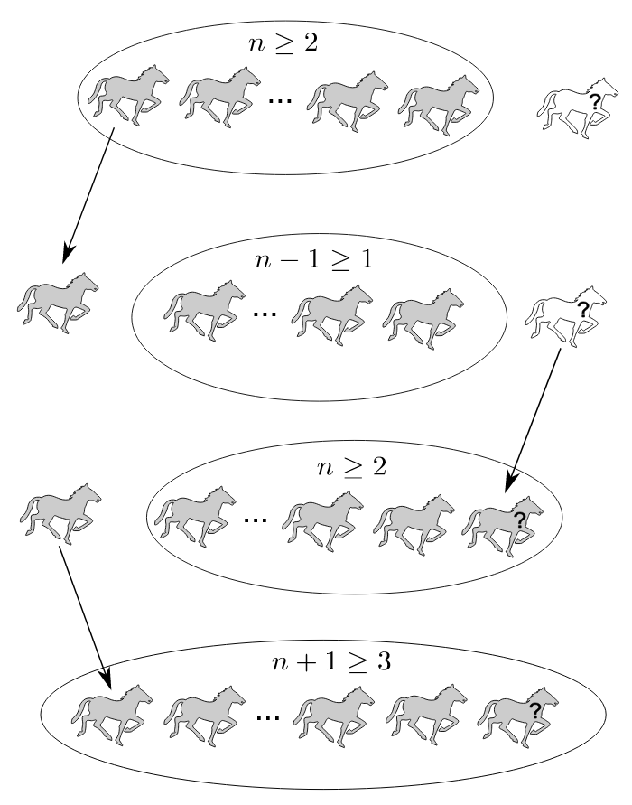
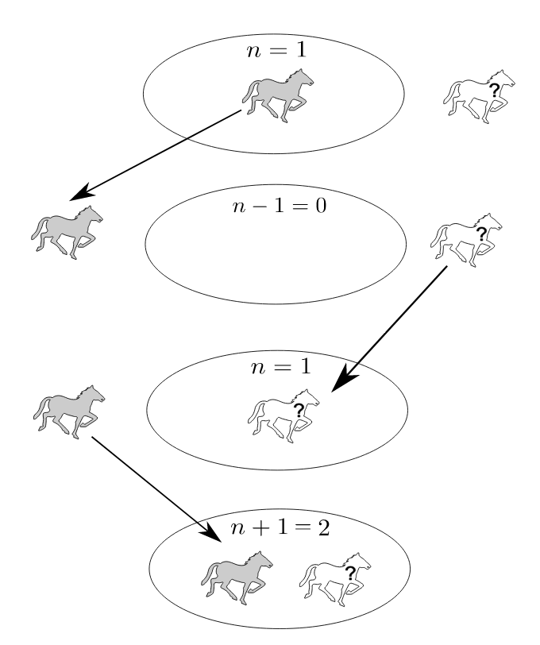
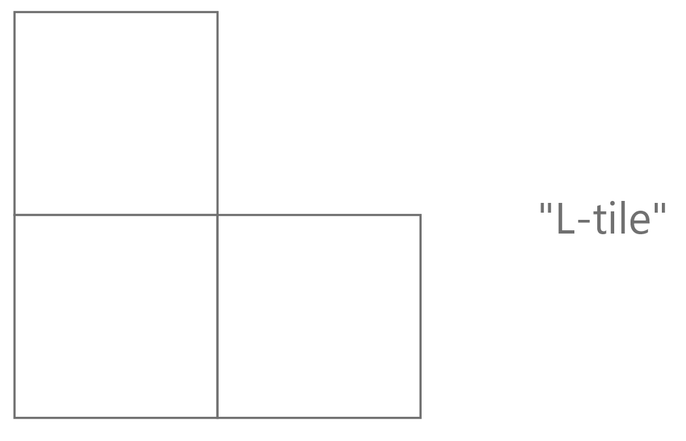
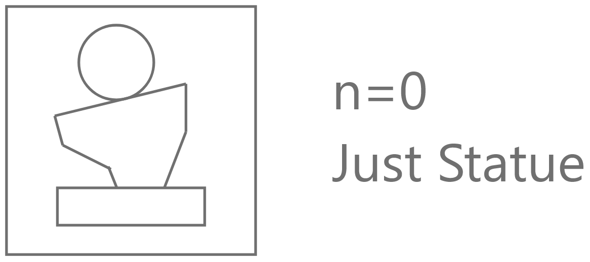
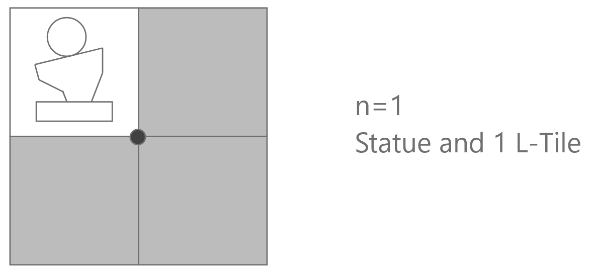
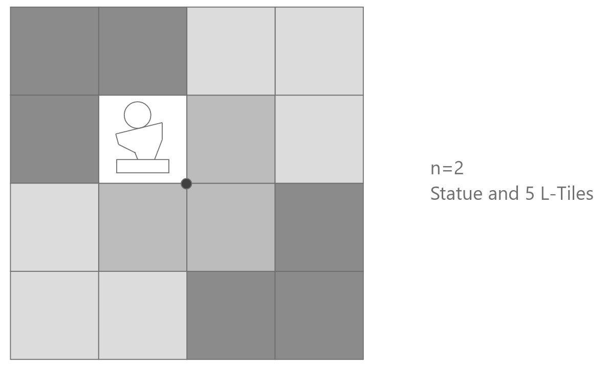
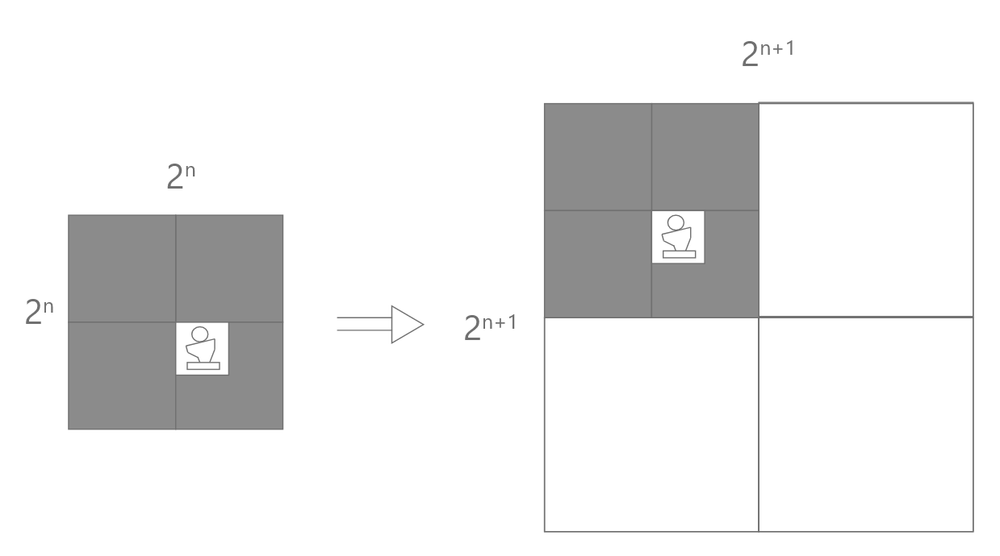
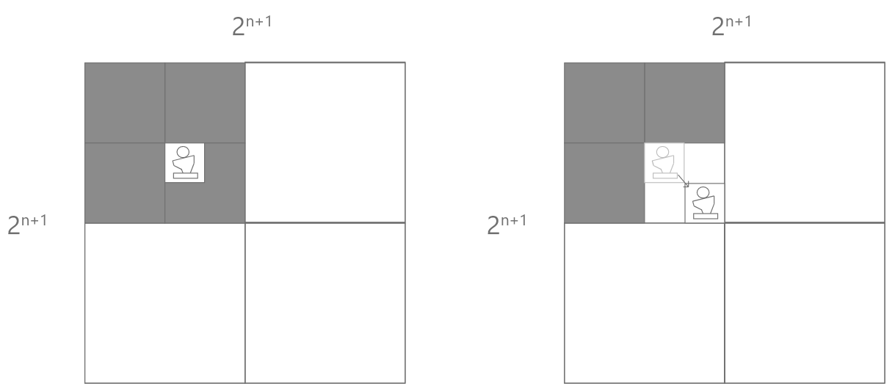
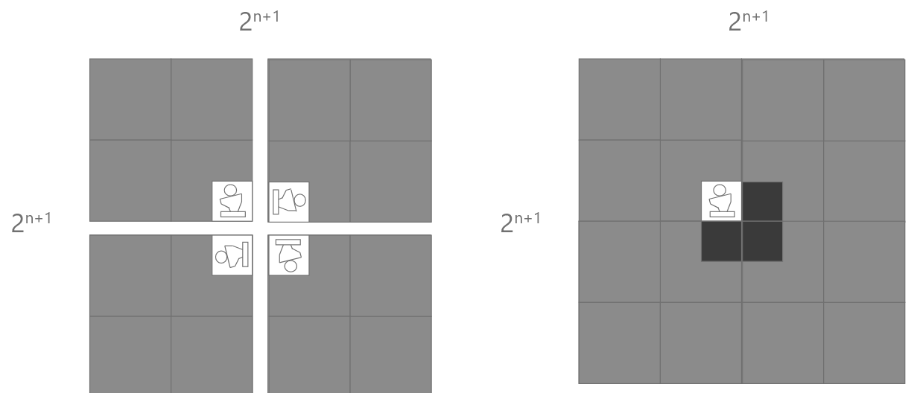

name: inverse
layout: true
class: center, middle, inverse
---
# ENSE 350: Math for Software Eng.

### Lecture 4: Ordinary Induction

$\cdot$ Adam Tilson, M.A.Sc., P.Eng

---
layout: false
.left-column[
    ## Agenda

]
.right-column[
1. Review: Lecture 2 Highlights
1. Ordinary Induction
1. Induction Examples
1. Bad Proof: All Horses are the Same Color
1. Tiling Puzzle
1. Prove Something Harder
]
---

## Ideal Set of Axoims
- Should be *complete* and *consistent*

Consistent - an axiom cannot be proven to be both true and false
- Absolutely required

Complete - an atomic set of axioms which can be used to prove all other axioms
- Unfortunately this doesn't exist
- People have dedicated their careers to finding them

---
## Logical Deduction
- A proof is a set of small, logical steps
- We can further structure our longer proofs with:
  - Theorems (Thm) - An important proposition
  - Lemma - A preliminary proposition used in proving later propositions (like a subroutine)
  - Corollary - A proposition that follows, in a few logical steps, from a lemma or theorem
---

## Writing Rules of Logic
- Premises (Antecedents)
- Conclusion (Consequent)
- Sound rules: A logical rule is sound if any assignment of truth values that make all the antecedents true must also make the consequent true
- e.g. Modus Ponens
$$ \frac{P, P\Rightarrow Q}{Q}$$
- "if P is true, and P implies Q is true, then Q is true"
???
In your mind it's like a big old truth table. Each step you add a column to it, and recompute the T's and F's. They can't ever change from the previous column!
---
.left-column[
## Methods of Proof

]
.right-column[
- Proof by Cases
- Direct Proof (Assume P)
- Indirect Proof
    - Assume the Contrapositive
    - Proof by Contradiction
- Prove and IFF
    - Mutual implication
    - Chain of IFFs
- Today we'll learn another useful tool!
]
---
## Induction

Goal: Prove something true for all values in a sequence.
- (1) We prove that $P(1)$ is true (Base Case)
- We want to prove that...
    - $P(1) \Rightarrow P(2)$
    - $P(2) \Rightarrow P(3)$
    - $P(3) \Rightarrow P(4)$ ...
- (2)  We do this symbolically by generalizing all these cases as:
    - $P(k) \Rightarrow P(k+1)$ (Induction Step)
    - Prove it using Assume $P$: If $P$ is True, and $P \rightarrow Q$, $Q$ is True.
- We conclude this is true for all values in the sequence.

---
## How Induction Works
Symbolically:

$\dfrac{P(1), \forall k \in \mathbb{N}, P(k) \Rightarrow P(k+1)}{\forall n \in \mathbb{N}, P(N)}$

It's like knocking over dominoes 
- you knock over the first domino, 
- if you can prove that the previous domino will knock over the next one (for any arbitrary domino)
    - we conclude all dominoes will get knocked over
---
## Induction Example
- Consider a hot dog stand with infinite hot dogs
- If we can prove that the first person in the line gets a hot dog
- And we can prove, for all people in the queue
    - If one person gets a hot dog, the person behind them will get a hot dog
- Thus, we conclude, everyone gets a hot dog. $\square$ 

- This is a "template proof", and very useful
---
## More induction examples
- Proof you can climb a ladder of any height
- If we can prove we can climb the first rung
- And we can prove that from any rung we can climb to the next rung
- Then we can prove we can climb a ladder of any height!

---
## Induction
Template:
- State the strategy (Proof by ordinary induction)
- Define predicate $P(k)$, known as the Inductive Hypothesis
- Prove the Base Case, i.e. that $P(1)$ is true
- Prove the implication $P(k) \Rightarrow P(k+1)$, known as the Inductive Step.
- Conclude, by the principle of induction, that the predicate is true for all values of $n$.

---
## Example 1
Theorem: $\forall n \in \mathbb{Z}^+ , 1+2+3+...+n = \dfrac{n(n+1)}{2}$

We could also write this as:
$$\sum_{i=1}^{n}i = \dfrac{n(n+1)}{2}$$

Proof (by ordinary induction).

Inductive Hypothesis: 
$P(k) := 1+2+3+...+k = \dfrac{k(k+1)}{2}$
---
## Example 1
Proof (by ordinary induction).  
Inductive Hypothesis: $P(k) := 1+2+3+...+k = \dfrac{k(k+1)}{2}$

Base Case:
- $\sum_{i=1}^{1}i = \dfrac{1(1+1)}{2}$
- $1 = 1 \checkmark$
---
## Example 1
Inductive Step: $P(k) \Rightarrow P(k+1)$

$ P(k) + (k+1) = P(k+1)$

$ 1 + 2 + 3 + ... + k + (k+1) = \dfrac{(k+1)((k+1)+1)}{2} $

$\dfrac{k(k+1)}{2} + (k+1) = \dfrac{(k+1)((k+1)+1)}{2}$

$\dfrac{k(k+1)}{2} + \dfrac{2(k+1)}{2} = \dfrac{(k+1)(k+2)}{2}$

---
## Example 1

$\dfrac{k(k+1)}{2} + \dfrac{2(k+1)}{2} = \dfrac{(k+1)(k+2)}{2}$

$\dfrac{(k+1)(k+2)}{2} = \dfrac{(k+1)(k+2)}{2} \checkmark$

Thus, by ordinary induction, $P(n)$ is true for all $\forall n \in \mathbb{Z}^+$

---
## Challenges:
- Identifying the correct base case
- Identifying the inductive hypothesis
- Properly constructing the inductive step, that is
    - showing that $P(k)$
    - with the next value included in (however this would be appropriately constructed)
    - equals $P(k+1)$
- Doing the math to show that 
---
## Why do we substitute k?
- With induction, we are trying to prove our predicate for any arbitrary $n$.
- However, we don't know if this statement is true for $n$.
- So we substitute in $k$, which is a set of values for which assume our predicate to be true.
  - The set starts empty
  - We begin adding elements to this set using the base case.
  - We keep adding values to this set in the inductive step
  - Once we verify the inductive step, our set now includes all values
- Thus, it is proven true for all $n$!
---
## Example 2

Theorem: $\forall n \in \mathbb{N}, 3 \mid (n^3-n) $

Is this true? Let's try 5? $(5^3-5) = (125-5) = 120.$ $3\mid 120 \checkmark$
- Seeeeems to be true, but remember no number of examples can ever prove something true!

Proof: By ordinary induction

Induction Hypothesis: $\forall k \in \mathbb{N}, P(k) := 3 \mid (k^3-k)$

Base Case:

---
## Example 2

Proof: By ordinary induction

Induction Hypothesis: $\forall k \in \mathbb{N}, P(k) := 3 \mid (k^3-k)$

Base Case:

$P(0)=0^3-0$
$= 0$

$3\mid 0 \checkmark$

---
## Example 2

Induction step: Show $ P(k) \Rightarrow P(k+1)$ 

$P(k+1) = 3 \mid ((k+1)^3 - (k+1))$ ?

$= 3 \mid ((k+1)^3 - (k+1))$ ?

$= 3 \mid (k^3 + 3k^2 + 3k + 1) - (k + 1)$ ?

$= 3 \mid k^3 + 3k^2 + 2k$ ?

? Now what ? We haven't really used the Induction Step yet.

Hint: We should be using the assumption $3 | P(k)$

---
## Example 2

$= 3 \mid k^3 + 3k^2 + 2k - k + k$ ?

$= 3 \mid (k^3 - k) + 3k^2 + 3k$ ?

$= 3 \mid (k^3 - k) + 3k^2 + 3k \checkmark$

We know $3 \mid 3k, 3 \mid 3k^2$,

By the inductive hypothesis, we assume $3 \mid (k^3 - k)$

$\because 3 \mid $ each term, $3 \mid P(k+1)$

$\therefore$, by ordinary induction,  $\forall n \in \mathbb{N}, P(n)$ is true. $\square$

---
### Bad Proof - All Horses are the Same Color

Induction seems so powerful. Can anything go wrong with it?
- Let's use it to prove that all horses are the same color.
- Theorem: All horses are same color.
- Proof: By ordinary induction.
- Inductive hypothesis: 
    - In any set of $n \geq 1$ horses, all the horses are the same color.
- Base case: 
    - We have a set of one horse. That horse must be the same color as itself. $\checkmark$

---
### Bad Proof - All Horses are the Same Color

- Inductive step:
    - Assume $P(k)$ to prove $P(k+1)$
    - Assume a set of $k$ horses all have the same color.
    - Name these horses $h_1$ to $h_k$
    - Remove the leader, $h_1$, so the set is $h_2 ... h_k$ of size $k-1$.
        - All these horses must be the same color. 
    - Let's add to our subset a new arbitrary horse. 
        - This makes a set of $k$ horses 
        - By our assumption, sets of $k$ horses are all the same color
    - Now let's add back in the leader horse to the set
        - Now have a set of $k+1$ horses, all of which are the same color.
---
### Bad Proof - All Horses are the Same Color

- Thus, we have transitioned from a set of $k$ horses of the same color, to $k+1$ horses of the same color. We completed the induction step.
- $\therefore$ all horses are the same color. $\square$ 

- What went wrong?

---
class: even-split
.column[

]
.column[
- What we think happened:

- $P(1) \checkmark$
- $P(k) \Rightarrow P(k+1) \checkmark$

- Image credit: Kmhkmh 
    - CC-BY 4.0
]
---
class: even-split
.column[

]
.column[
- The proof works for the case of $k=1$, $k=3+$
- but does not work for $k=2$
- $P(1) \not \Rightarrow P(2)$
- Our proof relied on there remaining at least one horse in the subset after removing the leader from which to observe a color.
- This prompts the idea of Strong Induction, which we'll look at next week!

- Image credit: Kmhkmh. CC-BY 4.0
]

---
## Tiling Puzzle

A wealthy benefactor wants to donate money to the university to fund a new green area.
Their requirements :
- The size of the courtyard be some size $2^n$ meter tiles.
- A statue of them is on a tile which touches the center
- The entire space must be tiled using $2 \times 2$ "L-tiles"

---
## L-Tile

---
## n=0

---
## n=1

---
## n=2

---
## Proof:
Prove, by induction, that this can be achieved for any $n$.

Theorem: $\forall n \in \mathbb{N}, \exists$ a way to tile a $2^n \times 2^n$ region with a center square missing.

Proof: By Induction.

Induction Hypothesis. $P(k)$ = Theorem.

Base Case: $k=0$. (Demonstrated in the previous slides)

Induction Step: $P(k) \Rightarrow P(k+1)$

---
## Strategy

We need to consider a $2^k \times 2^k$ courtyard, compared to a $2^{k+1} \times 2^{k+1}$ courtyard.

Each time the dimensions double.

The total size increases 4$\times$.

---
## Relationship between n and n+1...

---
## If only we could...

---
## If only we could...

---
## Solve a Tougher Problem
- Why can't we?
    - Our inductive hypothesis relies on our $k \times k$ region having a center tile missing.
- We could restructure our proof with Lemmas, Corallaries, etc.
    
- Sometimes it's easier to solve a tougher problem!
    - What is a "harder" formulation of this same problem which gives us more freedom?

---
## Solve a Tougher Problem
- Prove instead that we can put the statue in ANY square
- Theorem: $\forall n \in \mathbb{N}, \exists$ a way to tile a $2^n \times 2^n$ region with a any square missing.
- (By inspecting $n=0$, $n=1$, $n=2$, does this theorem seem reasonable?)

Proof: By ordinary induction
- Base Case: $k=0$, Still one tile, still holds  
- Induction Hypothesis: $P(k) \Rightarrow P(k+1)$
    - "If we can tile a $2^k \times 2^k$ area with any square missing, we can tile an $2^{k+1} \times 2^{k+1}$ area with any square missing"
---
## Tougher Problem Proof
- Assume we can place the statue in any square of a $2^k \times 2^k$ area
- A $2^{k+1} \times 2^{k+1}$ area consists of four $2^k \times 2^k$ regions 
- Choose any of the four regions, and place the empty square in any location
- In the remaining three regions:
    - Since we can place the empty square anywhere (Induction Hypothesis)
    - We will place the empty square touching the center of the new $2^{k+1} \times 2^{k+1}$ region, i.e., the corner of the respective $2^k \times 2^k$ regions.
    - We tile the three adjacent empty squares with a single L-tile
- Since $P(0), P(k) \Rightarrow P(k+1)$, the theorem is true for all $n$. $\square$

---
## Final Tips on Induction
- Did I prove the base case?
- Did I use the induction hypothesis, i.e. use $P(k)$ somewhere in the proof?
- Did I logically show, assuming $P(k)$, that $P(k+1)$ is also true?
- Are there any steps from $1...k$ where this induction would not hold?
    - We'll look at strategies for this in the next lecture!

---

class: even-split
### Cheat Sheet o' Math Symbols

.column[
$$\sum_{i=1}^{n}i$$
- The sum of all numbers from 1 to n.

- $\not \Rightarrow$ Not implies
]
.column[

]
---
class: even-split
### Cheat Sheet o' Axoims

.column[
- $\forall n \geq 0, 1+2+3+...+n = \dfrac{n(n+1)}{2}$
- All numbers divide 0

]
.column[

]
---

### References

- Dr. Abdul Bais's ENSE 350 Slides
- Tom Leighton, and Marten Dijk. 6.042J Mathematics for Computer Science. Fall 2010, Lecture 2. Massachusetts Institute of Technology: MIT OpenCourseWare, https://ocw.mit.edu. License: Creative Commons BY-NC-SA.
---
name: inverse
layout: true
class: center, middle, inverse
---
# Questions?