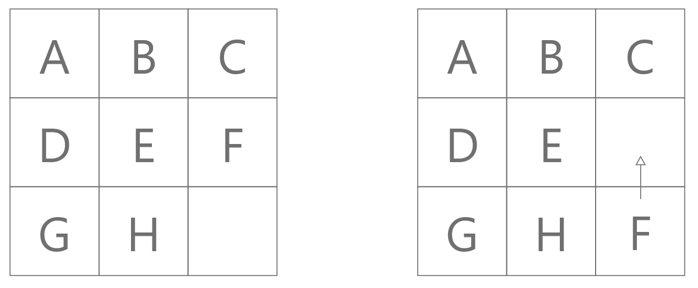
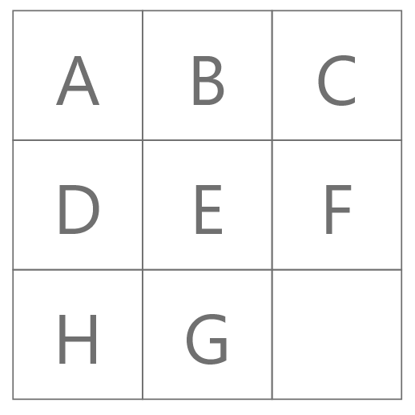

name: inverse
layout: true
class: center, middle, inverse
---
# ENSE 350: Math for Software Eng.

### Lecture 4: Strong Induction, Well Ordering Principle

$\cdot$ Adam Tilson, M.A.Sc., P.Eng

---
layout: false
.left-column[
    ## Agenda

]
.right-column[
1. Review: Lecture 3 Highlights
1. 8-Puzzle
1. Invariant
1. Strong Induction
1. Well Ordering Principle
1. Examples
]
---

## Induction

Goal: Prove something true for all values in a sequence.
- (1) We prove that P(0) is true (Base Case)
- We want to prove that...
    - $P(0) \Rightarrow P(1)$
    - $P(1) \Rightarrow P(2)$
    - $P(2) \Rightarrow P(3)$
    - $P(3) \Rightarrow P(4)$ ...
- (2)  We do this symbolically by generalizing all these cases as:
    - $P(n) \Rightarrow P(n+1)$ (Induction Step)
- We conclude this is true for all values in the sequence.

---
## How Induction Works
Symbolically:

$\dfrac{P(0), \forall n \in \mathbb{N}, P(n) \Rightarrow P(n+1)}{\forall m \in \mathbb{N}, P(m)}$

It's like knocking over dominoes 
- you knock over the first domino, 
- if you can prove that the previous domino will knock over the next one (for any arbitrary domino)
    - we conclude all dominoes will get knocked over

---
## Induction
Template:
- State the strategy (Proof by ordinary induction)
- Define predicate $P(n)$, known as the Inductive Hypothesis
- Prove the Base Case, i.e. that $P(0)$ is true
- Prove the implication $P(n) \Rightarrow P(n+1)$, known as the Inductive Step.
- Conclude, by the principle of induction, that the predicate is true for all values of $n$.

---
## Solve a Tougher Problem
- Sometimes with induction, it's easier to solve a tougher problem!
    - What is a "harder" formulation of this same problem which gives us more freedom?
    - e.g. with the tile puzzle - placing the empty square in ANY square rather than a Center square
    - This gave us more freedom in how we could use the inductive hypothesis P(n)
---
## 8 Puzzle

---

class: even-split
## 8 Puzzle

.column[
.image-60[]
]
.column[
- Legal move: slide pieces up, down, left and right into an adjacent empty square
- Goal: Prove that the puzzle on the left cannot be solved using legal moves.
]

---
.left-column[
    ## Legal Moves
]
.right-column[  
- This is the goal state 

C1 | C2  | C3
---|---|---
A |B |C
D |E |F
G |H |

- If we list out all letters from top left to bottom right row by row we get:

A B C D E F G H

- We can legal moves into two cases: Row moves and column moves.

]
---
.left-column[
## Legal Moves
### Row Move
]
.right-column[
- We can slide pieces horizontally into rows

- One row move from the goal state:

C1 | C2  | C3
---|---|---
A |B |C
D |E |F
G |  |H

- If we list out all letters from top left to bottom right row by row we get:

A B C D E F G H

- Note that nothing has changed regarding the relative order of the pieces from the goal state.

]
---
.left-column[
## Legal Moves
### Column Move
]
.right-column[
- We can slide pieces vertically through columns
- One column move from the goal state:

C1 | C2  | C3
---|---|---
A |B |C
D |E |
G |H |F

- If we list out all letters from top left to bottom right row by row we get:

A B C D E **G H F**

- Exactly 3 letters which have changed places
- i.e., 2 inversions have occurred, we need to swap 2 pairs of tiles to return to the correct order.

]
---
.left-column[
## Legal Moves
### Column Move
]
.right-column[
- Two column moves from the goal state

C1 | C2  | C3
---|---|---
A |B |
D |E |C
G |H |F

- Order: A B **D E C G H F**

- Exactly 5 letters which have changed places
- Another way we could say this is 4 inversions have occured, as we would need to swap 4 pairs of tiles to return to the correct order.
- In both cases, we have an *even* number of inversions

]
---
.left-column[
## Legal Moves
### Our Problem
]
.right-column[
- The problem we were asked to prove is

C1 | C2  | C3
---|---|---
A |B |C
D |E |F
H |G |

- Order: A B C D E F H G

- Exactly 1 pair of letters have changed places (odd number)
- Is there any way we can get from this state to the goal state?
- How do we formally prove this?

]
---
## Invariant
- The invariant is some property of the system which is true in the start state of the system, and true in every legal move. 
- We can use this to prove if the system is in a winnable state, or an unwinnable state.

---
### Complete proof
Lemma 1: A row move does not change the relative order of the tiles
- Proof: In a row move we move an item form some cell $i$ into an adjacent cell $(i+1)$ or $(i-1)$. Nothing else moves, hence the order is preserved. $\square$

Lemma 2: A column move changes the order of precisely two pairs of items
- Proof: in a column move, we move an item from cell $i$ into a blank spot $(i+3)$ or $(i-3)$. When an item moves three positions, it changes order with two items: ${(i-2), (i-1)}$ or ${(i+1), (i+2)}$ $\square$

---
### Complete proof

Def: A pair of letters, L1, L2, is an inversion (aka inverted pair) if L1 preceds L2 in the alphabet, but L1 is after L2 in the puzzle.

Lemma 3: During a move, the number of inversions can only increase by 2, decrease by 2, or stay the same:
- Proof: By Lemma 1, a row move has no changes. By Lemma 2, a column move changes +/- 2 changes.
    - A: Both pairs in order $\Rightarrow$ # inversion increases by 2
    - B: Both pairs inverted $\Rightarrow$ # inversion decreases by 2
    - C: One pair inverted $\Rightarrow$ # stays the same. $\square$

---
### Complete proof

Corollary 1: During a move, the parity (even/odd) of number of inversions does not change.
- Proof: Adding or subtracting 2 does not change parity. $\square$

---
### Complete proof

Lemma 4: Every state reachable from the puzzle given is odd.
- Proof: By ordinary induction
- Inductive hypothesis: After any sequence of $n$ moves from the start state, the parity of # inversions stays the same (odd).
- Base case:
    - The puzzle can be represented as A B C D E F H G which has exactly 1 inversion, H and G. 1 is odd. $\checkmark$

---
### Complete proof

- Inductive Step: For $n \geq 0$ show that $P(n) \Rightarrow P(n+1)$
    - By the inductive hypothesis, we know the parity of the number of inversions after the $n$'th move was odd.
    - By Corollary 1, we know the parity of the number of inversions does not change by any legal move. 
- Thus the number of inversions will still be odd after the $n+1$'th move. $\square$
---
### Complete proof
Proof of Theorem:
- The number of inversions in the goal state is 0. 
- The parity of the number of inversions of the goal state is even. 
- By Lemma 4, every state reachable from the starting state has an odd parity of the number of inversions.
- $\therefore$ the goal state cannot be reached. $\square$

---

### Strong Induction
- Last class we saw: Solve a Tougher Problem
- We can also use a stronger form of induction
- In strong induction, we need to...
    - Prove the base cases (May be several!)
    - Set up the hypothesis that *EVERY* step together implies the induction step
    - Rather than assuming $P(n)$ is true, we assume $P$ is true for every number up to and including $n$
    - Prove the hypothesis
- If we knock down the first domino,
    - AND the second domino is knocked over, AND the third, AND...
    - Then all dominos are knocked over

---

### Strong Induction Comparison

Ordinary Induction:

$\dfrac{P(0), \forall n \in \mathbb{N}, P(n) \Rightarrow P(n+1)}{\forall m \in \mathbb{N}, P(m)}$

Strong Induction:

$\dfrac{P(0)+, \forall n \in \mathbb{N}, P(0) \wedge P(1) \wedge P(2) \wedge ... \wedge P(n) \Rightarrow P(n+1)}{\forall m \in \mathbb{N}, P(m)}$

???
Which problem did we look at that would have been solved by strong induction?

---

### When to use Strong Induction

- When there is no obvious connection between $P(n)$ and $P(n+1)$

- i.e. we can't use $P(n)$ directly to prove $P(n+1)$

- However, we may be able to use some combination of $P(0), P(1), P(2) ... P(n)$

---

### How to use Strong Induction: Proof Template

- State that we are solving the problem by strong induction
- Define our Induction Hypothesis, $P(n)$, defining the induction variable $n$
- Prove the base case(s): $P(0)$ is true, may be others
- Prove the inductive step: $P(0) \wedge P(1) \wedge P(2) \wedge ... \wedge P(n) \Rightarrow P(n+1)$
- By strong induction, conclude $P(n)$ is true for all $n \in \mathbb{D}$

Warning: Sometimes using strong induction means you need to prove additional base cases!

---

class: even-split
### Example:
Prove: By strong induction, that every integer greater than 1 is a product of primes.

- Is this true?

.column[
- $2 = 2$
- $3 = 3$
- $4 = 2 \times 2$
- $5 = 5$
- $6 = 2 \times 3$
- $7 = 7$
- $8 = 2 \times 2 \times 2$
]
.column[
- $9 = 3 \times 3$
- $10 = 2 \times 5$
- $11 = 11$
- $12 = 2 \times 2 \times 3$
- $13 = 13$
- $14 = 2 \times 7$
- ...
]
---
### Proof: By ordinary induction
- Base Case: $P(2)$; $2$ is a prime, so it is the product of a single prime
- Inductive Hypothesis: $P(n)$ is a product of two primes
- Induction Step: $P(n) \Rightarrow P(n+1)$
- By cases:
    - Case A: $P(n+1)$ is prime. Then it's a product of itself. $\checkmark$
    - Case B: $P(n+1)$ is not prime. Then it must be a product of two integers smaller than itself.
    - What we need to make this work: All integers smaller than itself: $P(2), P(3), P(4), ..., P(n)$
    - What we have access to at this point: Only $P(n)$
    - We are stuck.
---
### Proof: By strong induction
- Base Case: $P(2)$; $2$ is a prime, so it is the product of a single prime
- Inductive Hypothesis: $P(n)$ is a product of two primes
- Induction Step: $P(2) \wedge P(3) \wedge ... \wedge P(n) \Rightarrow P(n+1)$
- By cases:
    - Case A: $P(n+1)$ is prime. Then it's a product of itself. $\checkmark$
    - Case B: $P(n+1)$ is not prime.
    - Then there exists some integers $a,b$ for all of $n$ , $2 \leq (a,b) \leq n$, such that 
        - $n+1 = a \times b$
    - By strong induction, both $a$ and $b$ are the product of primes. Thus $n+1 = a \times b$ is the product of primes. $\square$

---
## The N-Block game
- You and your opponent have a stack of 8 blocks.
- In each move, you can split any remaining stack into 2 stacks.
- Your score for that round is the product of blocks left if in the two stacks you split.
- e.g. 8 => 4, 4. Score = 4 * 4 = 16.
- 4 => 2, 2. Score = 2 * 2 = 4. 16 + 4 = 20
- ...
- e.g. 8 => 7, 1. Score = 7 * 1 = 7.
- e.g. 7 => 6, 1. Score = 6 * 1 = 6. 7 + 6 = 13.
- ...
Which strategy is better? Very even splits or very uneven splits?
---

## The N-Block game
- You and your opponent have a stack of 8 blocks.
- In each move, you can split any remaining stack into 2 stacks.
- Your score for that round is the product of blocks left if in the two stacks you split.
- Let's look at two strategies for playing this game.

---
## The N-Block game - First strategy

---
## The N-Block game - First strategy

| move | move score | cumulative score |
|---|---|---|
|8 => 4, 4 | 16 | 16|
|4 => 2, 2 | 4 | 20|
|...|...|...|

---
## The N-Block game - Second strategy

---
## The N-Block game - Second strategy
| move | move score | cumulative score |
|---|---|---|
|8 => 7, 1 | 7 | 7|
|7 => 6, 1 | 6 | 13|
|...|...|...|

Which strategy is better?
---
## First Strategy
| move | move score | cumulative score |
|---|---|---|
|8 => 4, 4 | 16 | 16|
|4 => 2, 2 | 4 | 20|
|4 => 2, 2 | 4 | 24|
|2 => 1, 1 | 1 | 25|
|2 => 1, 1 | 1 | 26| 
|2 => 1, 1 | 1 | 27| 
|2 => 1, 1 | 1 | 28|

---
## Second Strategy
| move | move score | cumulative score |
|---|---|---|
|8 => 7, 1 | 7 | 7|
|7 => 6, 1 | 6 | 13|
|6 => 5, 1 | 5 | 18|
|5 => 4, 1 | 4 | 22|
|4 => 3, 1 | 3 | 25|
|3 => 2, 1 | 2 | 27|
|2 => 1, 1 | 1 | 28|
---
## Every strategy produces the same result
- These two strategies tied.
- It turns out every strategy ties!
- Can you prove it?

Theorem: All strategies for the n-block game produce the same score.

---

Proof: By strong induction
Induction Hypothesis: For all $n \in \mathbb{N}, n \geq 2$ all strategies for the n-block game produce the same score, $S(n) = \dfrac{n(n-1)}{2}$

Base Case: $n=2$.

$S(2) = 1 \times 1 = 1.$

$S(2) = \dfrac{2(2-1)}{2} = 1 \checkmark $. 

Inductive Step: Assume $P(1) \wedge P(2) \wedge ... \wedge P(n)$ to prove $P(n+1)$
---
Inductive Step: Assume $P(1) \wedge P(2) \wedge ... \wedge P(n)$ to prove $P(n+1)$

$Let$ $k :=$ the the number of blocks remaining in the left pile after a split, $k \leq n$.

The blocks remaining in each pile in a split from n blocks thus $k$, $n-k$

The blocks remaining in each pile in a split from n+1 blocks thus $k$, $n+1-k$

The Score for a turn is thus $k(n+1-k)$

We can recursively compute the scores for each sub pile as $P(k)$, $P(n+1-k)$ 

---
$S(n+1) = k(n+1-k) + P(k) + P(n+1-k)$

$= k(n+1-k) + \dfrac{k(k-1)}{2} + \dfrac{(n+1-k)((n+1-k)-1)}{2}$

$= \dfrac{2k(n+1-k)}{2} + \dfrac{k(k-1)}{2} + \dfrac{(n+1-k)(n-k)}{2}$

$= \dfrac{2kn+2k-2k^2}{2} + \dfrac{k^2-k}{2} + \dfrac{n^2+n-nk-nk-k+k^2}{2}$

$= \dfrac{2kn+2k-2k^2 + k^2-k + n^2+n-nk-nk-k+k^2}{2}$
---
- $= \dfrac{2kn+2k-2k^2 + k^2-k + n^2+n-nk-nk-k+k^2}{2}$
- $= \dfrac{n^2+n}{2}$
- $ S(n+1) = \dfrac{(n+1)(n+1-1)}{2}$
- $ S(n+1) = \dfrac{(n+1)(n)}{2}$
- $ S(n+1) = \dfrac{n^2+n}{2} \checkmark$
- $\therefore$ all strategies for the n-block game produce the same score. $\square$

---

### References

- Dr. Abdul Bais's ENSE 350 Slides
- Tom Leighton, and Marten Dijk. 6.042J Mathematics for Computer Science. Fall 2010, Lecture 3. Massachusetts Institute of Technology: MIT OpenCourseWare, https://ocw.mit.edu. License: Creative Commons BY-NC-SA.
---
name: inverse
layout: true
class: center, middle, inverse
---
# Questions?
