name: inverse
layout: true
class: center, middle, inverse
---
# ENSE 350: Math for Software Eng.

### Lecture 11: Introduction to Graph Theory

$\cdot$ Adam Tilson, M.A.Sc., P.Eng

---
layout: false
.left-column[
  ## Agenda
]
.right-column[
1. Intro to Graphs
1. Connectivity
1. Graph Coloring
1. Greedy Algorithm
1. Walks, Paths, Closed Walks and Cycles
1. Trees
1. Spanning Trees
1. Minimum Spanning Trees
]

---
## Graph
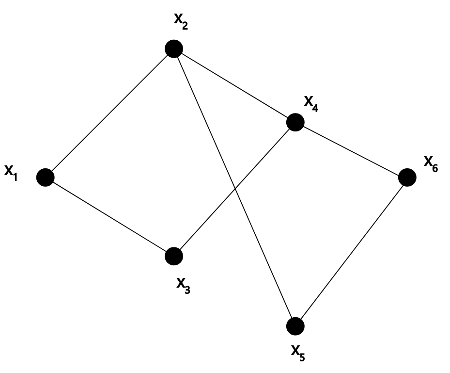
---
## Graph
- A graph, $G$, is a pair of sets, $(V,E)$.
  - $V$ is a non-empty set of vertices (nodes)
  - $E$ is a set of two item subsets of $V$ called edges
- e.g. $V = ${$x_1, x_2, x_3, x_4, x_5, x_6, ..., x_n$}
- $E = $ { { $x_1, x_2$ }, { $x_2, x_3$ }, { $x_1, x_4$ }, ... }

- With sets, order doesn't matter. Either you are in the set or not.
- With graphs, how you draw it doesn't matter, as long as the edges and verticies match

---
## Graph Definitions
- `Adjacent`: Two notes $x_i$ and $x_j$ are adjacent if {$x_i, x_j$}$ \in E$
- `Incident`: An edge $e=${$x_i, x_j$} is incident to $x_i, x_j$
- `Degree`: The degree of a vertex is the number of edges adjacent to it
- `Cardinality` of set $V$, $|V|$, is the number of vertices 
- `Simple`: A graph is simple if it has no `loops` or `multiple edges`
  - `Loops` are created when nodes connect to themselves
  - `Multi-edges` are created when a pair of nodes share more than one edge

---

## Connectivity
- Def: Vertices $u$ and $v$ are `connected` if there is a path from $u$ to $v$
- Def: A `graph is connected` if every pair of vertices is connected.

---

## k-Connected Graph
Def: Two vertices in a graph are `k-edge connected` if they remain connected in every subgraph obtained by deleting $k-1$ edges. 

- The graph remains connected if you remove less than k-edges!

- All 3-connected graphs are also 2-connected, but not vice versa!

---
## k-Connected Examples

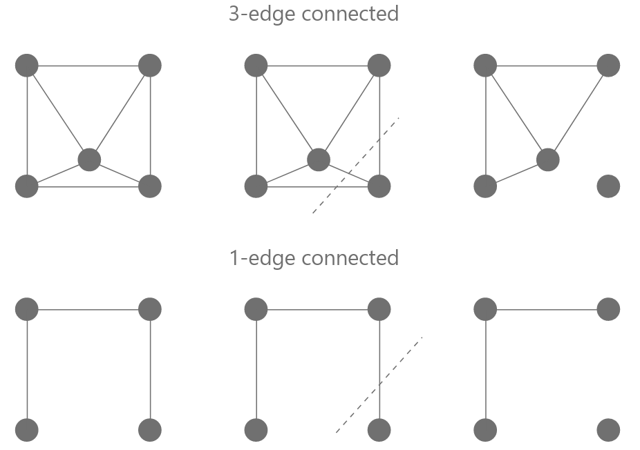

---
## k-Connected Examples

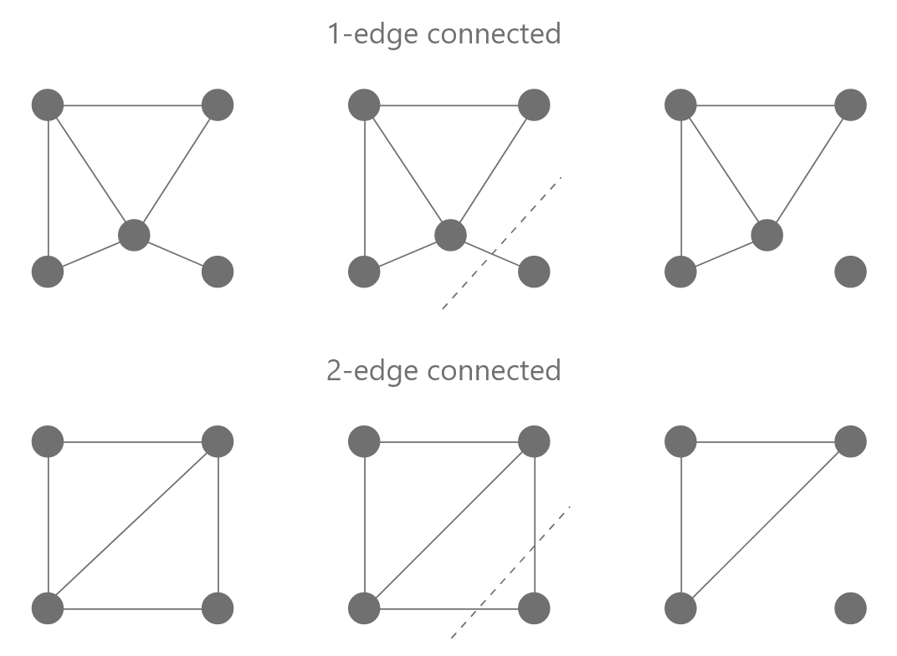

---

## Complete Graph

- A `graph is complete` if every pair of vertices share an edge

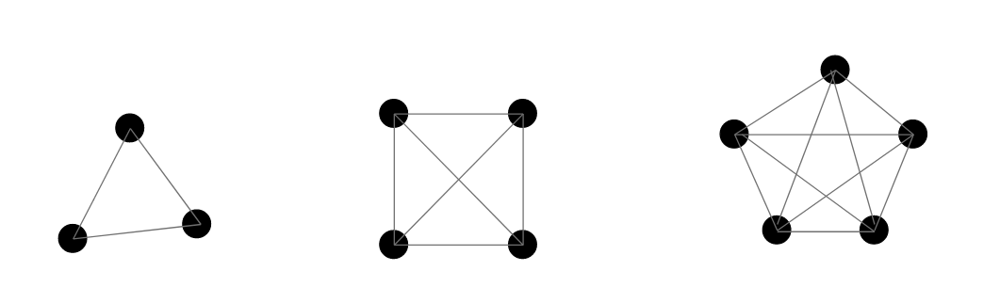
---
## Empty Graph
- An `empty graph` has no edges

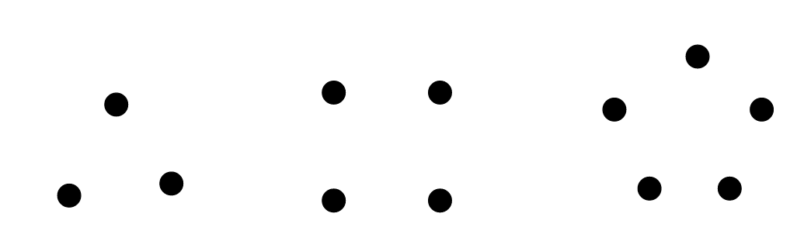

---
## Line Graph
- A `line graph` is a connected graph with $n$ nodes, $n-1$ edges, and at most degree 2
  
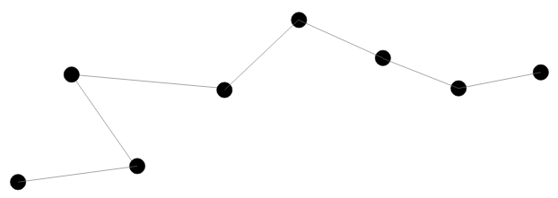

---
## Subgraph
A graph $G_1 = (V,E)$ is a subgraph of $G_2 = (V_2, E_2)$ if $V_1 \subseteq V_2$ and $E_1 \subseteq E_2$

($\subseteq$ means "is a subset of")

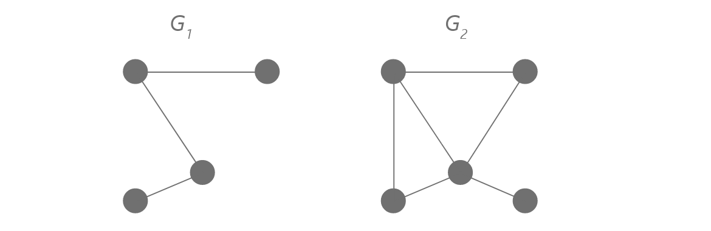

---
## Adjacency Matrix
As alternate way to draw a graph is is in an `adjacency matrix`
- For unweighted graphs
  - The vertices are represented by the rows and columns
  - An edge is represented by a 1
  - No edge is represented by 0

$
a_{ij} =
  \begin{cases}
    1 & \text{if \\{} v_i, v_j \text{\\}}\in E \\\
    0 & \text{otherwise}
  \end{cases}      
$

- For a weighted graph
  - The weight is represented in place of a 1

---
class: even-split
### Adjacency Matrix

.column[
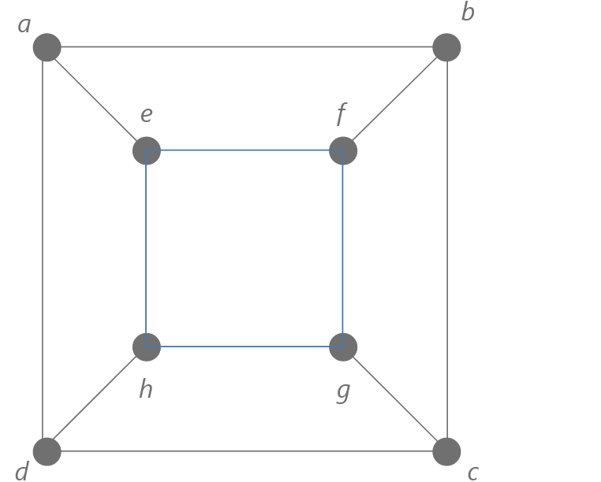

]
.column[

$\begin{bmatrix} 
0 & 1 & 0 & 1 & 1 & 0 & 0 & 0 \\\\ 
1 & 0 & 1 & 0 & 0 & 1 & 0 & 0 \\\\ 
0 & 1 & 0 & 1 & 0 & 0 & 1 & 0 \\\\ 
1 & 0 & 1 & 0 & 0 & 0 & 0 & 1 \\\\ 
1 & 0 & 0 & 0 & 0 & 1 & 0 & 1 \\\\ 
0 & 1 & 0 & 0 & 1 & 0 & 1 & 0 \\\\ 
0 & 0 & 1 & 0 & 0 & 1 & 0 & 1 \\\\ 
0 & 0 & 0 & 1 & 1 & 0 & 1 & 0
\end{bmatrix}$
]

---
### Adjacency Matrix

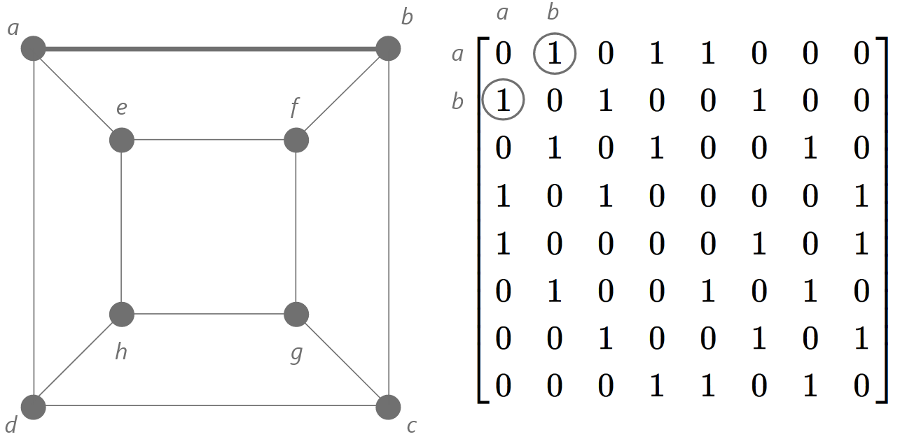

---
### Adjacency Matrix

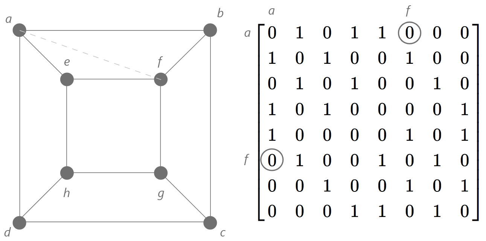

---

### Example: Exam Scheduling
- Students are enrolled in multiple courses at once
- Any two courses which a student could be expected to be enrolled in simultaneously must not have the same time schedule
- e.g. We can model this problem using graph theory

---
### Example: Exam Scheduling

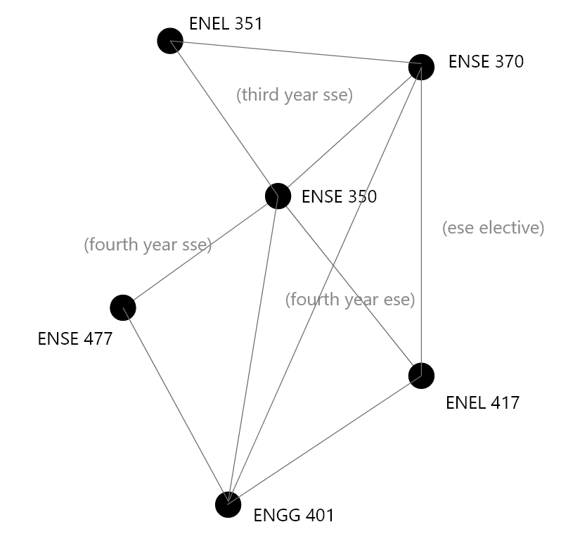

---
### Example: Exam Scheduling
`Graph Coloring Problem`: Given a graph $G$, and $K$ colors, assign a color to each node so adjacent notes all have different colors

Def: `Chromatic Number`: The minimum value of $k$ for which such a coloring exists. $\mathcal{X} (G)$ "Chi (G)"

---
### Example: Exam Scheduling
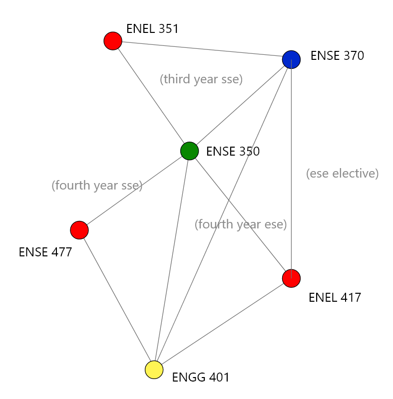

---
### Minimum Number of Colors
There is no easy way to find the chromatic number.
- Trivial to do for complete graphs, where all vertices are connected
  - e.g for three nodes, a triangle of edges
  - e.g. for four nodes, a box of edges with diagonals
  - A starting point is to find the largest complete subgraph
- A graph that can be colored with $k$ colors is `k-colorable`.
- e.g. `The Three-Coloring Problem` - can we color it with only 3?
- This problem is `NP hard` - It's easy to verify a solution, but exponentially harder to solve
  - Solving `NP` problems is a central challenge to CS!
???
In hardness
P - Polynomial Time. 2-Colorable
NP - Nondeterministic Polynomial Time - Can be verified in P time
NP-Complete - Every NP-Complete problem can be reduced to the SATisfiability problem
NP-Hard - The Halting Problem - Will program P, with input I, ever halt?

---
### Greedy Graph Coloring Algorithm
- For $G = (V,E)$
1. Order the nodes $v_1, v_2, ..., v_n$
2. Order the colors $c_1, c_2, ..., c_n$
3. For $i=1,2...n$, assign the lowest legal color to $v_i$
  
Naturally this will be highly dependant on the order of nodes.
- On average, you use fewer colors, when you sort the nodes by the highest degree descending
- This is a `greedy algorithm` - take the first solution that works, never go back and try to do better.
---
### Basic Graph Coloring Example
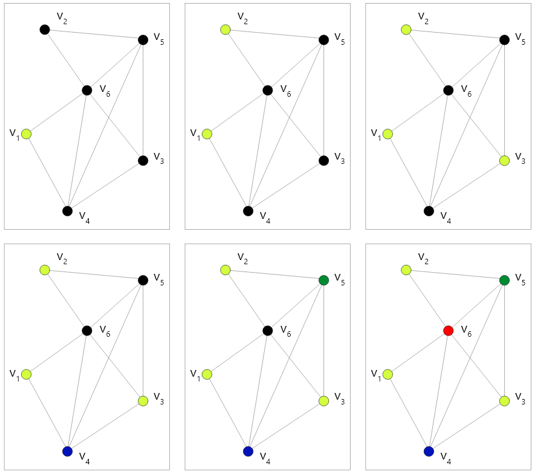
---
## Maximum Colors Proof
- Theorem: If every node in $G(V,E)$ has degree $\leq d$, the greedy coloring algorithm uses at most $d+1$ colors
- Proof: By induction
- Induction Hypothesis: 
  - $P(n) :=$ If every node in $n$-node $G(V,E)$ has degree $\leq d$, the basic algorithm uses at most $d+1$ colors
- Base Case: 
  - $P(1)$. One node, zero edges. 
  - $d = 0.$ 
  - $1$ colors. $\checkmark$.
---
## Maximum Colors Proof
Induction Step.
- Let $G(V, E)$ be an $(n+1)$ vertex graph with maximum degree $d$.
- Remove vertex $v_i$ and all edges incident to it.
  - This leaves an $n$-vertex subgraph, $H$
  - The maximum degree of $H$ must be $d\_h$
  - Thus $H$ is $(d\_h+1)$ colorable (by the Inductive Hypothesis). 
- Add back in $v_i$ and incident edges
  - $v_i$ will be assigned a color different than all adjacent vertices
  - $v_i$ will have at most $d$ vertices
  - at least one of the $(d+1)$ colors will be available
- $\therefore$ $G$ is $(d+1)$ colorable. $\square$

???

Why do we need to do that thing where we remove things. This reminds me of the horse coloring fiasco.

Apparently this has to do with set theory - the only way you can show you can get to a bigger set from any smaller set legal smaller set, is by starting with the bigger set and then removing from it. This is also why we did this with the horses. Huh. 

---
## Is d+1 the best we can do?

Let's look at some graphs for which $(d+1)$ is not so great...

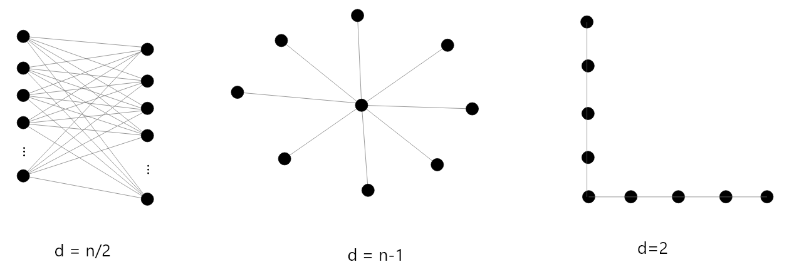

---
## Is d+1 the best we can do?

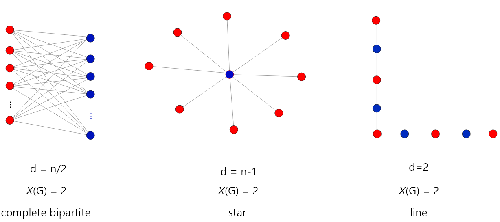

---
## Greedy Approach - ordering matters

How does the greedy algorithm work on the following graphs?

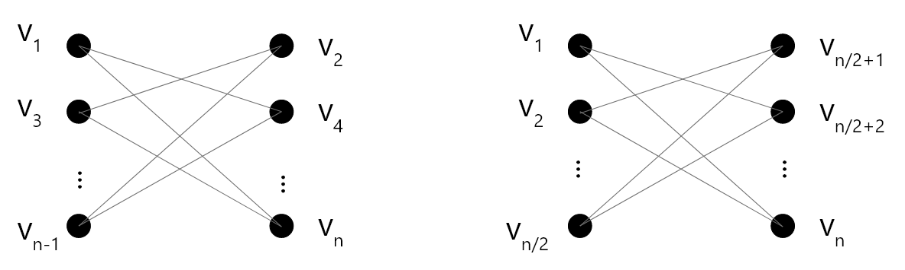

---
## Greedy Approach - ordering matters

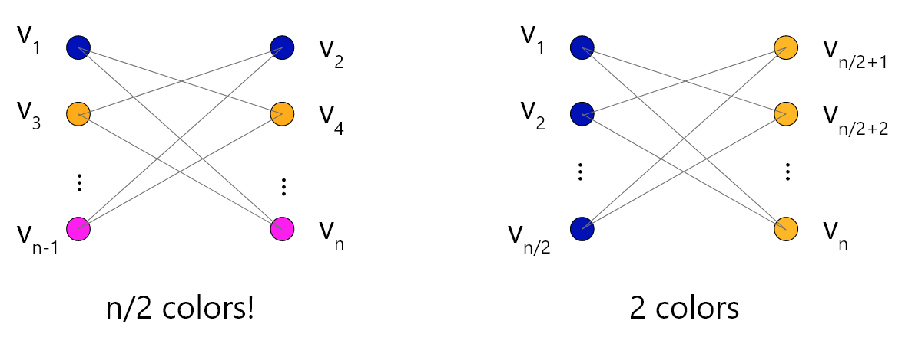

---
## Bipartite Graphs

Def: A graph $G(V, E)$ is said to be `bipartite` if $V$ can be split into $V_L, V_R$ so that every edge in $E$ connects a node in $V_L$ to a node in $V_R$. These graphs are `2-colorable`.

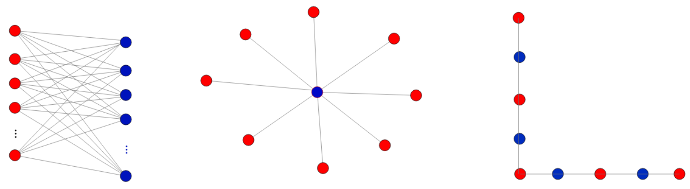

---

## Real World Applications of Coloring

- Server maintenance (the cloud)
- Transferring Variables to Registers
- Map coloring
- Radio Station Interference

---

## Walk and Paths

Def: A `walk` is a sequence of vertices connected by edges:
- $v_0 - v_1, - ... v_k$ (length k)

*A walk can traverse the same vertex multiple times*

Def: A `path` is a walk where all $v_i$'s are different.

- For a weighted graph, the length is the sum of weights in the path

---

### Lemma - Walks vs Paths

Lemma: If $\exists$ a walk from $u$ to $v$, $\exists$ a path from $u$ to $v$.
- Proof (By the well ordering principle): 
- Assume $\exists$ a walk from $u$ to $v$ which is the minimal length. 
- $u = v_0 - v_1 - ... v_k = v$

---
### Lemma - Walks vs Paths

- By Cases: 
  - $k=0. \checkmark$ 
  - $k=1.$  $u - v \checkmark$
  - $k \geq 2$ 
    - Suppose walk is not a path. $\exists i \neq j, v_i = v_j$ 
      - i.e. the same vertex is reached twice 
    - $u = v_0 - ... - v_i - ... - v_j - ... -v_k = v$
    - We could remove this loop:
    - $u = v_0 - ... - v_i -... -v_k = v$
    - This is a shorter walk. Our walk was not minimum length. ⨳
- $\therefore$ by the well ordering principle, if there is a walk from $u$ to $v$, there is also  a path from $u$ to $v$.

---

## Cycles and Closed Walks
Def: A `closed walk` is a walk in which the starting and ending vertex are the same.
- $v_0 - ... - v_i - ... -v_k = v_0$

Def: If $k \geq 3$, and each visited vertex is different, we have a `cycle`

Def: A graph without a cycle is `acyclic`.

---
## Odd Cycles and 2-colorability
The following properties of a graph are equivalent
- The graph is bipartite
- The graph is 2-colorable
- The graph does not contain any cycles with odd length
- The graph does not contain any closed walks with odd length

* If a graph contains an odd cycle, a minimum of 3 colors will be needed.
---

## Trees
Def: A `tree` is a connected, acyclic graph.
  
Def: A `leaf` is a node in a tree with a degree of 1.

---
### Pruning Lemma
Any connected subgraphs of trees are also trees.
- Proof: By contradiction
- Suppose a subgraph exists which is not a tree
- In that case it must have a cycle
- Since it is a subgraph of the larger graph, if it has a cycle the larger graph must have a cycle
   - But the whole graph is a tree! ⨳
---
### Lemma - Tree vertices and edges
- Lemma: A tree with n vertices has n-1 edges.
- Proof (by ordinary induction)
- Induction of Hypothesis: $P(n)$ in any tree of $n$-vertices, there are $n-1$ edges.
- Base case
  - $P(1)$ - 1 vertex. No edges. $\checkmark$
---
### Lemma - Tree vertices and edges
- Inductive step.
  - Assume $P(n)$ to prove $P(n+1)$
  - Let $T$ be a tree with $n+1$ vertices
    - Let's prune a leaf from $T$, (so that it is still a tree.)
    - Now we have a connected subgraph which is also a tree. (previous Lemma)
    - Re-attach $v$ : $T$ has $(n-1)$ edges + $1$ edge = $n$ edges. $\square$
---
### Spanning Tree
- Def: A `spanning tree` of a connected graph is subgraph that is a tree which contains every vertex in the original tree

Theorem: Every connected graph has a spanning tree

- Proof: By contradiction. 
- Assume we have a connected graph $G$ which does not have a spanning tree.
---
### Spanning Tree
Lemma: Removing an edge from a cycle does not change the connectivity of a graph
- Case 1: The path between arbitrary vertices, $v_x$ and $v_y$, did not go through the cycle.
  - No change to connectivity
- Case 2: The path between arbitrary vertices, $v_x$ and $v_y$, did go through the cycle
  - Now the path between $v_x$ and $v_y$ is changed to take the long road around the cycle (detour).

---
### Spanning Tree
- Let $T$ be a connected subgraph of $G$ with same vertices and the smallest number of edges possible
  - $T$ is not a spanning tree, so it must have a cycle
  - But if we remove one of the edges of that cycle, we have constructed a smaller connected subgraph (Lemma)
  - Thus we didn't have the smallest number of edges. ⨳

---
### Weighted Graphs
- Graphs can have weights assigned to the edges
- These weights have a number of real-world applications
  - e.g. Network parameters
  - e.g. Airline routes
  - e.g. Street routes with different types of streets, roads
  - e.g. Search Engine PageRank (directed)
- Typically lower weights are preferred!
---
### Weighted Graphs
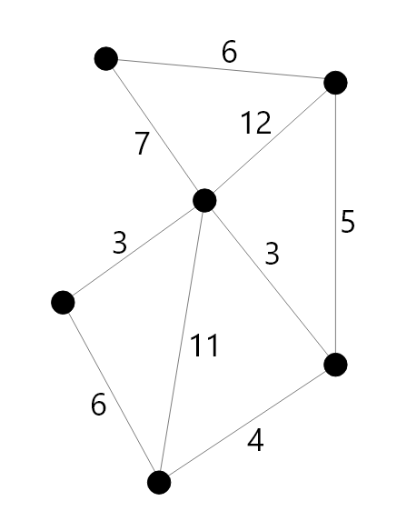

---
### Weighted Spanning Tree
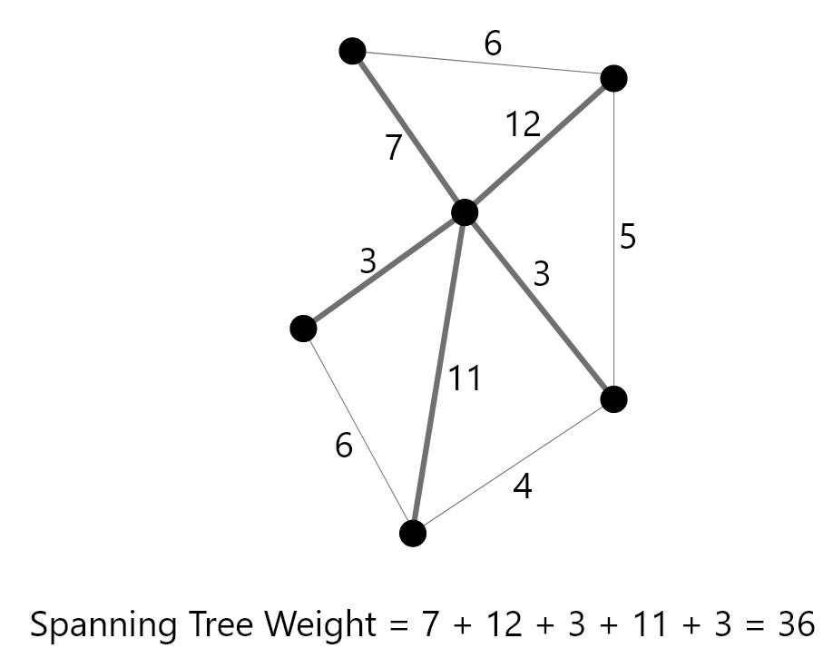

---
### Minimum Spanning Tree
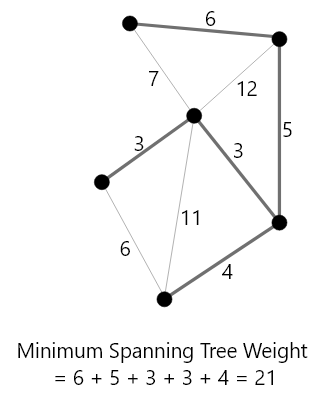

---
### Minimum Spanning Tree
Def: The `Minimum Spanning Tree` (MST) of an edge-weighted graph $G$ is the spanning tree of $G$ with the smallest possible sum of edge weights.

Algorithm: Grow a subgraph one edge at a time

- At each step:
  - Add the minimum weighted edge that keeps the graph acyclic
  - Continue until all vertices are connected

---
### MST Algorithm
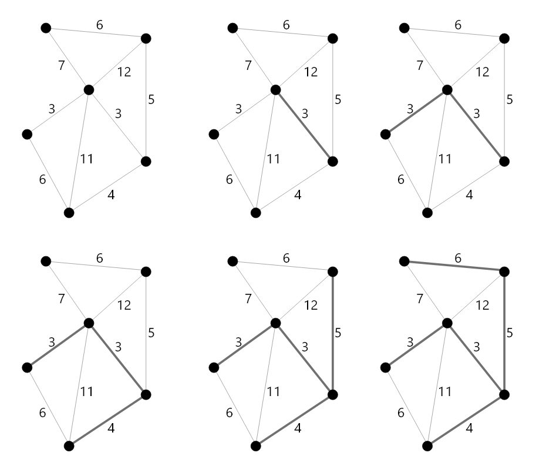

---
### Graph Theory Sample Question Topics:

- General application of concepts
- Graph Theory Proofs (grrr)
- Creating graphs from adjacency matrices and vice versa
- Using the greedy algorithm for graph coloring
- Growing Minimum Spanning Trees

---

### References

- Dr. Abdul Bais's ENSE 350 Slides
- Tom Leighton, and Marten Dijk. 6.042J Mathematics for Computer Science. Fall 2010, Lectures 6, 8. Massachusetts Institute of Technology: MIT OpenCourseWare, https://ocw.mit.edu. License: Creative Commons BY-NC-SA.
---

name: inverse
layout: true
class: center, middle, inverse
---
# Questions?
