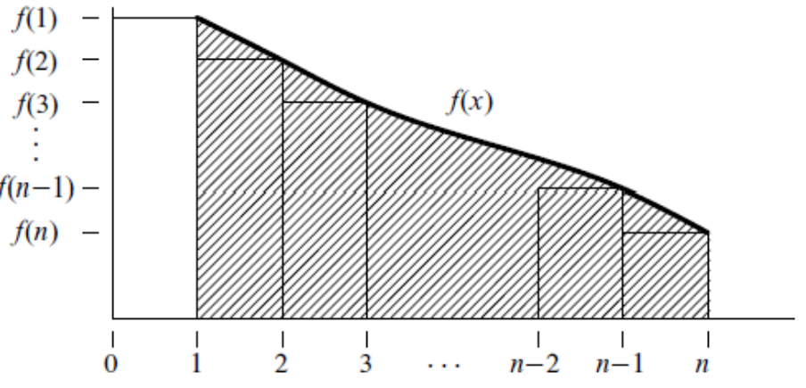
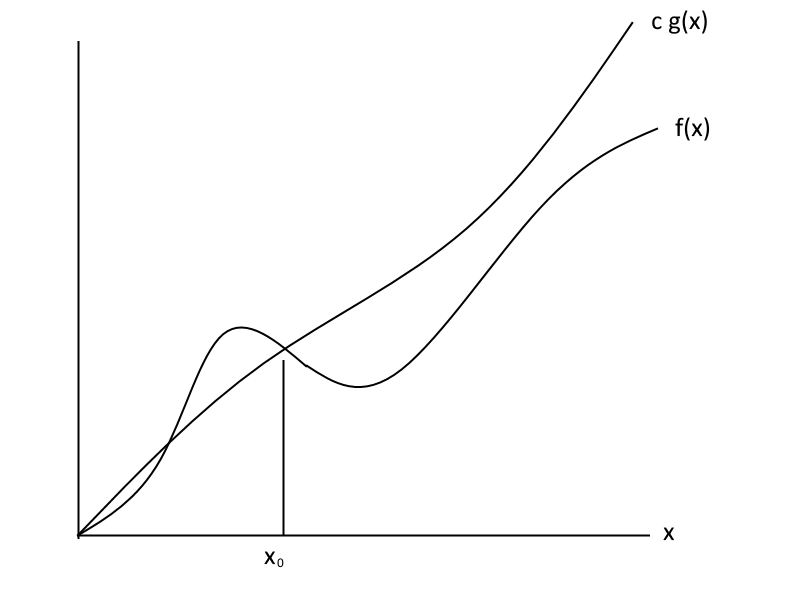

name: inverse
layout: true
class: center, middle, inverse

---

# ENSE 350: Math for Software Eng.

### Lecture 12: Sums and Asymptotics

Adam Tilson, M.A.Sc., Engineer-in-Training

---

layout: false
.left-column[
  ## Agenda
]
.right-column[
1. Closed Form Solutions
1. Perturbation
1. Annuity
1. Derivative Method
1. Linear Combination Method
1. Approximating Sums with Integrals
1. Double Sums
1. Products
1. Asymptotic Notation
]

---
## Closed Form solutions

$$\sum_{i=1}^n i = 1 + 2 + ... + n = \frac{n(n+1)}{2}$$

$$\sum_{i=1}^n i^2 = 1^2 + 2^2 + ... + n^2 = \frac{2(2n+1)(n+1)}{6}$$

---
## Closed Form solutions

$$\sum_{i=0}^n r^i = r^0 + r^1 + r^2 ... + r^n = \frac{r^{n+1}-1}{r-1}$$

$$n! = 1 \cdot 2  \cdot 3  \cdot ... \cdot n \ = \prod_{i=1}^n i$$

*When $n = 0$, sums are only the zero'th term. Sometimes this is zero, e.g. $3n$, sometimes this is 1, e.g. $3^n$. If a term is out of the bounds, it is 0 by definition, e.g. the 0th term if we are starting from i=1*

---
## Perturbation
- `Perturbation` is a method for finding the closed form solution of sums

- e.g. $\sum_{i=1}^n i = 1 + 2 + ... + n = S$

- We can add the sum forward and backward

$  S = 1 + 2 + ... + (n-1) + n$

$+ S = n + (n-1) + ... + 2 + 1$

$S + S = (n+1) + (n+1) ... (n+1) + (n+1)$

---
## Perturbation Examples

$S + S = (n+1) + (n+1) ... (n+1) + (n+1)$

$2S = n(n+1)$

$S = \frac{n(n+1)}{2}$

---
## Geometric Series

- $S = 1 + r + r^2 + ... + r^{n-1} + r^n$

- $rS = r + r^2 + ... + r(r^{n-1}) +r(r^n)$

- $rS = r + r^2 + ... + r^n + r^{n+1}$

- $S - rS = 1 - r^{n+1}$

- $S (1-r) = 1 - r^{n+1}$

- $S  = \frac{1 - r^{n+1}}{1-r}$

---
## Using Geometric Series
- $S = 1 + 2 + 4 + 8 + ... + N$
- $S = 2^0 + 2^1 + 2^2 + 2^3 + ... + 2^n$
- $S = \frac{2^{n+1}-1}{2-1}$
- $S = \frac{2 \cdot 2^n-1}{1}$
- $S = 2 \cdot 2^n-1$
- $S = 2 \cdot N-1$
- e.g. if N = 8, S = 15. (1111)
- e.g. if N = 16, S = 31. (11111)
---
## Annuity
Def: An $n$-year, $m$-dollar payment annuity, pays $m$ dollars at the start of each year for $n$ years.
- 50,000/Year for 20 years VS 1,000,000 today?
- 50,000/Year for 20 years VS 700,000 today?

Assume fixed interest rate P

- i.e. $1$ today = $(1+p)$ in one year, $(1+p)^2$ in two years...
- i.e. $1$ dollar in five years is $\frac{1}{(1+p)^5}$ today.
---
## Annuity payment
Payments | Current Value
---|---
$m$ | $m$
$m$ | $\frac{m}{1+p}$
$m$ | $\frac{m}{(1+p)^2}$

Total Value:

$m + \frac{m}{1+p} + \frac{m}{(1+p)^2} + ... + \frac{m}{(1+p)^{n-1}}$

$$\sum_{i=0}^{n-1} \frac{m}{(1+p)^i}$$
---
## Closed form Solution
Let $x = \frac{1}{1+p}$

$$= m \sum_{i=0}^{n-1} x^i$$

$$= m \frac {1-x^n}{1-x}$$

$$= m \frac {1- \frac{1}{(1+p)^n}}{1- \frac{1}{1+p}}$$
---
## Closed form Solution

$$= m \frac {1- \frac{1}{(1+p)^n}}{1- \frac{1}{1+p}}$$

$$= m \frac {1+p-\frac{1}{(1+p)^{n-1}}}{p}$$

m = 50,000. n = 20. p = 0.06
V = $607,906

Not worth! Also, holy smokes, 6% interest? What year is this example from?!

---
## Payments Forever (Perpetuity)
- What if you could have 50,000/yr forever vs 1,000,000 today?

How can we compute it?

Take the Limit as $n \rightarrow \infty$ of the previous formula.

$$= m \frac {1+p}{p}$$

At 6%, 50K/year = 883,333.33

In other words, if you had 883,333.33 today, you could take out 50K/year forever @ 6% interest!

---
## Geometric Sums for Numbers < 1

Corollary, from our geometric sum...

$$ S  = \frac{1 - r^{n+1}}{1-r} $$

if $-1 \lt r \lt 1$

$$ \lim_{n \Rightarrow \infty} r^n = 0 $$

$$ \sum_{i=0}^n r^i = \frac{1}{1-r} $$

---
## Geometric Sums for Numbers < 1

e.g.

$1 + \frac{1}{2} + \frac{1}{4} + \frac{1}{8} + ... = 2$

$1 + \frac{1}{3} + \frac{1}{9} + \frac{1}{27} + ... = \frac{3}{2}$
---
## More Perturbation

$ \sum_{i=1}^{n} ir^i = r + 2r^2 + 3r^3 + .. + nr^n $

$ S = r + 2r^2 + 3r^3 + .. + nr^n $

$ rS = r^2 + 2r^3 + 3r^4 + .. + (n-1)r^n + nr^{n+1} $

$ S-rS = r + r^2 + r^3 + ... + r^n - nr^{n+1} $  

$ S(1-r) = \frac{1-r^n}{1-r} - 1 -nr^{n+1} $

$ S = \frac{r-(n+1)r^{n+1}+{nr^{n+2}}}{(1-r)^2} $

---
## Derivative Method

For $r \neq 1, \sum_{i=0}^n r^i = \frac{1-r^n}{1-r}$

Take the derivative of each side...

$\sum_{i=0}^n ir^{i-1} = \frac{-(1-r)(n+1)r^n-(-1)(1-r)^{n+1}}{(1-r)^2}$

$= \frac{1-(n+1)r^n+nr^{n+1}}{(1-r)^2}$

---
## Derivative Method Continued

What do we need to do to get what we want? Multiply by r.

$\sum_{i=0}^n ir^i = \frac{r-(n+1)r^{n+1}+nr^{n+2}}{(1-r)^2}$

Which is what we found earlier.

---
## Formula Application - Business valuation

Theorem: If $-1 \leq x \leq 1, \sum_{i=1}^{\infty}ix^i = \frac{x}{(1-x)^2}$

This can be used to value growing companies...

e.g. An annuity that pays $m$ dollars at the end of each year $i$=1,2,3 is...

$m(\frac{ \frac{1}{1+p} }{(1-\frac{1}{(1+p)})^2})$

$m(\frac{1+p}{p^2})$

---
## Formula Application - Business valuation

e.g. 
If we use the following value:
- m=50k per year, at p=6% interest
  - A company makes 50k more this year than the last year...
- V = 14,722,222.
  - The company is worth 14,722,222 today!

---
## Linear Combination Method

$$\sum_{i=1}^n i^2 = 1^2 + 2^2 + ... + n^2 = \frac{2(2n+1)(n+1)}{6}$$

To derive this, we might suspect the formula is some third order polynomial, of the form...

$\sum_{i=1}^n i^2 = an^3 + bn^2 + cn + d$

---
## Linear Combination Method

$\sum_{i=1}^n i^2 = an^3 + bn^2 + cn + d$

Plug in:
- $n = 0: 0 = d$
- $n = 1: 1 = a + b + c + d$
- $n = 2: 5 = 8a + 4b + 2c + d$
- $n = 3: 14 = 27a + 9b + 3c + d$

Solving...
$$ a = \frac{1}{3}, b = \frac{1}{2}, c = \frac{1}{6}$$

---
## Linear Combination Warning

These solutions must be verified with induction, in case a polynomial does not fit all the terms!

- In other words, our original assumption that the sum could be represented by a third order polynomial may have been incorrect!

- The values we derived may describe part of the Sum, but not all of it

---
## Approximation with Integrals

What if we wanted to find the sum:

$\sum_{i=1}^{n}\sqrt{i}$

While it will be difficult to compute this directly, we can find the bounds using Integrals!

---
## Sum

---
## Lower Bound

---
## Upper Bound

---

## Approximating Sums

Let $S = \sum_{i=1}^{n} f(n)$

Let $I = \int_1^n f(x) \text{dx} $

Then, if the function is increasing...

$I + f(1) \leq S \leq I + f(n)$

If the function is decreasing...

$I + f(n) \leq S \leq I + f(1)$

---

$\sum_{i=1}^{n}\sqrt{i}$

$f(x) = \sqrt{i}$

$= \int_1^n \sqrt{i} \text{di}$

$=\frac{x^{\frac{3}{2}}}{\frac{3}{2}} \rvert_{i=1}^{i=n}$

$= \frac{2}{3}(n^\frac{3}{2}-1)$

$I + f(1) \leq S \leq I + f(n)$
---

$I + f(1) \leq S \leq I + f(n)$

$\frac{2}{3}(n^\frac{3}{2}-1) + \sqrt{1} \leq S \leq \frac{2}{3}(n^\frac{3}{2}-1) + \sqrt{n}$

$\frac{2}{3}n^\frac{3}{2} + \frac{1}{3} \leq S \leq \frac{2}{3}n^\frac{3}{2} + \sqrt{n} - \frac{2}{3}$

if  n=100, $667 \leq S \leq 676$. There is a small margin of error. ($\delta$)

$\sum_{i=1}^{n}\sqrt{i} = \frac{2}{3}n^\frac{3}{2} + \delta(n)$

$\sum_{i=1}^{n}\sqrt{i} \approx \frac{2}{3}n^\frac{3}{2}$

---

## Approximation

$g(x) \approx h(x)$ means $\lim\limits_{n\to \infty} \frac{g(x)}{h(x)}=1$

$\lim\limits_{n\to \infty} \frac{\frac{2}{3}n^\frac{3}{2} + \delta(n)}{\frac{2}{3}n^\frac{3}{2}}$

$\lim\limits_{n\to \infty} \frac{\frac{2}{3}n^\frac{3}{2} + \sqrt{n}}{\frac{2}{3}n^\frac{3}{2}}$

---

$\lim\limits_{n\to \infty} \frac{\frac{2}{3}n^\frac{3}{2} + \sqrt{n}}{\frac{2}{3}n^\frac{3}{2}}$

$\lim\limits_{n\to \infty} \frac{\frac{2}{3}n^\frac{3}{2}}{\frac{2}{3}n^\frac{3}{2}} = 1$

$ \lim\limits_{n\to \infty} \frac{\sqrt{n}}{\frac{2}{3}n^\frac{3}{2}}$

$ = \lim\limits_{n\to \infty} \frac{n^{\frac{1}{2}}}{\frac{2}{3}n^\frac{3}{2}} = 0$

---

$\lim\limits_{n\to \infty} \frac{\frac{2}{3}n^\frac{3}{2}}{\frac{2}{3}n^\frac{3}{2}} = 1$

$ = \lim\limits_{n\to \infty} \frac{n^{\frac{1}{2}}}{\frac{2}{3}n^\frac{3}{2}} = 0$

$\lim\limits_{n\to \infty} \frac{g(x)}{h(x)}=1 \checkmark$

---
## Decreasing function

---

## Upper Bound

---

## Lower Bound

---

## Decreasing example

$I + f(n) \leq S \leq I + f(1)$

- These are the same formulas, only flipped!

e.g.

$\sum_{i=1}^{n}\frac{1}{\sqrt{i}}$

---

## Independent Variables

$\sum_{i=1}^{n} j$

$ =j + j + j + j + j + ... + j$       $n$-times!

$ =nj$

---

## Sums not starting at 1?

$\sum_{i=10}^{200} i$

$= \sum\_{i=1}^{200} i - \sum\_{i=1}^{9} i$

$= \frac{200 \cdot 201}{2} -\frac{9 \cdot 10}{2} $

$= 20100 - 45 $

$= 20055 $

---

## Double sums

$ \sum\_{i=1}^{5} \sum\_{j=1}^{3} {i + j} $

$= \sum\_{i=1}^{5} (\sum\_{j=1}^{3} {i + j}) $

$= \sum\_{i=1}^{5} ((i + 1)+(i + 2)+(i + 3)) $

$= \sum\_{i=1}^{5} (3i + 6) $

$= (3(1) + 6) + (3(2) + 6) + (3(3) + 6) + (3(4) + 6) + (3(5) + 6)$

$= 75$
---

## Double sums

$ \sum\_{i=1}^{5} \sum\_{j=1}^{3} {i + j} $

$ = \sum\_{i=1}^{5} \sum\_{j=1}^{3} {i} + \sum\_{i=1}^{5} \sum\_{j=1}^{3}{j} $

$ = \sum\_{i=1}^{5} 3i + \sum\_{i=1}^{5} \dfrac {3 \cdot 4}{2} $

$ = \sum\_{i=1}^{5} 3i + \sum\_{i=1}^{5} 6 $

$ = 3 (\dfrac {6 \cdot 5}{2}) + 30 = 45 + 30 = 75$

---

## Products

Taking a $\ln$ can turn a product into a sum!

$$P = \prod\_{i=1}^{n} f(i) = f(1) \cdot f(2) \cdot f(3) \cdot f(4) \cdot ... \cdot f(n) $$

$$\ln{(P)} = \sum\_{i=1}^{n} \ln{(f(i))} = \ln{(f(1))} + \ln{(f(2))} + ... + \ln{(f(n))} = S $$

$$e^{\ln{(P)}} = e^{S} = P $$
---

## Asymptotic Notation
- `Asymptotic Notation` is a shorthand notation used to give a quick measure of the behaviour of a function $f(n)$ as n grows large.
- Also knows as `Algorithmic complexity`.

---
## Asymptotic Equality

For real valued functions, $x \in \mathbb{R}$...
- $f(x) \approx g(x)$ means $\lim\limits_{n\to \infty} \frac{f(x)}{g(x)}=1$
- We say these functions are `asymptotically equal`

e.g. 
- $f(x) = x^2 - 30000x + 10^{10}$
- $g(x) = x^2 + 2x - 3$

---
## Asymptotic Equality

e.g.
- $f(x) = 3x + 4$
- $g(x) = 4x + 5$

---

## Little Oh
For real valued functions, $x, f(x), g(x) \in \mathbb{R}$...
- with $g(x)$ non-negative
- $f(x) \in o (g(x))$ means $\lim\limits_{n\to \infty} \frac{f(x)}{g(x)}=0$
- This means $g(x)$ is a strict upper bound of $f(x)$
- $f(x)$ is strictly asymptotically smaller
- We can conclusively say $g(x)$ is growing faster than $f(x)$

e.g.
- $f(x) = x^2 - 30000x + 10^{10}$
- $g(x) = x^3 - x^2 + 2x - 3$
---

## Little Oh

- $f(x) = x^2 - 30000x + 10^{10}$
- $g(x) = x^3 - x^2 + 2x - 3$

$\lim\limits_{n\to \infty} \frac{x^2 - 30000x + 10^{10}}{x^3 - x^2 + 2x - 3}$

$=\lim\limits_{n\to \infty} \frac{x^3(x^{-1} - 30000x^{-2} + 10^{10}x^{-3})}{x^3(1 - x^{-1} + 2x^{-2} - 3x^{-3})}$

$=\frac{(0) - 30000(0) + 10^{10}(0)}{1 - (0) + 2(0) - 3(0)} = 0$

---

## Big Oh

For real valued functions, $x, f(x), g(x) \in \mathbb{R}$...
- with $f(x), g(x)$ non-negative
- $f(x) \in O (g(x))$ means $\lim\limits_{n\to \infty} \frac{f(x)}{g(x)}<\infty$
- i.e. for some constants $c, x\_0$
  - $0 \leq f(x) \leq c \cdot g(x)$ for all $x \gt x\_0$
- This means $g(x)$ may be a *tight* upper bound of $f(x)$
- For large numbers ($x \gt x_0$), $g(x)$ is growing as fast or faster than $f(x)$, ignoring constants

---
## Big Oh

---

## Big Oh Examples:

The runtime to multiply $n \times n$ matrices

$T(n) \in O(n^3)$

"The run time is at most $n^3$"
---
## Tricky Big Oh Examples

Is $4^x \in O (2^x)$?

$\lim\limits_{n\to \infty} \frac{4^x}{2^x}$

= $\lim\limits_{n\to \infty} 2^x$

= $\infty$
no!

Is $10 \in O (1)$?
yes.

---

## Little Omega
For real valued functions, $x, f(x), g(x) \in \mathbb{R}$...
- with $g(x)$ non-negative
- $f(x) \in \omega (g(x))$ means $\lim\limits_{n\to \infty} \frac{f(x)}{g(x)}=\infty$
- This means $g(x)$ is a strict lower bound of $f(x)$
- $f(x)$ is strictly asymptotically larger
- We can conclusively say $g(x)$ is growing slower than $f(x)$

e.g.
- $f(x) = x^4 - 30000x^3 + 10^{10}$
- $g(x) = x^3 - x^2 + 2x - 3$

---

## Big Omega

For real valued functions, $x, f(x), g(x) \in \mathbb{R}$...
- with $f(x), g(x)$ non-negative
- $f(x) \in \Omega (g(x))$ means $\lim\limits_{n\to \infty} \frac{f(x)}{g(x)}>0$
- i.e. for some constants $c, x\_0$
  - $0 \leq c \cdot g(x) \leq f(x)$ for all $x \gt x\_0$
- This means $g(x)$ may be a *tight* lower bound of $f(x)$
- For large numbers ($x \gt x_0$)
  - $g(x)$ is growing as slow or slower than $f(x)$, ignoring constants

---

## Theta

$f(x) \in \Theta (g(x))$

iff

$f(x) \in O(g(x))$

and

$f(x) \in \Omega (g(x))$

i.e. $g(x)$ is a tight bound of $f(x)$

---

## Theta

Big O:

- i.e. for some constants $c_1, x\_1$
  - $0 \leq f(x) \leq c_1 \cdot g(x)$ for all $x \gt x\_1$

Big Omega:

- i.e. for some constants $c_2, x\_2$
  - $0 \leq c_2 \cdot g(x) \leq f(x)$ for all $x \gt x\_2$

Theta
- Both the preceding cases, with different $c$ and $x_0$ values.
---
## Summary

Up to constant factors...

||||
|---|---|---|
| $O$ | means | $f(x) \leq g(x)$|
| $\Omega$ | means | $f(x) \geq g(x)$|
| $\Theta$ | means | $f(x) = g(x)$|
| $o$ | means | $f(x) \lt g(x)$|
| $\omega$ | means | $f(x) \gt g(x)$|

---

## Not an Equality!

In this course we are using the set notation symbol for asymptotic notation

$f(x) \in O (g(x))$

In the real world you typically see:

$f(x) = O (g(x))$

However, no equality exists. This is needless confusing, but is common usage.

---
### References

- Dr. Abdul Bais's ENSE 350 Slides
- Tom Leighton, and Marten Dijk. 6.042J Mathematics for Computer Science. Fall 2010, Lectures 12, 13. Massachusetts Institute of Technology: MIT OpenCourseWare, https://ocw.mit.edu. License: Creative Commons BY-NC-SA.
---

name: inverse
layout: true
class: center, middle, inverse
---
# Questions?
