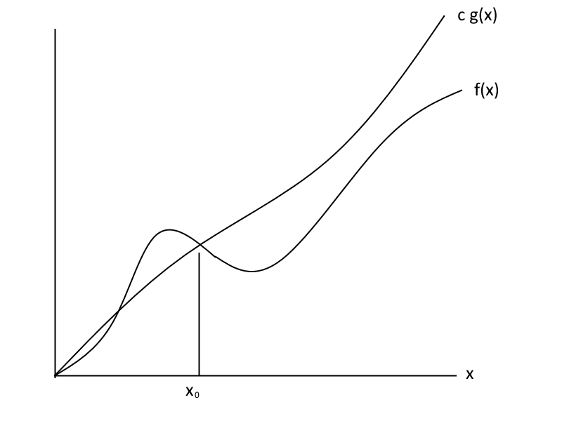
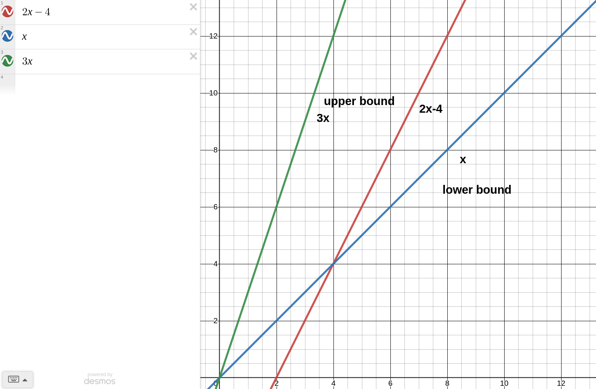

name: inverse
layout: true
class: center, middle, inverse

---

# ENSE 350: Math for Software Eng.

### Lecture 14: Asymptotic Notation

$\cdot$ Adam Tilson, M.A.Sc., P.Eng

---

layout: false
.left-column[
  ## Agenda
]
.right-column[
1. Asymptotic Notation
]
---

## Asymptotic Notation
- `Asymptotic Notation` is a shorthand notation used to give a quick measure of the behaviour of a function $f(n)$ as n grows large.
- Also knows as `Algorithmic complexity`.

---
## Asymptotic Equality

For real valued functions, $x \in \mathbb{R}$...
- $f(x) \approx g(x)$ means $\lim\limits_{n\to \infty} \frac{f(x)}{g(x)}=1$
- We say these functions are `asymptotically equal`

e.g. 
- $f(x) = x^2 - 30000x + 10^{10}$
- $g(x) = x^2 + 2x - 3$

---
## Asymptotic Equality

e.g.
- $f(x) = 3x + 4$
- $g(x) = 4x + 5$

---

## Little Oh
For real valued functions, $x, f(x), g(x) \in \mathbb{R}$...
- with $g(x)$ non-negative
- $f(x) \in o (g(x))$ means $\lim\limits_{n\to \infty} \frac{f(x)}{g(x)}=0$
- This means $g(x)$ is a strict upper bound of $f(x)$
- $f(x)$ is strictly asymptotically smaller
- We can conclusively say $g(x)$ is growing faster than $f(x)$

e.g.
- $f(x) = x^2 - 30000x + 10^{10}$
- $g(x) = x^3 - x^2 + 2x - 3$
---

## Little Oh

- $f(x) = x^2 - 30000x + 10^{10}$
- $g(x) = x^3 - x^2 + 2x - 3$

$\lim\limits_{n\to \infty} \frac{x^2 - 30000x + 10^{10}}{x^3 - x^2 + 2x - 3}$

$=\lim\limits_{n\to \infty} \frac{x^3(x^{-1} - 30000x^{-2} + 10^{10}x^{-3})}{x^3(1 - x^{-1} + 2x^{-2} - 3x^{-3})}$

$=\frac{(0) - 30000(0) + 10^{10}(0)}{1 - (0) + 2(0) - 3(0)} = 0$

---

## Big Oh

For real valued functions, $x, f(x), g(x) \in \mathbb{R}$...
- with $f(x), g(x)$ non-negative
- $f(x) \in O (g(x))$ means $\lim\limits_{n\to \infty} \frac{f(x)}{g(x)}<\infty$
- i.e. for some constants $c, x\_0$
  - $0 \leq f(x) \leq c \cdot g(x)$ for all $x \gt x\_0$
- This means $g(x)$ may be a *tight* upper bound of $f(x)$
- For large numbers ($x \gt x_0$), $g(x)$ is growing as fast or faster than $f(x)$, ignoring constants

---
## Big Oh



---

## Big Oh Examples:

The runtime to multiply $n \times n$ matrices

$T(n) \in O(n^3)$

"The run time is at most $n^3$"
---
## Tricky Big Oh Examples

Is $4^x \in O (2^x)$?

$\lim\limits_{n\to \infty} \frac{4^x}{2^x}$

= $\lim\limits_{n\to \infty} 2^x$

= $\infty$
no!

Is $10 \in O (1)$?
yes.

---

## Little Omega
For real valued functions, $x, f(x), g(x) \in \mathbb{R}$...
- with $g(x)$ non-negative
- $f(x) \in \omega (g(x))$ means $\lim\limits_{n\to \infty} \frac{f(x)}{g(x)}=\infty$
- This means $g(x)$ is a strict lower bound of $f(x)$
- $f(x)$ is strictly asymptotically larger
- We can conclusively say $g(x)$ is growing slower than $f(x)$

e.g.
- $f(x) = x^4 - 30000x^3 + 10^{10}$
- $g(x) = x^3 - x^2 + 2x - 3$

---

## Big Omega

For real valued functions, $x, f(x), g(x) \in \mathbb{R}$...
- with $f(x), g(x)$ non-negative
- $f(x) \in \Omega (g(x))$ means $\lim\limits_{n\to \infty} \frac{f(x)}{g(x)}>0$
- i.e. for some constants $c, x\_0$
  - $0 \leq c \cdot g(x) \leq f(x)$ for all $x \gt x\_0$
- This means $g(x)$ may be a *tight* lower bound of $f(x)$
- For large numbers ($x \gt x_0$)
  - $g(x)$ is growing as slow or slower than $f(x)$, ignoring constants

---

## Theta

$f(x) \in \Theta (g(x))$

iff

$f(x) \in O(g(x))$

and

$f(x) \in \Omega (g(x))$

i.e. $g(x)$ is a tight bound of $f(x)$

---

## Theta

Big O:

- i.e. for some constants $c_1, x\_1$
  - $0 \leq f(x) \leq c_1 \cdot g(x)$ for all $x \gt x\_1$

Big Omega:

- i.e. for some constants $c_2, x\_2$
  - $0 \leq c_2 \cdot g(x) \leq f(x)$ for all $x \gt x\_2$

Theta
- Both the preceding cases, with different $c$ and $x_0$ values.
---
## Summary

Up to constant factors...

||||
|---|---|---|
| $f(x) \in o (g(x))$ | means | $f(x) \lt g(x)$|
| $f(x) \in O (g(x))$ | means | $f(x) \lesssim g(x)$|
| $f(x) \in \Theta (g(x))$ | means | $f(x) \approx g(x)$|
| $f(x) \in \Omega (g(x))$ | means | $f(x) \gtrsim g(x)$|
| $f(x) \in \omega (g(x))$ | means | $f(x) \gt g(x)$|

---

## Not an Equality!

In this course we are using the set notation symbol for asymptotic notation

$f(x) \in O (g(x))$

In the real world you typically see:

$f(x) = O (g(x))$

However, no equality exists. This is needless confusing, but is common usage.

---

## Real world examples

Consider the following pseudocode.

Let $f(n)$ be a function of the math operations +,-,*,/ run as:

```py
def func(n):
    a = 5 
    b = 2
    for i in range(2,n):
        a = (a + i) * b
    print(a)
```

Find an appropriate math function for $g(n)$ such that:
$f(n) \in \Theta (g(n))$

---

## Real world examples

Consider the following pseudocode.

Let $f(n)$ be a function of the math operations +,-,*,/ run as:

```py
def func(n):
    a = 5 
    b = 2
    for i in range(2,n):  # n-2
        a = (a + i) * b   # 2
    print(a)
```

$f(x) = 2(n-2) = 2n-4$

$2n-4 \in \Theta (n)$

---

## Big O and Big Omega Examples



---

## Real world examples

Consider the following pseudocode.

Let $f(n)$ be a function of the math operations +,-,*,/ run as:

```py
def func(n):
    s = 0
    for i in range(1,n+1):
        for j in range (1,i+1):
          if (i//j)*j == i:
            s += 1
    print(s)
```

Find an appropriate math function for $g(n)$ such that:
$f(n) \in \Theta (g(n))$

---

## Real world examples

```py
def func(n):
    s = 0
    for i in range(1,n+1):         # ???
        for j in range (1,i+1):    # ???
          if (i//j)*j == i:        # 2
            s += 1
    print(s)
```

|||||||||||||
|---|---|---|---|---|---|---|---|---|---|---|---|
|i|1|2|2|3|3|3|...|n|n|n|n|
|j|1|1|2|1|2|3|...|1|2|...|n|

$1 + 2 + 3 + ... + n = \frac{n(n+1)}{2}$

$f(n) = \frac{2n(n+1)}{2} = n^2 + n \in \Theta(n^2)$

---

## Real world examples

Let's check it:

```py
def func(n):
    s = 0
    count = 0
    for i in range(1,n+1):         
        for j in range (1,i+1):    # n(n+1)/2
          count += 2
          if (i//j)*j == i:        # 2
            s += 1
    #print(s)
    print(count)
```

```
... 
>>> func(1)
2
>>> func(2)
6
>>> func(3)
12 
```

---


### References

- Dr. Abdul Bais's ENSE 350 Slides
- Tom Leighton, and Marten Dijk. 6.042J Mathematics for Computer Science. Fall 2010, Lectures 12, 13. Massachusetts Institute of Technology: MIT OpenCourseWare, https://ocw.mit.edu. License: Creative Commons BY-NC-SA.
---

name: inverse
layout: true
class: center, middle, inverse
---
# Questions?
