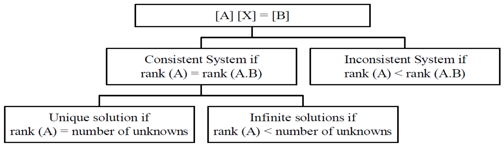

name: inverse
layout: true
class: center, middle, inverse

---

# ENSE 350: Math for Software Eng.

### Lecture 14: Iterative Methods: Solving Systems of Linear Equations

Adam Tilson, M.A.Sc., Engineer-in-Training

---

layout: false
.left-column[
  ## Agenda
]
.right-column[
1. Row, Column Vectors and Matrices
2. Upper and Lower Triangular Matrices
3. Identity Matrix
4. Matrix Operations
5. Matrix Laws
6. Transpose
7. Linear Independence
8. Trace
9. Determinant
10. Rank
11. System of Linear Equations
12. Matrix Inversion
]
---
## Row Vector, Column Vector and Matrix
$
\vec{r} = 
\begin{bmatrix}
1 & 2 & 3\\\\
\end{bmatrix}
$

$
\vec{c} = 
\begin{bmatrix}
1 \\\\
2 \\\\
3
\end{bmatrix}
$

Orientation of vectors only matters when treating them like matrices.

$
M = 
\begin{bmatrix}
1 & 2 & 3\\\\
2 & 3 & 4\\\\
3 & 4 & 5 
\end{bmatrix}
$
---
## Row Vector, Column Vector and Matrix

`Square Matrix` - The number of rows and columns are equal, e.g. $3\times 3$, $5\times 5$

$
A = 
\begin{bmatrix}
1 & 2 & 3\\\\
2 & 3 & 4\\\\
3 & 4 & 5 
\end{bmatrix}
$

$a\_{3,2}$ = element of $A$, row #$3$, column #$2 = 4$

- Indexing system does not start at $0$!
---
## Dot Product

The `dot product` of two vectors of equal length is the sum of the element-wise products.

$
\begin{bmatrix}
1 & 2 & 3\\\\
\end{bmatrix} \cdot \begin{bmatrix}
6 \\\\
7 \\\\
8
\end{bmatrix}
$

= $(1 \times 6) + (2 \times 7) + (3 \times 8) = 6 + 14 + 24 = 44$

For dot product, vector orientation doesn't matter.

---
## Upper Triangular Matrix, Lower Triangular Matrix

$
  \begin{bmatrix}
    a\_{11} & a\_{12} & a\_{13} \\\\
    a\_{21} & a\_{22} & a\_{23} \\\\
    a\_{31} & a\_{32} & a\_{33}
  \end{bmatrix} =
  \begin{bmatrix}
    \ell\_{11} &         0 & 0         \\\\
    \ell\_{21} & \ell\_{22} & 0         \\\\
    \ell\_{31} & \ell\_{32} & \ell\_{33}
  \end{bmatrix}
  \begin{bmatrix}
    u\_{11} & u\_{12} & u\_{13} \\\\
         0 & u\_{22} & u\_{23} \\\\
         0 &      0 & u\_{33}
  \end{bmatrix}
$

e.g.

$
L = 
\begin{bmatrix}
1 & 0 & 0\\\\
2 & 3 & 0\\\\
3 & 4 & 5 
\end{bmatrix} U = 
\begin{bmatrix}
1 & 2 & 3\\\\
0 & 3 & 4\\\\
0 & 0 & 5 
\end{bmatrix}
$
---
## Diagonal and Identity Matrices 

`Diagonal Matrix` - Only has values along the diagonal

$
D = 
\begin{bmatrix}
1 & 0 & 0\\\\
0 & 0 & 0\\\\
0 & 0 & 5 
\end{bmatrix}
$

`Identity Matrix` - All values along the diagonal = $1$, others = $0$.

$
I = 
\begin{bmatrix}
1 & 0 & 0\\\\
0 & 1 & 0\\\\
0 & 0 & 1 
\end{bmatrix}. AI = A
$
---
## Matrix Addition, Subtraction

`Matrix Addition` is element-wise addition

$C = A + B = B + A$

`Matrix Subtraction` is element-wise subtraction

$C = A - B$

$A$, $B$, $C$ must have the same dimensions.

---
## Matrix Multiplication

`Matrix Multiplication`, for matrices $A\_{m\times n}$, $B\_{n\times p}$,

$\text{columns}(A) = \text{rows}(B)$

$AB = C$, where

Math style:

$c\_{ij} = a\_{i1}b\_{1j} + a\_{i2}b\_{2j} +\cdots + a\_{in}b\_{nj}= \sum\_{k=1}^n a\_{ik}b\_{kj}$

---
## Matrix Multiplication

Pseudo-code style:

- For each row in $A$, create a row vector
  - For each column in $B$, create a column vector
      - take the dot product of the row and column vector
      - Store the result in a new matrix in the intersection of the row and the column

$
  \begin{bmatrix}
    1 & 4 & 7 \\\\
    2 & 5 & 8 \\\\
    3 & 6 & 9
  \end{bmatrix}
  \begin{bmatrix}
    3 & 4 & 5 \\\\
    6 & 7 & 8 \\\\
    9 & 10 & 11
  \end{bmatrix}=
  \begin{bmatrix}
    90 & 102 & 114 \\\\
    108 & 123 & 138 \\\\
    126 & 144 & 162
  \end{bmatrix}
$

---
## Matrix Multiplication

$(2 \times 5) + (5 \times 8) + (8 \times 11)$

$= 10 + 40 + 88 = 138$

---
## Scalar Multiplication

When a matrix is multiplied by a scalar, every element in the matrix is multiplied by that scalar.

e.g.

$
  3 \times
  \begin{bmatrix}
    3 & 4 & 5 \\\\
    6 & 7 & 8 \\\\
    9 & 10 & 11
  \end{bmatrix}=
  \begin{bmatrix}
    9 & 12 & 15 \\\\
    18 & 21 & 24 \\\\
    27 & 30 & 33
  \end{bmatrix}
$
---
## Matrix Laws
Addition is commutative: 
- $A + B = B + A$

Multiplication is not: 
- $AB \neq BA$

However, the following rules hold: 
- $(AB)C = A(BC)$
- $A(B+C) = AB + AC$
- $(A + B)C = AB + BC$

---
## Transpose
$A=   \begin{bmatrix}
    9 & 1  \\\\
    8 & 2  \\\\
    7 & 3 
  \end{bmatrix}
$
$A^T=   \begin{bmatrix}
    9 & 8 & 7  \\\\
    1 & 2 & 3
  \end{bmatrix}
$

If $A = A^T$, the matrix is `symmetric`

$S = \begin{bmatrix}
    9 & 8 & 7  \\\\
    8 & 2 & 3  \\\\
    7 & 3 & 4  \\\\
\end{bmatrix}$

---
## Linear Independence

Vectors $\vec{v_1}, \vec{v_2}, \vec{v_3}$ are `Linearly independent` if none be re-written as a linear combination of others.

$k_1 \begin{bmatrix}
    a_1  \\\\
    a_2  \\\\
    a_3 
  \end{bmatrix} + k_2   \begin{bmatrix}
    b_1  \\\\
    b_2  \\\\
    b_3 
  \end{bmatrix} + k_3   \begin{bmatrix}
    c_1  \\\\
    c_2  \\\\
    c_3 
  \end{bmatrix} = 0
  $
  
  iff $k_1 = k_2 = k_3 = 0$. (No solutions)
---
## Linear Independence

e.g.

$\vec{v_1}=   \begin{bmatrix}
    1  \\\\
    0  \\\\
    0 
  \end{bmatrix}, \vec{v_2}=   \begin{bmatrix}
    0  \\\\
    1  \\\\
    0 
  \end{bmatrix}, \vec{v_3}=   \begin{bmatrix}
    0  \\\\
    0  \\\\
    1 
  \end{bmatrix}
$

The only solution to: 

$k\_1 \vec{v_1} + k\_2 \vec{v_2} + k\_3 \vec{v_3} = 0$ 

$k_1 = k_2 = k_3 = 0$.

---
## Linear Combination

A `linear combination` can be made if the vectors are not linearly independent:

$\vec{v_1}=   \begin{bmatrix}
    1  \\\\
    0  \\\\
    0 
  \end{bmatrix}, \vec{v_2}=   \begin{bmatrix}
    0  \\\\
    1  \\\\
    0 
  \end{bmatrix}, \vec{v_3}=   \begin{bmatrix}
    5  \\\\
    -5  \\\\
    0
  \end{bmatrix}
$

$k\_1 \vec{v_1} + k\_2 \vec{v_2} + k\_3 \vec{v_3} = 0$ 

$\vec{v_3} = 5 \vec{v_2} -5 \vec{v_2}$.

$k\_1 = 5, k\_2 = -5, k\_3 = 1$ 

---
## Trace of a Matrix

A `Trace` of a matrix is the sum of the elements on the diagonals

$$\text{Trace}(A) = \sum\_{i=1}^{n}a\_{ii}$$

e.g. 
$
  \text{Trace}\begin{pmatrix}\begin{bmatrix}
    9 & 12 & 15 \\\\
    18 & 21 & 24 \\\\
    27 & 30 & 33
  \end{bmatrix}\end{pmatrix} = 9 + 21 + 33 = 63
$

---
## Determinant

An operation defined for square matrices of any size.

For matrix $A$, written as $\text{det}(A)$ or $|A|$

The determinant of a $2 \times 2$ matrix is:

$
\begin{align}|A| = \begin{vmatrix} a & b\\\\
c & d \end{vmatrix}=ad-bc.\end{align}
$

We can use this in a recursive approach...

---
## Determinant

For larger matrices, take a recursive approach

- To find the determinant of a Matrix:
  - Select any row or column of the Matrix
  - The determinant is the sum of:
      - Each element $a\_{i,j}$ in that row or column
      - Multiplied by the `co-factor`, i.e.
          - Take the corresponding sign from the `checkerboard` matrix
          - Multiply by the determinant of the matrix where the row and column corresponding to $a\_{i,j}$ are removed.
- Hint: Strategic row or column selection can minimize work

---
### Checkerboard Matrix

$(-1)^{i+j} = 
  \begin{bmatrix}
    1 & -1 & 1 & \cdots \\\\
    -1 & 1 & -1 & \cdots \\\\
    1 & -1 & 1 & \cdots \\\\
    \vdots & \vdots & \vdots& \ddots
  \end{bmatrix}
$

---

### Determinant Example:
$
  \begin{vmatrix}
    7 & 8 & 9 \\\\
    0 & 10 & 3 \\\\
    1 & 0 & 2
  \end{vmatrix}
$

Checkerboard Matrix
$
  \begin{bmatrix}
    1 & -1 & 1  \\\\
    -1 & 1 & -1 \\\\
    1 & -1 & 1
  \end{bmatrix}
$

Using the top row...
$= 7 \times (1) \times   \begin{vmatrix}
    10 & 3 \\\\
    0 & 2
  \end{vmatrix} + (-1) \times 8 \times \begin{vmatrix}
    0 & 3 \\\\
    1 & 2
  \end{vmatrix} + 9 \times (1) \times \begin{vmatrix}
    0 & 10 \\\\
    1 & 0
  \end{vmatrix} $

---
$= 7 \times (1) \times   \begin{vmatrix}
    10 & 3 \\\\
    0 & 2
  \end{vmatrix} + (-1) \times 8 \times \begin{vmatrix}
    0 & 3 \\\\
    1 & 2
  \end{vmatrix} + 9 \times (1) \times \begin{vmatrix}
    0 & 10 \\\\
    1 & 0
  \end{vmatrix} $

$= 7 \times 1 \times (10 \times 2-0 \times 3) $
$+ -1 \times 8 \times (0 \times 2-1 \times 3) $
$+ 9 \times 1 \times (0 \times 0-1 \times 10) $

$= 7 \times 20 - 8 \times -3 + 9 \times -10$

$= 140 + 24 -90$

$= 74$

---

### Determinant Example Take 2:
$
  \begin{vmatrix}
    7 & 8 & 9 \\\\
    0 & 10 & 3 \\\\
    1 & 0 & 2
  \end{vmatrix}
$

Checkerboard Matrix
$
  \begin{bmatrix}
    1 & -1 & 1 \\\\
    -1 & 1 & -1 \\\\
    1 & -1 & 1
  \end{bmatrix}
$

Using the left-most column...
$= 7 \times (1) \times   \begin{vmatrix}
    10 & 3 \\\\
    0 & 2
  \end{vmatrix} + 1 \times (1) \times \begin{vmatrix}
    8 & 3 \\\\
    10 & 9
  \end{vmatrix} $

---
$= 7 \times (1) \times   \begin{vmatrix}
    10 & 3 \\\\
    0 & 2
  \end{vmatrix} + 1 \times (1) \times \begin{vmatrix}
    8 & 9 \\\\
    10 & 3
  \end{vmatrix} $

$= 7 \times 1 \times (10 \times 2-0 \times 3) $
$+ 1 \times 1 \times (8 \times 3-10 \times 9) $

$= 7 \times 20 + 1 \times (24 - 90)$

$= 140 + 24 -90$

$= 74$
---
### Properties of a determinant

- Theorem 1: If a row or column in an $n \times n$ matrix $A$ is zero, then $|A| = 0$.
- Theorem 2: If a row in an $n \times n$ matrix $A$ is proportional to another row, $|A| = 0$.
- Theorem 3: If a column in an $n \times n$ matrix $A$ is proportional to another column, $|A| = 0$.
- Theorem 4: If a row or column in an $n \times n$ matrix $A$ is multiplied by $k$ to produce matrix $B$, i.e. $B = kA$, then $|B| = k |A|$.
- Theorem 5: If A is an upper or lower triangular matrix, then $|A| = \prod\_{i=1}^{n}a\_{ii}$, i.e. the product of the elements of the diagonal.

---
## Rank of a Matrix

The rank of a matrix is defined as the order of the largest square sub-matrix whose determinant is zero.

e.g. Rank is 3

$
  \begin{bmatrix}
    7 & 8 & 9 & 1 \\\\
    0 & 10 & 3 & 2\\\\
    1 & 0 & 2 & 3
  \end{bmatrix}
$

---
e.g. Rank is 2

$
  \begin{bmatrix}
    7 & 8 & 9 & 1 \\\\
    0 & 10 & 3 & 2\\\\
    0 & 0 & 0 & 0
  \end{bmatrix}
$

e.g. Rank is 4 (`Full Rank`)

$
  \begin{bmatrix}
    1 & 0 & 0 & 0 \\\\
    0 & 0 & 0 & 1\\\\
    0 & 1 & 0 & 0\\\\
    0 & 0 & 1 & 0
  \end{bmatrix}
$

---
e.g. Rank is 2, because columns 1 and 2 are not linearly independent (`Rank deficient`)

$ A =
  \begin{bmatrix}
    1 & 2 & 0\\\\
    2 & 4 & 1\\\\
    3 & 6 & 0
  \end{bmatrix}
$

$|A| = 0$, so $\text{rank}(A) < 3$

---
## Systems of Linear Equations
- Can be expressed using matrices:

$2x\_1 + 3x\_2 + x\_3 = 2$

$x\_1 - 2x\_2 + 4x\_3 = 4$

$x\_2 - x\_3 = 1$

$\begin{bmatrix}
    2 & 3 & 1\\\\
    1 & -2 & 4\\\\
    0 & 1 & -1
  \end{bmatrix} 
  \begin{bmatrix}
    x\_1\\\\
    x\_2\\\\
    x\_3
  \end{bmatrix}=\begin{bmatrix}
    2\\\\
    4\\\\
    1
  \end{bmatrix}$

---
## Augmented Matrix

$A\vec{x}=\vec{b}=\begin{bmatrix}
    2 & 3 & 1\\\\
    1 & -2 & 4\\\\
    0 & 1 & -1
  \end{bmatrix} 
  \begin{bmatrix}
    x\_1\\\\
    x\_2\\\\
    x\_3
  \end{bmatrix}=\begin{bmatrix}
    2\\\\
    4\\\\
    1
  \end{bmatrix}$

The `augmented matrix`, $A.B$ appends the `right-hand-side vector`, $B$, to the right of the `coefficient matrix`, $A$.

$A.B = \begin{bmatrix}
    2 & 3 & 1 & 2\\\\
    1 & -2 & 4 & 4\\\\
    0 & 1 & -1 & 1
  \end{bmatrix} $

---
## Possible Solutions:

- No solutions
- One unique solution
- Infinitely many solutions

---
### Possible Solutions Visualized:

---
### Example: One unique solution
$A.B = \begin{bmatrix}
    1 & 1 & 0 & 2\\\\
    0 & 1 & 1 & 4\\\\
    0 & 0 & 1 & 7
  \end{bmatrix} $

$\text{Rank}(A) = \text{Rank}(A.B) = 3$

$x_3 = 7, x_2 = -3, x_1 = 5$
---
### Example: Infinitely many solutions
$A.B = \begin{bmatrix}
    1 & 1 & 0 & 2\\\\
    0 & 1 & 1 & 4\\\\
    0 & 2 & 2 & 8
  \end{bmatrix} $

$\text{Rank}(A) = 2$

Number Unknowns $ = 3$

$\text{Rank}(A) < $ Number Unknowns

$x_1 + x_2 = 2, x_2 + x_3 = 4$

---
### Example: No solutions
$A.B = \begin{bmatrix}
    0 & 0 & 1 & 2\\\\
    1 & 1 & 1 & 4\\\\
    2 & 2 & 2 & 7
  \end{bmatrix} $

Rows 2, 3 are inconsistent!
2 (Row 2) - Row 3 => 0 = 1
---
## Matrix Inversion

A square matrix is invertible if $|A| \neq 0$

$A A^{-1} = A^{-1} A = I$

$A^{-1} = \frac{1}{|A|} (\text{adj}(A))$

$\text{adj}(A)$ is the `adjugate matrix`

$\text{adj}(A) = C^T$

$C$ is the `co-factor matrix`

---
### Matrix Inversion

$\text{adj}(A) = C^T$

$C$ is the `co-factor matrix`, which is the matrix where...
- For each element $a\_{i,j}$ in that row or column
- Take the the corresponding sign from the "checkerboard" matrix
- Multiplied by the determinant of the matrix where the row and column corresponding to $a\_{i,j}$ are removed.
- We've seen these co-factors when computing the determinant recursively!
---
### Why to use Matrix Inversion

If $A$ is invertible then...

$A \vec{x} = \vec{b}$

$A^{-1}A\vec{x} = A^{-1}\vec{b}$

$I\vec{x} = A^{-1}\vec{b}$

$\vec{x} = A^{-1}\vec{b}$

If we compute $A^{-1}$ once, we could re-use it to rapidly get different $\vec{x}$ for different $\vec{b}$'s.

---

### Matrix Inversion Woes

The formally defined inversion process is prohibitively slow!
- For every term in the co-factor matrix, you need to compute the `Minor`, i.e. the Matrix with the row and column removed.
- Since the process is recursive, this grows very fast as the matrices gets larger

In the next lecture we'll look at some methods for solving systems of linear equations!

---

### References

- Dr. Abdul Bais's ENSE 350 Slides
---

name: inverse
layout: true
class: center, middle, inverse
---
# Questions?
