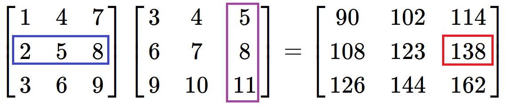
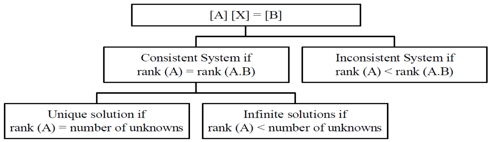
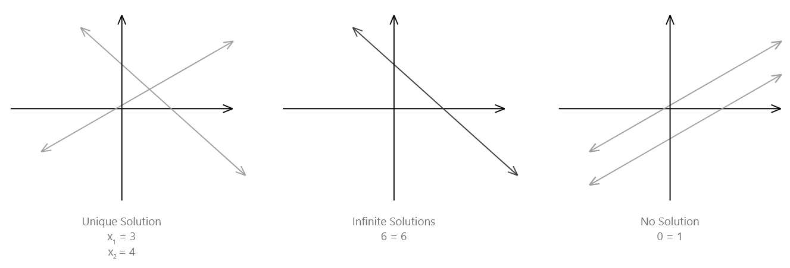

name: inverse
layout: true
class: center, middle, inverse

---

# ENSE 350: Math for Software Eng.

### Lecture 16: Algorithms for Solving Systems of Linear Equations

$\cdot$ Adam Tilson, M.A.Sc., P.Eng

---

layout: false
.left-column[
  ## Agenda
]
.right-column[
1. Row, Column Vectors and Matrices
2. Upper and Lower Triangular Matrices
3. Identity Matrix
4. Matrix Operations
5. Matrix Laws
6. Transpose
7. Linear Independence
8. Trace
9. Determinant
10. Rank
11. System of Linear Equations
12. Matrix Inversion
13. Gauss-Jordan Elimination
14. LU Decomposition
]
---
## Row Vector, Column Vector and Matrix
$
\vec{r} = 
\begin{bmatrix}
1 & 2 & 3\\\\
\end{bmatrix}
$

$
\vec{c} = 
\begin{bmatrix}
1 \\\\
2 \\\\
3
\end{bmatrix}
$

Orientation of vectors only matters when treating them like matrices.

$
M = 
\begin{bmatrix}
1 & 2 & 3\\\\
2 & 3 & 4\\\\
3 & 4 & 5 
\end{bmatrix}
$
---
## Row Vector, Column Vector and Matrix

`Square Matrix` - The number of rows and columns are equal, e.g. $3\times 3$, $5\times 5$

$
A = 
\begin{bmatrix}
1 & 2 & 3\\\\
2 & 3 & 4\\\\
3 & 4 & 5 
\end{bmatrix}
$

$a\_{3,2}$ = element of $A$, row #$3$, column #$2 = 4$

- Indexing system does not start at $0$!
---
## Dot Product

The `dot product` of two vectors of equal length is the sum of the element-wise products.

$
\begin{bmatrix}
1 & 2 & 3\\\\
\end{bmatrix} \cdot \begin{bmatrix}
6 \\\\
7 \\\\
8
\end{bmatrix}
$

= $(1 \times 6) + (2 \times 7) + (3 \times 8) = 6 + 14 + 24 = 44$

For dot product, vector orientation doesn't matter.

---
## Upper Triangular Matrix, Lower Triangular Matrix

$
  \begin{bmatrix}
    a\_{11} & a\_{12} & a\_{13} \\\\
    a\_{21} & a\_{22} & a\_{23} \\\\
    a\_{31} & a\_{32} & a\_{33}
  \end{bmatrix} =
  \begin{bmatrix}
    \ell\_{11} &         0 & 0         \\\\
    \ell\_{21} & \ell\_{22} & 0         \\\\
    \ell\_{31} & \ell\_{32} & \ell\_{33}
  \end{bmatrix}
  \begin{bmatrix}
    u\_{11} & u\_{12} & u\_{13} \\\\
         0 & u\_{22} & u\_{23} \\\\
         0 &      0 & u\_{33}
  \end{bmatrix}
$

e.g.

$
L = 
\begin{bmatrix}
1 & 0 & 0\\\\
2 & 3 & 0\\\\
3 & 4 & 5 
\end{bmatrix} U = 
\begin{bmatrix}
1 & 2 & 3\\\\
0 & 3 & 4\\\\
0 & 0 & 5 
\end{bmatrix}
$
---
## Diagonal and Identity Matrices 

`Diagonal Matrix` - Only has values along the diagonal

$
D = 
\begin{bmatrix}
1 & 0 & 0\\\\
0 & 0 & 0\\\\
0 & 0 & 5 
\end{bmatrix}
$

`Identity Matrix` - All values along the diagonal = $1$, others = $0$.

$
I = 
\begin{bmatrix}
1 & 0 & 0\\\\
0 & 1 & 0\\\\
0 & 0 & 1 
\end{bmatrix}. AI = A
$
---
## Matrix Addition, Subtraction

`Matrix Addition` is element-wise addition

$C = A + B = B + A$

`Matrix Subtraction` is element-wise subtraction

$C = A - B$

$A$, $B$, $C$ must have the same dimensions.

---
## Matrix Multiplication

`Matrix Multiplication`, for matrices $A\_{m\times n}$, $B\_{n\times p}$,

$\text{columns}(A) = \text{rows}(B)$

$AB = C$, where

Math style:

$c\_{ij} = a\_{i1}b\_{1j} + a\_{i2}b\_{2j} +\cdots + a\_{in}b\_{nj}= \sum\_{k=1}^n a\_{ik}b\_{kj}$

---
## Matrix Multiplication

Pseudo-code style:

- For each row in $A$, create a row vector
  - For each column in $B$, create a column vector
      - take the dot product of the row and column vector
      - Store the result in a new matrix in the intersection of the row and the column

$
  \begin{bmatrix}
    1 & 4 & 7 \\\\
    2 & 5 & 8 \\\\
    3 & 6 & 9
  \end{bmatrix}
  \begin{bmatrix}
    3 & 4 & 5 \\\\
    6 & 7 & 8 \\\\
    9 & 10 & 11
  \end{bmatrix}=
  \begin{bmatrix}
    90 & 102 & 114 \\\\
    108 & 123 & 138 \\\\
    126 & 144 & 162
  \end{bmatrix}
$

---
## Matrix Multiplication

$(2 \times 5) + (5 \times 8) + (8 \times 11)$

$= 10 + 40 + 88 = 138$

---
## Scalar Multiplication

When a matrix is multiplied by a scalar, every element in the matrix is multiplied by that scalar.

e.g.

$
  3 \times
  \begin{bmatrix}
    3 & 4 & 5 \\\\
    6 & 7 & 8 \\\\
    9 & 10 & 11
  \end{bmatrix}=
  \begin{bmatrix}
    9 & 12 & 15 \\\\
    18 & 21 & 24 \\\\
    27 & 30 & 33
  \end{bmatrix}
$
---
## Matrix Laws
Addition is commutative: 
- $A + B = B + A$

Multiplication is not: 
- $AB \neq BA$

However, the following rules hold: 
- $(AB)C = A(BC)$
- $A(B+C) = AB + AC$
- $(A + B)C = AB + BC$

---
## Transpose
$A=   \begin{bmatrix}
    9 & 1  \\\\
    8 & 2  \\\\
    7 & 3 
  \end{bmatrix}
$
$A^T=   \begin{bmatrix}
    9 & 8 & 7  \\\\
    1 & 2 & 3
  \end{bmatrix}
$

If $A = A^T$, the matrix is `symmetric`

$S = \begin{bmatrix}
    9 & 8 & 7  \\\\
    8 & 2 & 3  \\\\
    7 & 3 & 4  \\\\
\end{bmatrix}$

---
## Linear Independence

Vectors $\vec{v_1}, \vec{v_2}, \vec{v_3}$ are `Linearly independent` if none be re-written as a linear combination of others.

$k_1 \begin{bmatrix}
    a_1  \\\\
    a_2  \\\\
    a_3 
  \end{bmatrix} + k_2   \begin{bmatrix}
    b_1  \\\\
    b_2  \\\\
    b_3 
  \end{bmatrix} + k_3   \begin{bmatrix}
    c_1  \\\\
    c_2  \\\\
    c_3 
  \end{bmatrix} = 0
  $
  
  iff $k_1 = k_2 = k_3 = 0$. (No solutions)
---
## Linear Independence

e.g.

$\vec{v_1}=   \begin{bmatrix}
    1  \\\\
    0  \\\\
    0 
  \end{bmatrix}, \vec{v_2}=   \begin{bmatrix}
    0  \\\\
    1  \\\\
    0 
  \end{bmatrix}, \vec{v_3}=   \begin{bmatrix}
    0  \\\\
    0  \\\\
    1 
  \end{bmatrix}
$

The only solution to: 

$k\_1 \vec{v_1} + k\_2 \vec{v_2} + k\_3 \vec{v_3} = 0$ 

$k_1 = k_2 = k_3 = 0$.

---
## Linear Combination

A `linear combination` can be made if the vectors are not linearly independent:

$\vec{v_1}=   \begin{bmatrix}
    1  \\\\
    0  \\\\
    0 
  \end{bmatrix}, \vec{v_2}=   \begin{bmatrix}
    0  \\\\
    1  \\\\
    0 
  \end{bmatrix}, \vec{v_3}=   \begin{bmatrix}
    5  \\\\
    -5  \\\\
    0
  \end{bmatrix}
$

$k\_1 \vec{v_1} + k\_2 \vec{v_2} + k\_3 \vec{v_3} = 0$ 

$\vec{v_3} = 5 \vec{v_1} -5 \vec{v_2}$.

$k\_1 = 5, k\_2 = -5, k\_3 = 1$ 

---
## Trace of a Matrix

A `Trace` of a matrix is the sum of the elements on the diagonals

$$\text{Trace}(A) = \sum\_{i=1}^{n}a\_{ii}$$

e.g. 
$
  \text{Trace}\begin{pmatrix}\begin{bmatrix}
    9 & 12 & 15 \\\\
    18 & 21 & 24 \\\\
    27 & 30 & 33
  \end{bmatrix}\end{pmatrix} = 9 + 21 + 33 = 63
$

---
## Determinant

An operation defined for square matrices of any size.

For matrix $A$, written as $\text{det}(A)$ or $|A|$

The determinant of a $2 \times 2$ matrix is:

$
\begin{align}|A| = \begin{vmatrix} a & b\\\\
c & d \end{vmatrix}=ad-bc.\end{align}
$

We can use this in a recursive approach...

---
## Determinant

For larger matrices, take a recursive approach

- To find the determinant of a Matrix:
  - Select any row or column of the Matrix
  - The determinant is the sum of:
      - Each element $a\_{i,j}$ in that row or column
      - Multiplied by the `co-factor`, i.e.
          - Take the corresponding sign from the `checkerboard` matrix
          - Multiply by the determinant of the matrix where the row and column corresponding to $a\_{i,j}$ are removed.
- Hint: Strategic row or column selection can minimize work

---
### Checkerboard Matrix

$(-1)^{i+j} = 
  \begin{bmatrix}
    1 & -1 & 1 & \cdots \\\\
    -1 & 1 & -1 & \cdots \\\\
    1 & -1 & 1 & \cdots \\\\
    \vdots & \vdots & \vdots& \ddots
  \end{bmatrix}
$

---

### Determinant Example:
$
  \begin{vmatrix}
    7 & 8 & 9 \\\\
    0 & 10 & 3 \\\\
    1 & 0 & 2
  \end{vmatrix}
$

Checkerboard Matrix
$
  \begin{bmatrix}
    1 & -1 & 1  \\\\
    -1 & 1 & -1 \\\\
    1 & -1 & 1
  \end{bmatrix}
$

Using the top row...
$= 7 \times (1) \times   \begin{vmatrix}
    10 & 3 \\\\
    0 & 2
  \end{vmatrix} + (-1) \times 8 \times \begin{vmatrix}
    0 & 3 \\\\
    1 & 2
  \end{vmatrix} + 9 \times (1) \times \begin{vmatrix}
    0 & 10 \\\\
    1 & 0
  \end{vmatrix} $

---
$= 7 \times (1) \times   \begin{vmatrix}
    10 & 3 \\\\
    0 & 2
  \end{vmatrix} + (-1) \times 8 \times \begin{vmatrix}
    0 & 3 \\\\
    1 & 2
  \end{vmatrix} + 9 \times (1) \times \begin{vmatrix}
    0 & 10 \\\\
    1 & 0
  \end{vmatrix} $

$= 7 \times 1 \times (10 \times 2-0 \times 3) $
$+ -1 \times 8 \times (0 \times 2-1 \times 3) $
$+ 9 \times 1 \times (0 \times 0-1 \times 10) $

$= 7 \times 20 - 8 \times -3 + 9 \times -10$

$= 140 + 24 -90$

$= 74$

---

### Determinant Example Take 2:
$
  \begin{vmatrix}
    7 & 8 & 9 \\\\
    0 & 10 & 3 \\\\
    1 & 0 & 2
  \end{vmatrix}
$

Checkerboard Matrix
$
  \begin{bmatrix}
    1 & -1 & 1 \\\\
    -1 & 1 & -1 \\\\
    1 & -1 & 1
  \end{bmatrix}
$

Using the left-most column...
$= 7 \times (1) \times   \begin{vmatrix}
    10 & 3 \\\\
    0 & 2
  \end{vmatrix} + 1 \times (1) \times \begin{vmatrix}
    8 & 3 \\\\
    10 & 9
  \end{vmatrix} $

---
$= 7 \times (1) \times   \begin{vmatrix}
    10 & 3 \\\\
    0 & 2
  \end{vmatrix} + 1 \times (1) \times \begin{vmatrix}
    8 & 9 \\\\
    10 & 3
  \end{vmatrix} $

$= 7 \times 1 \times (10 \times 2-0 \times 3) $
$+ 1 \times 1 \times (8 \times 3-10 \times 9) $

$= 7 \times 20 + 1 \times (24 - 90)$

$= 140 + 24 -90$

$= 74$
---
### Properties of a determinant

- Theorem 1: If a row or column in an $n \times n$ matrix $A$ is zero, then $|A| = 0$.
- Theorem 2: If a row in an $n \times n$ matrix $A$ is proportional to another row, $|A| = 0$.
- Theorem 3: If a column in an $n \times n$ matrix $A$ is proportional to another column, $|A| = 0$.
- Theorem 4: If a row or column in an $n \times n$ matrix $A$ is multiplied by $k$ to produce matrix $B$, i.e. $B = kA$, then $|B| = k |A|$.
- Theorem 5: If A is an upper or lower triangular matrix, then $|A| = \prod\_{i=1}^{n}a\_{ii}$, i.e. the product of the elements of the diagonal.

---
## Rank of a Matrix

The rank of a matrix is defined as the order of the largest square sub-matrix whose determinant is non-zero.

e.g. Rank is 3

$
  \begin{bmatrix}
    7 & 8 & 9 & 1 \\\\
    0 & 10 & 3 & 2\\\\
    1 & 0 & 2 & 3
  \end{bmatrix}
$

---
e.g. Rank is 2

$
  \begin{bmatrix}
    7 & 8 & 9 & 1 \\\\
    0 & 10 & 3 & 2\\\\
    0 & 0 & 0 & 0
  \end{bmatrix}
$

e.g. Rank is 4 (`Full Rank`)

$
  \begin{bmatrix}
    1 & 0 & 0 & 0 \\\\
    0 & 0 & 0 & 1\\\\
    0 & 1 & 0 & 0\\\\
    0 & 0 & 1 & 0
  \end{bmatrix}
$

---
e.g. Rank is 2, because columns 1 and 2 are not linearly independent (`Rank deficient`)

$ A =
  \begin{bmatrix}
    1 & 2 & 0\\\\
    2 & 4 & 1\\\\
    3 & 6 & 0
  \end{bmatrix}
$

$|A| = 0$, so $\text{rank}(A) < 3$

---
## Systems of Linear Equations
- Can be expressed using matrices:

$2x\_1 + 3x\_2 + x\_3 = 2$

$x\_1 - 2x\_2 + 4x\_3 = 4$

$x\_2 - x\_3 = 1$

$\begin{bmatrix}
    2 & 3 & 1\\\\
    1 & -2 & 4\\\\
    0 & 1 & -1
  \end{bmatrix} 
  \begin{bmatrix}
    x\_1\\\\
    x\_2\\\\
    x\_3
  \end{bmatrix}=\begin{bmatrix}
    2\\\\
    4\\\\
    1
  \end{bmatrix}$

---
## Augmented Matrix

$A\vec{x}=\vec{b}=\begin{bmatrix}
    2 & 3 & 1\\\\
    1 & -2 & 4\\\\
    0 & 1 & -1
  \end{bmatrix} 
  \begin{bmatrix}
    x\_1\\\\
    x\_2\\\\
    x\_3
  \end{bmatrix}=\begin{bmatrix}
    2\\\\
    4\\\\
    1
  \end{bmatrix}$

The `augmented matrix`, $A.B$ appends the `right-hand-side vector`, $B$, to the right of the `coefficient matrix`, $A$.

$A.B = \begin{bmatrix}\begin{array}{ccc|c}
    2 & 3 & 1 & 2\\\\
    1 & -2 & 4 & 4\\\\
    0 & 1 & -1 & 1
  \end{array}\end{bmatrix}$

---
## Possible Solutions:

- No solutions
- One unique solution
- Infinitely many solutions

---
### Possible Solutions Visualized:

---
### Example: One unique solution
$A.B = \begin{bmatrix}\begin{array}{ccc|c}
    1 & 1 & 0 & 2\\\\
    0 & 1 & 1 & 4\\\\
    0 & 0 & 1 & 7
  \end{array}\end{bmatrix} $

$\text{Rank}(A) = \text{Rank}(A.B) = 3$

$x_3 = 7, x_2 = -3, x_1 = 5$
---
### Example: Infinitely many solutions
$A.B = \begin{bmatrix}\begin{array}{ccc|c}
    1 & 1 & 0 & 2\\\\
    0 & 1 & 1 & 4\\\\
    0 & 2 & 2 & 8
  \end{array}\end{bmatrix} $

$\text{Rank}(A) = 2$

Number Unknowns $ = 3$

$\text{Rank}(A) < $ Number Unknowns

$x_1 + x_2 = 2, x_2 + x_3 = 4$

---
### Example: No solutions
$A.B = \begin{bmatrix}\begin{array}{ccc|c}
    0 & 0 & 1 & 2\\\\
    1 & 1 & 1 & 4\\\\
    2 & 2 & 2 & 7
  \end{array}\end{bmatrix} $

Rows 2, 3 are inconsistent!
2 (Row 2) - Row 3 => 0 = 1
---
## Matrix Inversion

A square matrix is invertible if $|A| \neq 0$

$A A^{-1} = A^{-1} A = I$

$A^{-1} = \frac{1}{|A|} (\text{adj}(A))$

$\text{adj}(A)$ is the `adjugate matrix`

$\text{adj}(A) = C^T$

$C$ is the `co-factor matrix`

---
### Matrix Inversion

$\text{adj}(A) = C^T$

$C$ is the `co-factor matrix`, which is the matrix where...
- For each element $a\_{i,j}$ in that row or column
- Take the the corresponding sign from the "checkerboard" matrix
- Multiplied by the determinant of the matrix where the row and column corresponding to $a\_{i,j}$ are removed.
- We've seen these co-factors when computing the determinant recursively!
---
### Why to use Matrix Inversion

If $A$ is invertible then...

$A \vec{x} = \vec{b}$

$A^{-1}A\vec{x} = A^{-1}\vec{b}$

$I\vec{x} = A^{-1}\vec{b}$

$\vec{x} = A^{-1}\vec{b}$

If we compute $A^{-1}$ once, we could re-use it to rapidly get different $\vec{x}$ for different $\vec{b}$'s.

---

### Matrix Inversion Woes

The formally defined inversion process is prohibitively slow!
- For every term in the co-factor matrix, you need to compute the `Minor`, i.e. the determinant of the Matrix with the row and column removed.
- Since the process is recursive, this grows very fast as the matrices gets larger

---
## Gauss-Jordan Elimination

- Our first method to solve a system of linear equations: $A\vec{x}=\vec{b}$
- Algorithm
  - Create the Augmented matrix, $A.\vec{b}$
  - Forward Elimination
      - Working from the top down, perform `Row operations` to reduce $A$ to an upper triangular matrix with $1$s along the diagonal, known as `Reduced Row Echelon Form`, $U.\vec{b'}$
  - Back Elimination
      - Working from the bottom up, use `Row operations` to reduce $U$ to the identity matrix, allowing you to quickly find the missing values. $I.\vec{x}$

---

## Row Operations
- Three row operations are permitted:
1. Swap two rows
2. Multiply a row by a non-zero value
3. Add a constant multiple of a row to another

Note: These operations do not change the solution to the system, but may change determinant!

---
## Naive Algorithm
The naive algorithm for forward elimination is:
Select the `pivot` as $a\_{1,1}$
- Scale the pivot to $1$ by dividing Row(pivot)/pivot
- For each Row below the pivot, reduce the leading term in that row to 0 by...
  - Row($n$) = Row($n$) - $a\_{n,1} \cdot $Row(pivot)
- Recurse downwards by moving the pivot down and to the right by one.

---
## Example: No Row Swaps

$ 1x\_1 +   2x\_2 +   3x\_3 +   5x\_4 =   52$

$ 2x\_1 +   3x\_2 +   6x\_3 =   47$

$           8x\_2 +  -2x\_3 +  -5x\_4 =   25$

$-5x\_1 +  -2x\_2 +   6x\_3 +   5x\_4 =   9$

---
## Example: Augmented

$A.\vec{b}=\begin{bmatrix}\begin{array}{cccc|c}
    1 & 2 & 3 & 5 & 52\\\\
    2 & 3 & 6 & 0 & 47\\\\
    0 & 8 & -2 & -5 & 25\\\\
    -5 & -2 & 6 & 5 & 9\\\\
  \end{array}\end{bmatrix} 
$

---
## Forward Elimination

- Row(1) = Row(1) / 1
- Row(2) = Row(2) - Row(1) * 2 
- Row(4) = Row(4) - Row(1) * -5

$A.\vec{b}=\begin{bmatrix}\begin{array}{cccc|c}
    1 & 2 & 3 & 5 & 52\\\\
    0 & -1 & 0 & -10 & -57\\\\
    0 & 8 & -2 & -5 & 25\\\\
    0 & 8 & 21 & 30 & 269\\\\
  \end{array}\end{bmatrix} 
$

---
## Forward Elimination

- Row(2) = Row(1) / -1
- Row(3) = Row(3) - Row(2) * 8
- Row(4) = Row(4) - Row(2) * 8

$A.\vec{b}=\begin{bmatrix}\begin{array}{cccc|c}
    1 & 2 & 3 & 5 & 52\\\\
    0 & 1 & 0 & 10 & 57\\\\
    0 & 0 & -2 & -85 & -431\\\\
    0 & 0 & 21 & -50 & -187\\\\
  \end{array}\end{bmatrix} 
$

---
## Forward Elimination

- Row(3) = Row(3) / -2
- Row(4) = Row(4) - Row(3) * 21

$A.\vec{b}=\begin{bmatrix}\begin{array}{cccc|c}
    1 & 2 & 3 & 5 & 52\\\\
    0 & 1 & 0 & 10 & 57\\\\
    0 & 0 & 1 & 42.5 & 215.5\\\\
    0 & 0 & 0 & -942.5 & -4712.5\\\\
  \end{array}\end{bmatrix} 
$

---
## Forward Elimination

- Row(4) = Row(4) / 942.5

$A.\vec{b}=\begin{bmatrix}\begin{array}{cccc|c}
    1 & 2 & 3 & 5 & 52\\\\
    0 & 1 & 0 & 10 & 57\\\\
    0 & 0 & 1 & 42.5 & 215.5\\\\
    0 & 0 & 0 & 1 & 5\\\\
  \end{array}\end{bmatrix} 
$

---
## Backward Elimination

- Row(3) = Row(3) - Row(4) * 42.5

$A.\vec{b}=\begin{bmatrix}\begin{array}{cccc|c}
    1 & 2 & 3 & 5 & 52\\\\
    0 & 1 & 0 & 10 & 57\\\\
    0 & 0 & 1 & 0 & 3\\\\
    0 & 0 & 0 & 1 & 5\\\\
  \end{array}\end{bmatrix} 
$

---
## Backward Elimination

- Row(2) = Row(2) - Row(4) * 10

$A.\vec{b}=\begin{bmatrix}\begin{array}{cccc|c}
    1 & 2 & 3 & 5 & 52\\\\
    0 & 1 & 0 & 0 & 7\\\\
    0 & 0 & 1 & 0 & 3\\\\
    0 & 0 & 0 & 1 & 5\\\\
  \end{array}\end{bmatrix} 
$

---
## Backward Elimination

- Row(1) = Row(1) - Row(4) * 5
- Row(1) = Row(1) - Row(3) * 3
- Row(1) = Row(1) - Row(2) * 2
 
$A.\vec{b}=\begin{bmatrix}\begin{array}{cccc|c}
    1 & 0 & 0 & 0 & 4\\\\
    0 & 1 & 0 & 0 & 7\\\\
    0 & 0 & 1 & 0 & 3\\\\
    0 & 0 & 0 & 1 & 5\\\\
  \end{array}\end{bmatrix} = I.\vec{x}
$

---
## Gauss-Jordan Warnings:

What can go wrong?
- Leading zeros where not expected!
- Rounding errors when dividing - Numerical stability!

---
## Partial Pivoting

We can prevent rounding and divide zero errors by first:

- Before scaling the pivot
- For all rows including the row of the pivot
  - Swap the row with the largest absolute value in the left-most term with the pivot row
  - If the starting pivot row is the largest, leave it.

---
## Partial Pivoting - Inversion

- We can use Gauss Jordan with Parial Pivoting to invert a matrix
  - We achieve this by starting with an identity matrix 
  - Performs updates to the identity matrix in parallel
  - Once complete, the identity matrix will have transformed into the inverse!

- Why is this useful? 
  - If we had different values for $\vec{b'}$, we'd only need to multiply by the inverse to get the new $\vec{x'}$

???

Why is it called partial pivoting? Because it only works on the rows! If you also swapped columns, this would be full pivoting.

---
## Example - Gauss-Jordan with Partial Pivoting and Inversion

$A.\vec{b}=\begin{bmatrix}\begin{array}{cccc|c}
    0 & 20 & 10 & 30 & 5\\\\
    10 & 0 & 0 & 20 & 10\\\\
    20 & 10 & 20 & 0 & 15\\\\
    30 & 30 & 30 & 10 & 20\\\\
  \end{array}\end{bmatrix} 
$
$
RHS=\begin{bmatrix}
    1 & 0 & 0 & 0\\\\
    0 & 1 & 0 & 0\\\\
    0 & 0 & 1 & 0\\\\
    0 & 0 & 0 & 1\\\\
  \end{bmatrix} 
$

---
## Example - Gauss-Jordan with Partial Pivoting and Inversion

- Swap R1, R4

$A.\vec{b}=\begin{bmatrix}\begin{array}{cccc|c}
    30 & 30 & 30 & 10 & 20\\\\
    10 & 0 & 0 & 20 & 10\\\\
    20 & 10 & 20 & 0 & 15\\\\
    0 & 20 & 10 & 30 & 5\\\\
  \end{array}\end{bmatrix} 
$
$
RHS=\begin{bmatrix}
    0 & 0 & 0 & 1\\\\
    0 & 1 & 0 & 0\\\\
    0 & 0 & 1 & 0\\\\
    1 & 0 & 0 & 0\\\\
  \end{bmatrix} 
$

---
## Example - Gauss-Jordan with Partial Pivoting and Inversion

- R1 = R1 / 30
- R2 = R2 - R1 * 10
- R3 = R3 - R1 * 20

$\begin{bmatrix}\begin{array}{cccc|c}
    1 & 1 & 1 & \frac{1}{3} & \frac{2}{3} \\\\
    0 & -10 & -10 & \frac{50}{3} & \frac{10}{3}\\\\
    0 & -10 & 0 & -\frac{20}{3} & \frac{5}{3}\\\\
    0 & 20 & 10 & 30 & 5\\\\
  \end{array}\end{bmatrix} 
$
$
\begin{bmatrix}
    0 & 0 & 0 & \frac{1}{30} \\\\
    0 & 1 & 0 & -\frac{1}{3} \\\\
    0 & 0 & 1 & -\frac{2}{3}\\\\
    1 & 0 & 0 & 0\\\\
  \end{bmatrix} 
$

---
## Example - Gauss-Jordan with Partial Pivoting and Inversion

- Swap R2, R4

$\begin{bmatrix}\begin{array}{cccc|c}
    1 & 1 & 1 & \frac{1}{3} & \frac{2}{3} \\\\
    0 & 20 & 10 & 30 & 5\\\\
    0 & -10 & 0 & -\frac{20}{3} & \frac{5}{3}\\\\
    0 & -10 & -10 & \frac{50}{3} & \frac{10}{3}\\\\
  \end{array}\end{bmatrix} 
$
$
\begin{bmatrix}
    0 & 0 & 0 & \frac{1}{30} \\\\
    1 & 0 & 0 & 0\\\\
    0 & 0 & 1 & -\frac{2}{3}\\\\
    0 & 1 & 0 & -\frac{1}{3} \\\\
  \end{bmatrix} 
$

---
## Example - Gauss-Jordan with Partial Pivoting and Inversion

- R2 = R2 / 20
- R3 = R3 - R2 * -10
- R4 = R4 - R2 * -10

$\begin{bmatrix}\begin{array}{cccc|c}
    1 & 1 & 1 & \frac{1}{3} & \frac{2}{3} \\\\
    0 & 1 & \frac{1}{2} & \frac{3}{2} & \frac{1}{4}\\\\
    0 & 0 & 5 & -\frac{25}{3} & \frac{25}{6}\\\\
    0 & 0 & -5 & \frac{95}{3} & \frac{35}{6}\\\\
  \end{array}\end{bmatrix} 
$
$
\begin{bmatrix}
    0 & 0 & 0 & \frac{1}{30} \\\\
    \frac{1}{20} & 0 & 0 & 0\\\\
    \frac{1}{2} & 0 & 1 & -\frac{2}{3}\\\\
    \frac{1}{2} & 1 & 0 & -\frac{1}{3} \\\\
  \end{bmatrix} 
$

---
## Example - Gauss-Jordan with Partial Pivoting and Inversion

- R3 = R3 / 5
- R4 = R4 - R3 * -5

$\begin{bmatrix}\begin{array}{cccc|c}
    1 & 1 & 1 & \frac{1}{3} & \frac{2}{3} \\\\
    0 & 1 & \frac{1}{2} & \frac{3}{2} & \frac{1}{4}\\\\
    0 & 0 & 1 & -\frac{5}{3} & \frac{5}{6}\\\\
    0 & 0 & 0 & 40 & 10\\\\
  \end{array}\end{bmatrix} 
$
$
\begin{bmatrix}
    0 & 0 & 0 & \frac{1}{30} \\\\
    \frac{1}{20} & 0 & 0 & 0\\\\
    \frac{1}{10} & 0 & \frac{1}{5} & -\frac{2}{15}\\\\
    1 & 1 & 1 & -1 \\\\
  \end{bmatrix} 
$

---
## Example - Gauss-Jordan with Partial Pivoting and Inversion

- R4 = R4 / 40

$\begin{bmatrix}\begin{array}{cccc|c}
    1 & 1 & 1 & \frac{1}{3} & \frac{2}{3} \\\\
    0 & 1 & \frac{1}{2} & \frac{3}{2} & \frac{1}{4}\\\\
    0 & 0 & 1 & -\frac{5}{3} & \frac{5}{6}\\\\
    0 & 0 & 0 & 1 & \frac{1}{4}\\\\
  \end{array}\end{bmatrix} 
$
$
\begin{bmatrix}
    0 & 0 & 0 & \frac{1}{30} \\\\
    \frac{1}{20} & 0 & 0 & 0\\\\
    \frac{1}{10} & 0 & \frac{1}{5} & -\frac{2}{15}\\\\
    \frac{1}{40} & \frac{1}{40} & \frac{1}{40} & -\frac{1}{40} \\\\
  \end{bmatrix} 
$

---
## Example - Gauss-Jordan with Partial Pivoting and Inversion

- R3 = R3 - R4 * (-5/3)
- R2 = R2 - R4 * (3/2)
- R1 = R1 - R4 * (1/3)

$\begin{bmatrix}\begin{array}{cccc|c}
    1 & 1 & 1 & 0 & \frac{7}{12} \\\\
    0 & 1 & \frac{1}{2} & 0 & -\frac{1}{8}\\\\
    0 & 0 & 1 & 0 & \frac{5}{12}\\\\
    0 & 0 & 0 & 1 & \frac{1}{4}\\\\
  \end{array}\end{bmatrix} 
$
$
\begin{bmatrix}
    -\frac{1}{120} & -\frac{1}{120} & -\frac{1}{120} & \frac{1}{120} \\\\
    \frac{1}{80} & -\frac{3}{80} & -\frac{3}{80} & -\frac{3}{80}\\\\
    \frac{7}{120} & -\frac{5}{120} & \frac{19}{120} & -\frac{11}{120}\\\\
    \frac{1}{40} & \frac{1}{40} & \frac{1}{40} & -\frac{1}{40} \\\\
  \end{bmatrix} 
$

---
## Example - Gauss-Jordan with Partial Pivoting and Inversion

- R2 = R2 - R4 * 1
- R1 = R1 - R4 * (1/2)

$\begin{bmatrix}\begin{array}{cccc|c}
    1 & 1 & 0 & 0 & \frac{1}{6} \\\\
    0 & 1 & 0 & 0 & -\frac{1}{3}\\\\
    0 & 0 & 1 & 0 & \frac{5}{12}\\\\
    0 & 0 & 0 & 1 & \frac{1}{4}\\\\
  \end{array}\end{bmatrix} 
$
$
\begin{bmatrix}
    -\frac{4}{60} & -\frac{1}{30} & -\frac{1}{6} & \frac{2}{15} \\\\
    -\frac{1}{60} & -\frac{1}{60} & -\frac{7}{60} & -\frac{1}{12}\\\\
    \frac{7}{120} & -\frac{5}{120} & \frac{19}{120} & -\frac{11}{120}\\\\
    \frac{1}{40} & \frac{1}{40} & \frac{1}{40} & -\frac{1}{40} \\\\
  \end{bmatrix} 
$

---
## Example - Gauss-Jordan with Partial Pivoting and Inversion

- R1 = R1 - R2 * 1

$\begin{bmatrix}\begin{array}{cccc|c}
    1 & 0 & 0 & 0 & \frac{1}{2} \\\\
    0 & 1 & 0 & 0 & -\frac{1}{3}\\\\
    0 & 0 & 1 & 0 & \frac{5}{12}\\\\
    0 & 0 & 0 & 1 & \frac{1}{4}\\\\
  \end{array}\end{bmatrix} 
$
$
\begin{bmatrix}
    -\frac{1}{20} & \frac{1}{20} & \frac{1}{20} & \frac{1}{20} \\\\
    -\frac{1}{60} & -\frac{1}{60} & -\frac{7}{60} & -\frac{1}{12}\\\\
    \frac{7}{120} & -\frac{5}{120} & \frac{19}{120} & -\frac{11}{120}\\\\
    \frac{1}{40} & \frac{1}{40} & \frac{1}{40} & -\frac{1}{40} \\\\
  \end{bmatrix} 
$

---
## Inversion outcome:

We have solved our current system:

$\begin{bmatrix}\begin{array}{cccc|c}
    x\_1 \\\\
    x\_2 \\\\
    x\_3 \\\\
    x\_4 \\\\
  \end{array}\end{bmatrix} = \begin{bmatrix}\begin{array}{cccc|c}
    \frac{1}{2} \\\\
    -\frac{1}{3}\\\\
    \frac{5}{12}\\\\
    \frac{1}{4}\\\\
  \end{array}\end{bmatrix} 
$

---
## Inversion outcome:

More importantly, if we need to re-use the system, e.g. compute a new $\vec{x'}$' from $\vec{b'}$, we can simply use our inverted matrix:

$\vec{x'} = A^{-1} \vec{b'}$

Where, 
$A^{-1} = \begin{bmatrix}
    -\frac{1}{20} & \frac{1}{20} & \frac{1}{20} & \frac{1}{20} \\\\
    -\frac{1}{60} & -\frac{1}{60} & -\frac{7}{60} & -\frac{1}{12}\\\\
    \frac{7}{120} & -\frac{5}{120} & \frac{19}{120} & -\frac{11}{120}\\\\
    \frac{1}{40} & \frac{1}{40} & \frac{1}{40} & -\frac{1}{40} \\\\
  \end{bmatrix} 
$

---
## Inversion outcome:

e.g. Resolve using $\vec{b} = <20, 30, 40, 50>$

$\begin{bmatrix}
    -\frac{1}{20} & \frac{1}{20} & \frac{1}{20} & \frac{1}{20} \\\\
    -\frac{1}{60} & -\frac{1}{60} & -\frac{7}{60} & -\frac{1}{12}\\\\
    \frac{7}{120} & -\frac{5}{120} & \frac{19}{120} & -\frac{11}{120}\\\\
    \frac{1}{40} & \frac{1}{40} & \frac{1}{40} & -\frac{1}{40} \\\\
  \end{bmatrix} \times \begin{bmatrix}
    20 \\\\
    30 \\\\
    40 \\\\
    50 \\\\
  \end{bmatrix} = \begin{bmatrix}
    1 \\\\
    -\frac{4}{3} \\\\
    \frac{5}{3} \\\\
    1 \\\\
  \end{bmatrix}
$

Depending on how we count, for our 4x4, this was about 240 operations for setup, and 28 to use.

---
## LU Decomposition

- Another method for solving systems of linear equations is LU decomposition
  - LU Decomposition breaks our $A$ matrix into $LU$, upper and lower triangular matrices
  - These can be used to approximate inversion and solve linear systems
- The L and U operations can be created using a simplified version of the elimination techniques we performed in gauss-jordan, with two major modifications:
  - In forward elimination, we will not reduce the first term of each row to 1
  - In the backward pass, we will perform backward substitution rather than backward elimination

???

Why do we do it differently?
I don't know, I've just always seen it done that way.
Presumably its faster for computers kinda thing.
Definitely it's going to be faster if you want to solve a number of equations with the same LHS but a different RHS
---
## LU Decomposition Theory

Forward Pass
- $A\vec{x} = \vec{b}$
- $LU\vec{x} = \vec{b}$
- $U\vec{x} = \vec{y}$
- $L\vec{y} = \vec{b}$

---
## LU Decomposition Theory

Use back Substitution to:
- Solve for $\vec{y}$: $L\vec{y} = \vec{b}$
- Solve for $\vec{x}$: $U\vec{x} = \vec{y}$

For additional values of $\vec{b}$, only need to do back substitution!

---
## L and U Matrix Construction

- The $U$ Matrix is created by performing forward naive gaussian elimination
  - Similar to Gauss-Jordan, except the leading term in each row is not first reduced to 1.
- The $L$ Matrix is created from the Identity Matrix, appending the coefficients computed when performing elimination operations on the corresponding element in the $U$ matrix, in that position.

- To simplify, we will not consider examples requiring row swaps, which requires keeping track of the permutation matrix, $P$.
---

## LU Example
$A=\begin{bmatrix}
    30 & 30 & 30 & 10\\\\
    20 & 10 & 20 & 0\\\\
    0 & 20 & 10 & 30\\\\
    10 & 0 & 0 & 20\\\\
 \end{bmatrix} 
$

$\vec{b}=\begin{bmatrix}
    20\\\\
    15\\\\
    5\\\\
    10\\\\
 \end{bmatrix} 
$

---

## LU Example
$L=\begin{bmatrix}
    1 & 0 & 0 & 0\\\\
    0 & 1 & 0 & 0\\\\
    0 & 0 & 1 & 0\\\\
    0 & 0 & 0 & 1\\\\
    \end{bmatrix} 
$
$U=\begin{bmatrix}
    30 & 30 & 30 & 10\\\\
    20 & 10 & 20 & 0\\\\
    0 & 20 & 10 & 30\\\\
    10 & 0 & 0 & 20\\\\
  \end{bmatrix} 
$

---

## LU Example

- R2 = R2 - R1 * (2/3)
- R4 = R4 - R1 * (1/3)

$L=\begin{bmatrix}
    1 & 0 & 0 & 0\\\\
    \frac{2}{3} & 1 & 0 & 0\\\\
    0 & 0 & 1 & 0\\\\
    \frac{1}{3} & 0 & 0 & 1\\\\
    \end{bmatrix} 
$
$U=\begin{bmatrix}
    30 & 30 & 30 & 10\\\\
    0 & -10 & 0 & -\frac{20}{3}\\\\
    0 & 20 & 10 & 30\\\\
    0 & -10 & 0 & \frac{50}{3}\\\\
\end{bmatrix} 
$

---

## LU Example

- R3 = R3 - R2 * (-2)
- R4 = R4 - R2 * (1)

$L=\begin{bmatrix}
    1 & 0 & 0 & 0\\\\
    \frac{2}{3} & 1 & 0 & 0\\\\
    0 & -2 & 1 & 0\\\\
    \frac{1}{3} & 1 & 0 & 1\\\\
    \end{bmatrix} 
$
$U=\begin{bmatrix}
    30 & 30 & 30 & 10\\\\
    0 & -10 & 0 & -\frac{20}{3}\\\\
    0 & 0 & 10 & \frac{50}{3}\\\\
    0 & 0 & -10 & \frac{70}{3}\\\\
\end{bmatrix} 
$

---

## LU Example

- R4 = R4 - R3 * (-1)

$L=\begin{bmatrix}
    1 & 0 & 0 & 0\\\\
    \frac{2}{3} & 1 & 0 & 0\\\\
    0 & -2 & 1 & 0\\\\
    \frac{1}{3} & 1 & -1 & 1\\\\
    \end{bmatrix} 
$
$U=\begin{bmatrix}
    30 & 30 & 30 & 10\\\\
    0 & -10 & 0 & -\frac{20}{3}\\\\
    0 & 0 & 10 & \frac{50}{3}\\\\
    0 & 0 & 0 & 40\\\\
\end{bmatrix} 
$

Decomposition is done. Took about 30 operations to decompose.

---

## LU Example - Back Substitution

To actually solve our system, we need to perform two rounds of back-substitution:

1. Solve for $\vec{y}$: 
   - $L\vec{y} = \vec{b}$
2. Solve for $\vec{x}$: 
   - $U\vec{x} = \vec{y}$

---

## LU Example - Back Substitution
$L\vec{y} = \vec{b}$
$L=\begin{bmatrix}
    1 & 0 & 0 & 0\\\\
    \frac{2}{3} & 1 & 0 & 0\\\\
    0 & -2 & 1 & 0\\\\
    \frac{1}{3} & 1 & -1 & 1\\\\
    \end{bmatrix} 
$
$\vec{b}=\begin{bmatrix}
    20\\\\
    15\\\\
    5\\\\
    10\\\\
 \end{bmatrix} 
$

  - $y_1 = 20 / 1 = 20$
  - $y_2 = (15-\frac{2}{3}y_1) / 1 = (15-\frac{40}{3}) / 1 = \frac{5}{3}$
  - $y_3 = (5+2y_2) / 1 = 5 + \frac{10}{3} = \frac{25}{3}$
  - $y_4 = (10-\frac{1}{3}y_1 - y_2 + y_3 )/ 1) = (10-\frac{20}{3} - \frac{5}{3} + \frac{25}{3})/ 1) = 10 $

---

## LU Example - Back Substitution
$U\vec{x} = \vec{y}$
$U=\begin{bmatrix}
    30 & 30 & 30 & 10\\\\
    0 & -10 & 0 & -\frac{20}{3}\\\\
    0 & 0 & 10 & \frac{50}{3}\\\\
    0 & 0 & 0 & 40\\\\
\end{bmatrix} 
$
$\vec{y}=\begin{bmatrix}
    20\\\\
    \frac{5}{3}\\\\
    \frac{25}{3}\\\\
    10\\\\
 \end{bmatrix} 
$
  - $x_4 = 10 / 40 = \frac{1}{4}$
  - $x_3 = (\frac{25}{3}-\frac{50}{3}x_4)/10 = (\frac{25}{3}-\frac{50}{12})/10 = \frac{5}{12}$
  - $x_2 = (\frac{5}{3} -(-\frac{20}{3})x_4 ) / -10 = (\frac{5}{3} +\frac{20}{12}) ) / -10 = -\frac{1}{3}$
  - $x_1 = (20 - 30x_2 - 30x_3 - 10x_4) / 30$
---
## LU Example - Back Substitution

$x_1 = (20 - 30x_2 - 30x_3 - 10x_4) / 30 $
$= (20 - (-10) -\frac{150}{12} - \frac{10}{4} ) / 30 = \frac{1}{2}$

$\begin{bmatrix}\begin{array}{cccc|c}
    x\_1 \\\\
    x\_2 \\\\
    x\_3 \\\\
    x\_4 \\\\
  \end{array}\end{bmatrix} = \begin{bmatrix}\begin{array}{cccc|c}
    \frac{1}{2} \\\\
    -\frac{1}{3}\\\\
    \frac{5}{12}\\\\
    \frac{1}{4}\\\\
  \end{array}\end{bmatrix} 
$

---
## LU Conclusion

- About 30 operations to decompose
- About 20 operations to back-substitute
- Overall much quicker than Gauss-Jordan!

- To re-solve the system, 
  - we save our $L$ and $U$, 
  - we don't need to decompose again, 
  - given some other RHS vector $\vec{b'}$ we perform both iterations of back-substitution to solve for $\vec{y'}$ and then $\vec{x'}$

---
### References

- Dr. Abdul Bais's ENSE 350 Slides
---

name: inverse
layout: true
class: center, middle, inverse
---
# Questions?
