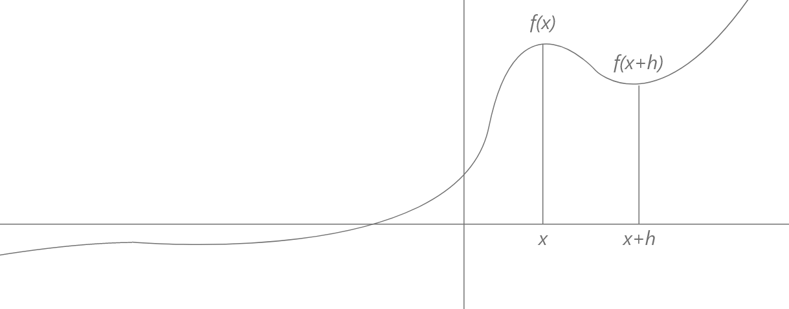

name: inverse
layout: true
class: center, middle, inverse

---

# ENSE 350: Math for Software Eng.

### Lecture 16: Intro to Numerical Methods

Adam Tilson, M.A.Sc., Engineer-in-Training

---

layout: false
.left-column[
  ## Agenda
]
.right-column[
1. Exact vs Approximate Solutions
2. True Error
3. Approximation Error
4. Taylor's Theorem
5. Topics to Cover
]
---
## Mathematical Modeling of Engineering Problems
- Common to all fields of Engineering, some problems can be modelled mathematically
  - The model is an equation or set of equations
  - The solution to the problem is to solve the equation(s)

---
## Exact Solution
- Symbolic calculations
  - Most of the math we have done so far has been symbolic
  - Express our quantities in terms of variables
    - Algebra
    - Integration
    - Differentiation (Ordinary, Partial)
  - Generally speaking, these operations are easy for humans, but hard for computers.

---
## Numerical Solution
- We wish to leverage computer power to solve our model
  - We don't necessarily need to figure out the symbolic solution first
    - Maybe it is too hard, maybe impossible
    - We may not need the exact (closed-form solution) to get enough information to solve our engineering problem.

---
## Goal for this section

To develop and learn of algorithms for accomplishing these tasks for us.
- We previously saw this with systems of linear equations. 
  - Gauss-Jordan Elimination
  - LU Decomposition
    - In the real world, we may apply these same procedures to systems with hundreds or thousands of unknowns
- In the lab, we will be implementing, using and comparing some of these algorithms

---
## Approximation Error
- Because we are not using exact solutions, there will necessarily be some error
- Sources of error:
  - Modelling error - selecting the wrong model (wrong types of equation(s))
      - Typically Large
  - Rounding Error - Computers round off after a certain level of precision
      - Rounding Errors Propagate - Numerical stability
      - e.g. in solving systems of linear equations, if we made a rounding error in creating a Pivot, it would affect every row that follows.

---
## Approximation Error
- Sources of error:
  - Truncation Error - Purposefully selecting a simplified version of an equation
      - e.g. rather than computing the closed form of a converging summation, we could instead sum up the first $n$ elements and stop early, naturally introducing some error.

---
## Example - Approximating a Derivative with a Slope
- Recall that a derivative is the instantaneous slope at a point 
  - We can approximate with the the slope that point by computing the rise and run of nearby points

---

$$\frac{\mathrm{d} f}{\mathrm{d}x} = \lim\_{h \to 0} \dfrac{f(x+h)-f(x)}{h}$$

$$\frac{\mathrm{d} f}{\mathrm{d}x} \approx \dfrac{f(x+h)-f(x)}{h} \text{, for small h}$$

---
## True Error
- $E_t = \text{True Value} - \text{Approximate Value}$
 
e.g.

- $f(x) = 2x^2$ 
- $\frac{\mathrm{d} f}{\mathrm{d}x} = 4x$
- $\frac{\mathrm{d} f}{\mathrm{d}x} \Bigr|_{x=2}= 4(2) = 8$

Approximated, $h=1$:
- $\frac{\mathrm{d} f}{\mathrm{d}x} \approx \frac{f(2+1)-f(2)}{1} \approx 18-8 \approx 10$

---
- $\frac{\mathrm{d} f}{\mathrm{d}x} \approx \frac{f(2+1)-f(2)}{1} \approx 18-8 \approx 10$

- $E_t = \text{True Value} - \text{Approximate Value} = 8 - 10 = -2$

This error term is not particularly useful, because it doesn't communicate scale. 
- How good or bad is -2 error? 
- What does the - mean?

---

## Relative True Error
- $\epsilon_t = \frac{E_t}{\text{True Value}}$
- $\epsilon_t = -\frac{2}{8} = -\frac{1}{4} = -0.25$

Better. This is a percentage. What does the negative mean?

---

## Absolute Relative True Error
- $|\epsilon_t| = |\frac{E_t}{\text{True Value}}|$
- $|\epsilon_t| = 0.25$

Better. Now we aren't worrying about that negative sign.

---

## Percent Absolute Relative True Error
- $|\epsilon_t| = |\frac{E_t}{\text{True Value}}| \times 100\\%$
- $|\epsilon_t| = 25\\%$

Let's explicitly express this as a percentage.
- Any problems left?
- What if we don't know the true error?!
  - That would require computing the exact solution, which is the whole thing we are trying to avoid!

---
## Approximate Error
- For iterative methods which get successively better results

- $E_a = \text{Present Approximation} - \text{Previous Approximation}$

Of course, all the same problems exist as before. Let's jump to the best formulation

---
## Percent Absolute Relative Approximate Error
- $|\epsilon_a| = |\frac{E_a}{\text{Present Approximation}}| \times 100\\%$

Example:

Let's our approximate our derivative using successively smaller values for $h$:

Approximated, $h=2$:
- $\frac{\mathrm{d} f}{\mathrm{d}x} \approx \frac{f(2+2)-f(2)}{1} \approx \frac{32-8}{2} \approx 12$

---
## Percent Absolute Relative Approximate Error

Approximated, $h=1$:
- $\frac{\mathrm{d} f}{\mathrm{d}x} \approx \frac{f(2+1)-f(2)}{1} \approx 18-8 \approx 10$

Computing Error:

- $|\epsilon_a| = |\frac{\text{Present Approximation} - \text{Previous Approximation}}{\text{Present Approximation}}| \times 100\\%$
- $= |\frac{10 - 12}{10}| \times 100\\%$
- $= 20\\%$

---
## Stopping Criteria

For iterative methods, we can use several approaches for stopping:
1. After a fixed number of iterations
2. When $|\epsilon_a| \lt \epsilon_s$, some predefined error for which we will consider the solution to be "close enough"!
3. When the approximate error is below the number of significant digits of our measurement $|\epsilon_a| \leq 0.5 \times 10^{(2-m)} \\%$

---
## Taylor's Theorem

A method for approximating functions

If all higher derivatives exist, and are continuous between $x$ and $x+h$:

$f(x) \approx f(h)+\frac {f'(h)}{1!} (x-h)+ \frac{f''(h)}{2!} (x-h)^2+\frac{f'''(h)}{3!}(x-h)^3+ \cdots$

- The more terms we use, the more accurate our approximation!
- When $h=0$, this is called the Maclaurin series.

---
## Taylor's Theorem

$f(x) \approx f(h)+\frac {f'(h)}{1!} (x-h)+ \frac{f''(h)}{2!} (x-h)^2+\frac{f'''(h)}{3!}(x-h)^3+ \cdots$

---
## Taylor's Theorem Example

$f(x) \approx f(h)+\frac {f'(h)}{1!} (x-h)+ \frac{f''(h)}{2!} (x-h)^2+\frac{f'''(h)}{3!}(x-h)^3+ \cdots$

- $h=0$
- $f(h) = e^h$
- $f(0) = e^0 = 1$
- $f'(h) = e^h$
- $f'(0) = 1$
- $f''(0) = 1$...

$e^x \approx f(x) = 1 + x + \frac{x^2}{2!} + \frac{x^3}{3!} + ...$

---
## Example Evaluation

Let's use Taylor's Theorem to compute:
- $f(x) = e^x$ for $x=2$. i.e. $e^2, n = 2$
- $e^2 = f(2) = 1 + 2 + \frac{2^2}{2}$
- $e^2 = f(2) = 5$

- $e^2, n = 3$
- $e^2 = f(2) = 1 + 2 + \frac{2^2}{2} + \frac{2^3}{3 \times 2}$
- $e^2 = f(2) = 6.333$

---
## Example Evaluation - Approximate Error

- $e^2, n = 4$
- $e^2 = f(2) = 1 + 2 + \frac{2^2}{2} + \frac{2^3}{3 \times 2} + \frac{2^4}{4 \times 3 \times 2}$
- $e^2 = f(2) = 7$

- $|\epsilon_a| = |\frac{\text{Present Approximation} - \text{Previous Approximation}}{\text{Present Approximation}}| \times 100\\%$
- $= |\frac{7 - 6.333}{7}| \times 100\\%$
- $= 9.5\\%$
---
## Example Evaluation - True Error

Actual Value:
$e^2 = 7.389$

Percent Absolute Relative True Error
- $|\epsilon_t| = |\frac{E_t}{\text{True Value}}| \times 100\\%$
- $|\epsilon_t| = |\frac{7.389-7}{7.389}| \times 100\\%$
- $|\epsilon_t| = 5.25\\%$

---
## Topics to Cover:

1. Solving systems of linear equations (done)
2. Solutions to non-linear equations (root finding)
3. Numerical Integration
4. Numerical Differentiation
5. Interpolation and Regression

---

### References

- Dr. Abdul Bais's ENSE 350 Slides
---

name: inverse
layout: true
class: center, middle, inverse
---
# Questions?
