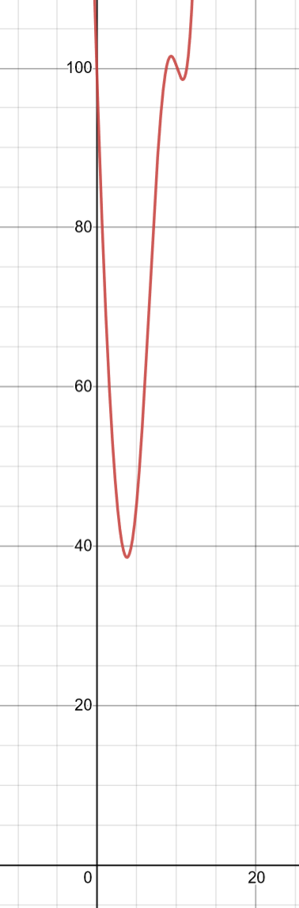
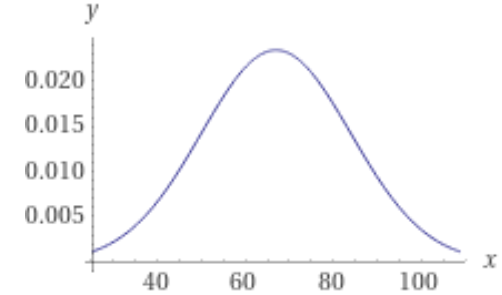

name: inverse
layout: true
class: center, middle, inverse

---

# ENSE 350: Math for Software Eng.

### Lecture 20: Numerical Integration Problems

$\cdot$ Adam Tilson, M.A.Sc., P.Eng

---

layout: false
.left-column[
  ## Agenda
]
.right-column[
1. Problems
]
---
Let's work through some practice problems!

Q1. Consider the following integral:

$\int_0^4 1-e^{-x}\text{d}x$
- Evaluate the integral analytically
- Evaluate with Midpoint $n=4$ segments
- Evaluate with Trapezoid $n=4$ segments
- Evaluate with 1/3 Simpsons $n=4$ segments
- Compare the geometry of each method with the graph, is the behavior as expected? 

---
Q2. Consider the following integral:

$\int_0^1 xe^{2x}\text{d}x$

Using the trapezoid rule, compare $n=3$, $n=4$ and $n=5$ segments and compute the percent absolute relative approximate error between successive splits.

---
Q3. A transportation engineering study requires calculating the number of cars through an intersection travelling during morning rush hour. The following table provides the number of cars that pass every 4 minutes during that period:

|time|7:30|7:45|8:00|8:15|8:30|8:45|9:00|9:15|
|---|---|---|---|---|---|---|---|---|
|cars / 4 minutes|18|23|14|24|-|20|-|9|

Using an appropriate method (or combination of methods), estimate the number total number of cars through the intersection from 7:30 to 9:15.

---
Q4. The amount of mass transported via a pipe over a periodd of time can be computed as:

$\int_{t_1}^{t_2}Q(t)c(t)\text{d}t$

Where:
- $M$ is the mass in $mg$
- $t_1$ is the initial time, in $min$
- $t_2$ is the final time in $min$
- $Q(t)$ is the flow rate, in $\frac{m^3}{min}$
- $c(t)$ is the concentration in $\frac{mg}{min}$

(ctd.)

---

The following functions represent temporal variations in flow and concentration:

$Q(t) = 9+5\left(\cos\left(0.4t\right)\right)^{2}$

$c(t) = 5e^{-0.5t}+2e^{0.15t}$

Estimate the mass transported from $t_1=2$ and $t_2=8$ minutes. Compare results of using 1/3 Simpsons Rule with 3 segments, and trapezoid rule with 6 segments.

(ctd.)

???

Note: Actual, per Wolfram Alpha is 335.963

---

---

Q5. In statistics, the Gaussian functioned is defined as:

$g(x) = \frac{1}{\sigma\sqrt{2\pi}} e^ { - \frac{(x - \mu)^2}{2\sigma^2}}$

Where $\mu$ is the mean, and $\sigma$ is the standard deviation.

Taking the definite integral under this curve gives a percentage.

The mean of a course is $\mu=67\\%$ with a standard deviation of $\sigma=17\\%$. 

(ctd.)

---

---

Assuming the students grades can be approximated using the gaussian distribution, predict how many people in the course of 95 people failed. Use 1/3 simpsons rule and 1 segment.

Hint: Plug in known quantities and integrate the Gaussian from $x=0$ to $x=50$.

???
Note: The true percent value of failures is 0.158161 

---

### References

"Dr. K. Dow, Dr. S. Adeeb, Dr. L. Westover, Dr. Y. Li, W. Qiu" (2022). "Introduction to Numerical Analysis for Engineers". Retrieved from https://engcourses-uofa.ca 

---

name: inverse
layout: true
class: center, middle, inverse
---
# Questions?
