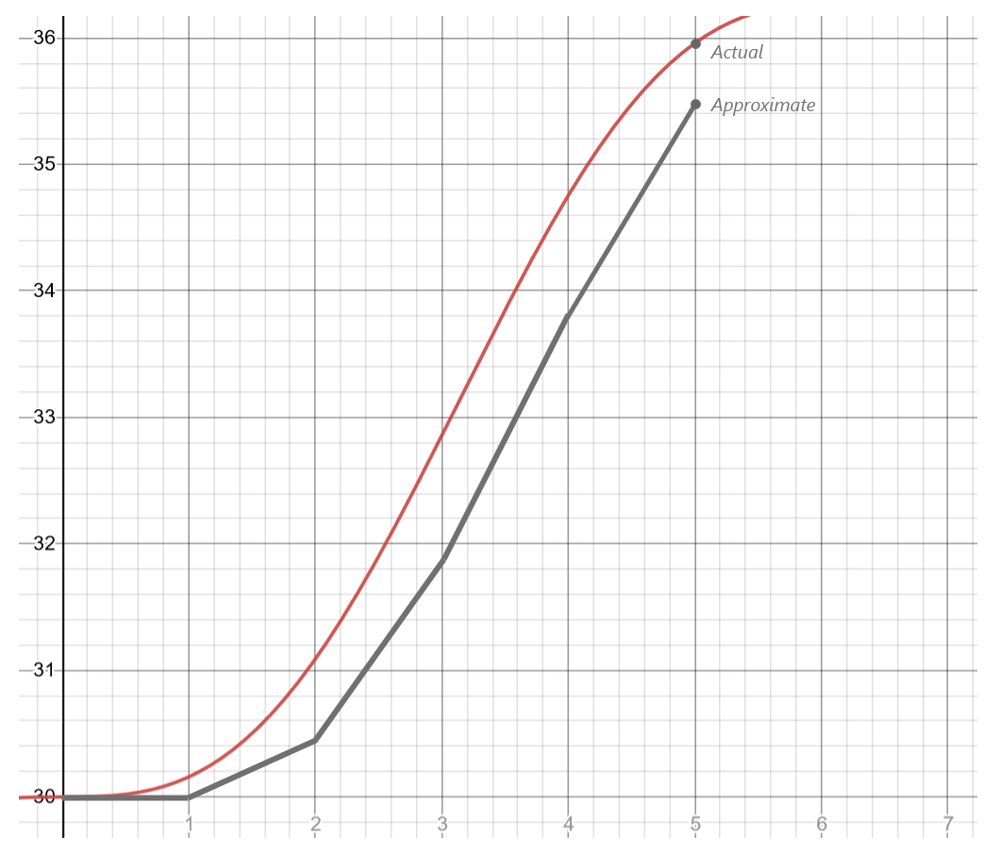
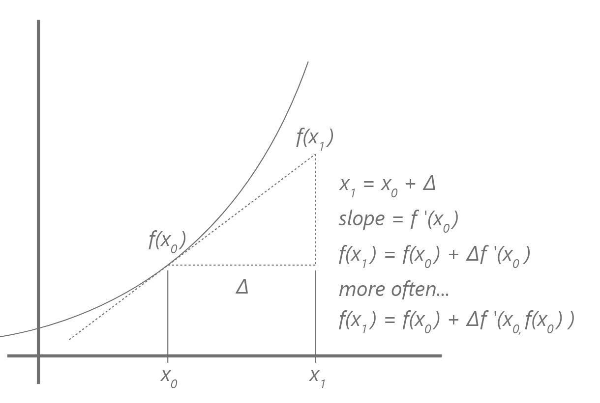
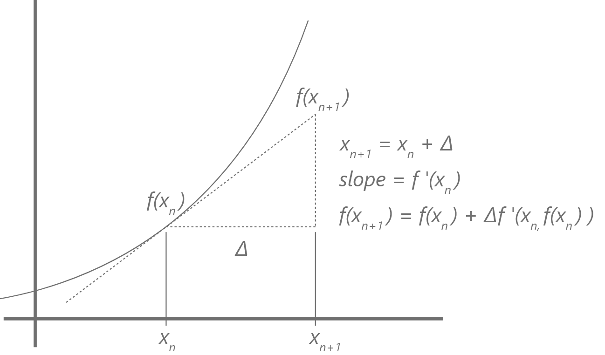

name: inverse
layout: true
class: center, middle, inverse

---

# ENSE 350: Math for Software Eng.

### Lecture 21: Numerical Differentiation: Iterative Solutions to Initial Value Problems

Adam Tilson, M.A.Sc., Engineer-in-Training

---

layout: false
.left-column[
  ## Agenda
]
.right-column[
1. Ordinary Differential Equations
2. Initial Value Problems
3. Euler Method
4. Runge-Kutta Method
]

---
## Ordinary Differential Equations

Recall that an `Ordinary Differential Equation` (ODE) is a differential equation containing one or more functions of ONE independent variable, and the derivative(s) of those functions.
- These types of functions have use in natural sciences, e.g. physics (mechanics)
  - $F = ma$
  - $F(x(t)) = m\dfrac{\text{d}^2x(t)}{\text{d}t^2}$
- We can contrast this with `Partial Differential Equations` which contain functions with respect to two or more independent variables.

---
## Initial Value Problem

Recall that an `Initial Value Problem` (IVP) is an ODE which contains some unknown function, but includes the initial conditions of that ODE.
  - Recall that integrating an ODE, i.e. computing the symbolic anti-derivative, produces some constant value, $c$ which we cannot determine without more information. 
  - The `Initial Value` gives us that information to solve our problem.

---
### IVP Example - Position and Velocity
e.g. Consider a particle with following position function: 
- $x(t) = t - \sin(t) + 30$

The change of position w.r.t time is velocity:
- $v\_x (t) = x'(t) = 1 - \cos(t)$

---
### IVP Example - Position and Velocity

If we wished to recover the original position, we could integrate both sides:
- $\frac{\text{d}v}{\text{d}t} = x'(t) = 1 - \cos(t)$
- $\int \text{d}v = \int x'(t) = 1 - \cos(t) \text{d}t$
- $x(t) = t - \sin(t) + c$

We have lost information. We do not know the value of the constant term, $c$. 
---
### IVP Example - Position and Velocity
However, if we were provided the initial conditions:
- $x(0) = 30$

We could substitute this in to solve for c:
- $x(0) = 0 - \sin(0) + c = 30$
- $c = 30$
- $x(t) = t - \sin(t) + 30$

---
### IVP Example - Position and Velocity
We now have enough information that we could evaluate our function at a new point in time.
- e.g. Find $x(30)$
- $x(30) = 30 - \sin(30) + 30 \approx 60.99$

---
### Numerical Methods motivation
The euler method enables us to solve these initial value problems without taking a symbolic integral.
- Assume we are given 
- $v\_x (t) = x'(t) = 1 - \cos(t)$
- $x(0) = 30$
- $Find x(5)$
  
For the purposes of solving this IVP, the original function is unknown, but we know it is $x(t)=t-\sin(t)+30$
---
### Euler's Example
$x(t)=t-\sin(t)+30$
.image-50[

]
---
### What we know:
- We know where we are starting ($t=0, x=30$)
- We know our goal ($t=5$)
- We know the function of the first derivative, which corresponds to the instantaneous slope at any given point
- Starting at $t=0$
  - We can determine the slope at that point, $f'(0)$
  - And take a small step in that direction, $h$-units
  - We can iterative
- Thus, we can take small steps along the slope and arrive at the goal
---
### Euler Method Graphically

---
### Euler Method Graphically

---
### Euler Method Graphically

---
### Euler Method Graphically

---
### Euler Method Graphically

---
### Euler Method Mathematically

---
### Euler Method Generally

---
### Computing our example mathematically
For our example:
- $f'(x) = 1 - \cos(t)$
- $x\_0 = 0$
- $f(0) = 30$
- $\Delta_x = 1$
- $x\_1 = 1$

First iteration:
- $f(x\_1) = f(1) = f(0) + \Delta_x \times f'(x_0)$
- $= 30 + 1 - \cos(0)$
- $= 30 + 1 - 1 = 30$

---
### Computing our example mathematically
Second iteration:
- $f(x\_2) = f(2) = f(1) + \Delta_x \times f'(x_1)$
- $= 30 + 1 - \cos(1)$
- $= 30 + 1 - 0.5403 = 30.4597$

Third iteration:
- $f(x\_3) = f(3) = f(2) + \Delta_x \times f'(x_2)$
- $= 30.4597 + 1 - \cos(2)$
- $= 31.8758$

---
### Computing our example mathematically
Fourth iteration:
- $f(x\_4) = f(4) = f(3) + \Delta_x \times f'(x_3)$
- $= 31.8758 + 1 - \cos(3)$
- $= 33.8658$

Fifth iteration:
- $f(x\_5) = f(5) = f(4) + \Delta_x \times f'(x_4)$
- $= 33.8658 + 1 - \cos(4)$
- $= 35.5194$

---
### Computing our example mathematically

Actual:
- $f(x) = x - \sin(x) + 30$
- $= f(5) = 5 - \sin(5) + 30$
- $= 35.9589$

Absolute Relative Percent True Error:

$=|\frac{35.5197-35.9589}{35.9589}| \times 100\\% = 1.22\\%$

---
### More steps
What if instead we had used step size of $0.5$? $0.25?$

.image-60[

]
---
### One more example:
$y' = y + xy$=
$(x_0, y_0) = (0,1)$
$N=10$
$Find y_2$

- What is the step size? $(5-0) / 10 = 0.5$.

- $y\_{n+1} = y\_{n} + \Delta_x \times y'(x_n, y_n)$

$y\_{0.2} = 1 + 0.2 (1 + 0*1) = 1.2$
$y\_{0.4} = 1.2 + 0.2 (1.2 + 0.2 * 1.2) = 1.488$
$y\_{0.6} = 1.488 + 0.2 (1.488 + 0.4 * 1.488) = 1.905$
$y\_{0.8} = 1.905 + 0.2 (1.905 + 0.6 * 1.905) = 2.514$
$y\_{1} = 2.514 + 0.2 (2.514 + 0.8 * 2.514) = 3.419$
$y\_{1.2} = 3.419 + 0.2 (3.419 + 1.0 * 3.419) = 4.787$
$y\_{1.4} = 4.787 + 0.2 (4.787 + 1.2 * 4.787) = 6.893$
$y\_{1.6} = 6.893 + 0.2 (6.893 + 1.4 * 6.893) = 10.202$
$y\_{1.8} = 10.202 + 0.2 (10.202 + 1.6 * 10.202) = 15.507$
$y\_{2} = 15.507 + 0.2 (15.507 + 1.8 * 15.507) = 24.191$

---

What even is this thing? We don't actually need to know.
However, it turns out...

$y = e^\frac{x(x+2)}{2}$

Exponential. Euler's isn't great at these.

Actual value: 

$e^{2*4}{2} = e^4 = 54.5982.$

Let's compare
$N = 10: y_2 = 24.191. 55.687\\%$ Absolute Relative Percent True Error
$N = 100: y_2 = 49.238. 9.806\\%$
$N = 1000: y_2 = 54.021. 1.046\\%$
$N = 10000: y_2 = 54.540. 0.095\\%$

---
### Another Example:

$f'(x) = f(x)$
$f(0) = 1$
$x(5)?$
$\Delta_x = 1$

(We don't know f(x), but we do know it's the function where the derivative is the same as the function? hmm... f(x) = e^x)

$f(0) = 1$
$f(1) = 1 + 1 = 2$
$f(2) = 2 + 2 = 4$
$f(3) = 4 + 4 = 8$
$f(4) = 8 + 8 = 16$
$f(5) = 16 + 16 = 32$

e^5 = 148.41. Wow, big error! 

However, if:
- $n = 20, f(5) \approx 86.7$
- $n = 40, f(5) \approx 111.2$
- $n = 100, f(5) \approx 131.5$
- $n = 1000, f(5) \approx 146.8$
- It's taking a lot of iterations to get close!

---
## Runge-Kutta 4th Order

An alternative method to solving ODE IVP's is the Runge-Kutta 4th Order approximation. It is a formulation of Simpsons's Rule from approximating integrals, and may be derived using the Taylor series.

$\frac{dy}{dx} = f(x, y), y(x_0) = y_0$

- $x\_{n+1} = x\_n + h$
- $y\_{n+1} = y_n + \frac{1}{6}h\left(k\_1 + 2k\_2 + 2k\_3 + k\_4 \right)$

---
## Runge-Kutta 4th

- $y\_{n+1} = y_n + \frac{1}{6}h\left(k\_1 + 2k\_2 + 2k\_3 + k\_4 \right)$
- $k\_1 = \ f(x\_n, y\_n)$
- $k\_2 = \ f\left(x\_n + \frac{h}{2}, y\_n + h\frac{k\_1}{2}\right)$
- $k\_3 = \ f\left(x\_n + \frac{h}{2}, y\_n + h\frac{k\_2}{2}\right)$
- $k\_4 = \ f\left(x\_n + h, y\_n + hk\_3\right)$

Intuitively, our four terms are: 
- the slope at the beginning of the line,
- the slope at the end of the line, 
- and two midpoint terms which are weighted heavier

---
e.g. Runge-Kutta 4th of the exponential:

- $y' = y, y_0 = 1, h=5 $ 
- $k\_1 = 1$
- $k\_2 = 1 + 5\frac{1}{2}$
  - $k\_2 =3.5$
- $k\_3 = 1 + 5\frac{3.5}{2}$
  - $k\_2 =9.75$
- $k\_4 = 1 + 5 \times 9.75$
  - $k\_4 = 49.75$
- $y_1 = 1 + \frac{1}{6}5\left(1 + 2 \times 3.5 + 2 \times 9.75 + 49.75 \right)$
- $y_1 = 65.375$

Way better than Euler for n=1.
---
## Runge-Kutta 4th Example

Runge-Kutta 4th for different N's:

- n = 1: $y_1 = 65.4$
- n = 2: $y_2 - 117.9$
- n = 10: $y_10 = 148.2$

Much quicker than the Euler Method!
---

### References

- Dr. Abdul Bais's ENSE 350 Slides
---

name: inverse
layout: true
class: center, middle, inverse
---
# Questions?
