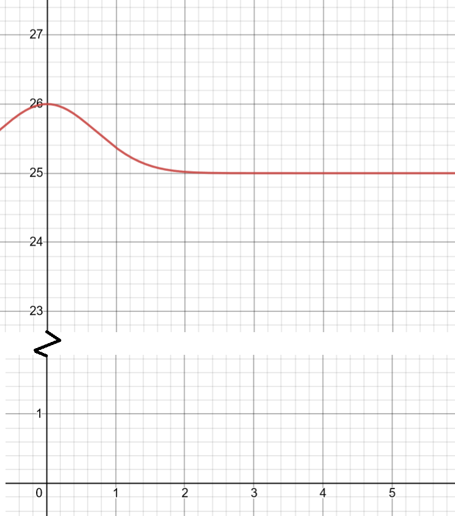

name: inverse
layout: true
class: center, middle, inverse

---

# ENSE 350: Math for Software Eng.

### Lecture 22: Initial Value Problem Examples

Adam Tilson, M.A.Sc., Engineer-in-Training

---

layout: false
.left-column[
  ## Agenda
]
.right-column[
1. Problems
]
---
Let's work through some practice problems!

Q1. Consider the following equation:

$y'(x)=2x(25-y(x))$

If the coordinate $(x,y) = (0, 26)$ appears on the graph, find the value of $y(1.5)$. Compare Euler's Method with 3 steps and Runge-Kutta 4th with 1 step.

---

True Value: 25.1

---

Q2. Consider the following ordinary differential equation:

$y'(t) - y(t) = cos(t)$

And the initial value y(2)=3.

Find y(6)

Use Euler's Method with 4 steps.

---

Q3. The concentration of salt $x$ in a home made soap maker is given as a function of time by
$\frac{\text{d}}{\text{d}t} x(t) = 37.5 - 3.5x(t)$

At the initial time, $t=0$ , the salt concentration in the tank is $50 \frac{g}{L}$. Using Euler's Method, perform $8$ iterations to determine salt concentration after $3$ minutes?

---

Q4. A polluted lake has an initial concentration of a bacteria of $10^7 \frac{\text{parts}}{m^3}$ , while the acceptable level is only $5 \times 10^6 \frac{\text{parts}}{m^3}$. The concentration of the bacteria will reduce as fresh water enters the lake. The differential equation that governs the concentration $C$ of the pollutant as a function of time (in weeks) is given by:

$\frac{\text{d}}{\text{d}t}C(t) + 0.06C(t) = 0, C(0)=10^7$

Using the Runge-Kutta 4th order method, find the concentration of the pollutant after $7$ weeks. Take a step size of $3.5$ weeks.

---

Q5. The Radioactive decay of a material is given by the formula:

$Q'(t)=-kQ(t)$

Where the mass present at time $t=t_0$ is $Q_0$, and $k$ is the decay constant. 

The radioactive decay constant, $k$, of a substance is $2.28 s^{-1}$ If the mass is currently $4g$, approximately how long until less than $1g$ remain? Use the Euler Method with a step size of $0.1 s$ Approximate to the nearest $0.1 s$.

---

### References

"Dr. K. Dow, Dr. S. Adeeb, Dr. L. Westover, Dr. Y. Li, W. Qiu" (2022). "Introduction to Numerical Analysis for Engineers". Retrieved from https://engcourses-uofa.ca 

---

name: inverse
layout: true
class: center, middle, inverse
---
# Questions?
