name: inverse
layout: true
class: center, middle, inverse

---

# ENSE 350: Math for Software Eng.

### Lecture 22: Numerical Integration

$\cdot$ Adam Tilson, M.A.Sc., P.Eng

---

layout: false
.left-column[
  ## Agenda
]
.right-column[
1. Integration
2. Midpoint Rule
3. Trapezoid Rule
4. Simpson's 1/3 Rule
]

---
## Goal

The purpose of this chapter is to explore iterative numerical methods for finding definite integrals for functions. 
- Recall, the integral represents the area under the curve of a function given some left and right bounds.
- Symbolically, we find the equation for the integral, and then evaluate that equation at the left and right bounds, taking the difference of the right and left evaluations as our area.

---
### Symbolic Integration

- $\int_{a}^{b} x^2 + 2x + 3 \text{ dx}$
- $= \frac{1}{3}x^3 + x^2 + 3x + c \Big|_a^b$
- $= \frac{1}{3}b^3 + b^2 + 3b + c - \frac{1}{3}a^3 - a^2 - 3a - c$
- $= \frac{1}{3}b^3 + b^2 + 3b - \frac{1}{3}a^3 - a^2 - 3a$

e.g. b = 6, a = 3

- $= \frac{1}{3}6^3 + 6^2 + 3(6) - \frac{1}{3}3^3 - 3^2 - 3(3)$
- $= 72 + 36 + 18 - 9 - 9 - 9 = 99$

---
### Integration Graphically

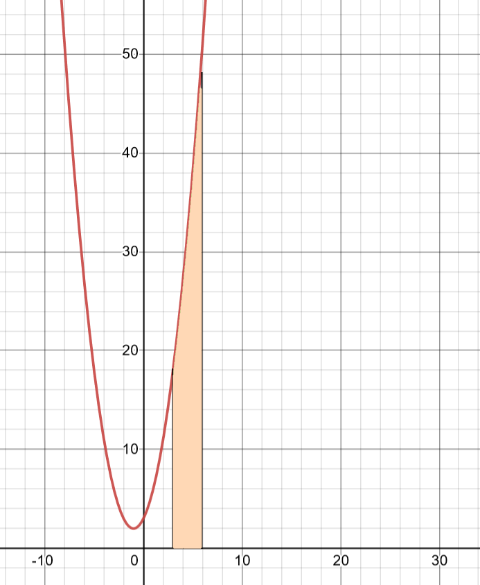

---

## Numerical Approaches
1. Midpoint Rule
2. Trapezoid Rule
3. 1/3 Simpson's Rule

---
### Example

We'll use the following example to compare the three methods:

$ f(x) = -\frac{1}{2}x^4 + 3x^2 + x + 1 $

.image-50[
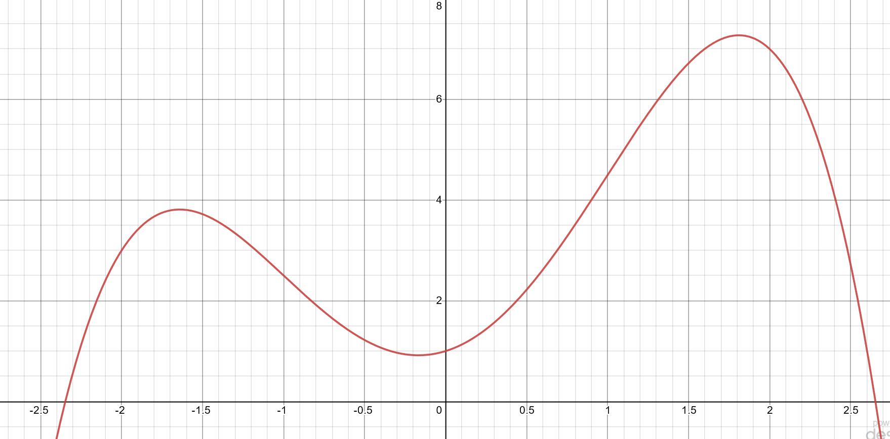
]
---
### Definite Integral

$ \int_{-2}^{2} -\frac{1}{2}x^4 + 3x^2 + x + 1 \,dx $
.image-50[
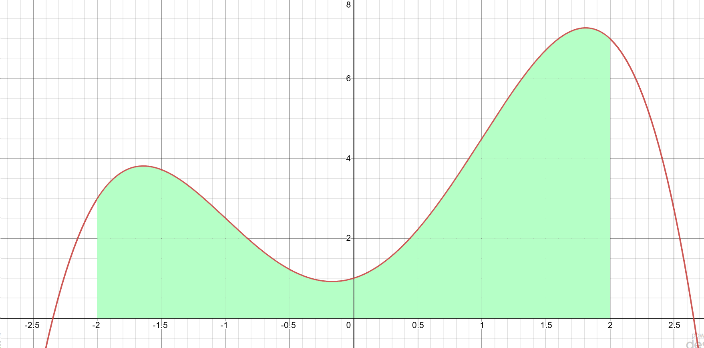
]
---

### True Value

- $ = -\frac{1}{10}x^5 + x^3 + \frac{1}{2}x^2 + x + c $
- $ = \left( -\frac{1}{10}x^5 + x^3 + \frac{1}{2}x^2 + x \right) \Bigr\rvert\_{x = 2} - \left( -\frac{1}{10}x^5 + x^3 + \frac{1}{2}x^2 + x \right) \Bigr\rvert\_{x = -2} $
- $ = \left( -\frac{1}{10}(2)^5 + (2)^3 + \frac{1}{2}(2)^2 + (2) \right) - $
$ \left( -\frac{1}{10}(-2)^5 + (-2)^3 + \frac{1}{2}(-2)^2 + (-2) \right) $
- $ = \left( -\frac{32}{10} + 8 + \frac{4}{2} + 2 \right)  - \left( \frac{32}{10} + (-8) + \frac{4}{2} + (-2) \right) $
- $ = -\frac{32}{10} + 8 + \frac{4}{2} + 2  - \frac{32}{10} + 8 - \frac{4}{2} + 2 $
- $ = -3.2 + 8 + 2  -3.2 + 8 + 2 $
- $ = 13.6 $

---
## Midpoint Rule (Middle Riemann sum)

The `midpoint rule` approximates the area by fitting a rectangle between the two integral bounds, and uses the function's $y$ value at the midpoint as the top of the rectangle. We can make successively better approximations by dividing the integral bounds into smaller intervals, and summing the result of the midpoint rule computed for each of these intervals.

The formula for one segment:

$ \text{Area} = (b-a) \times f( \frac{a+b}{2}) $

---
## Midpoint Rule
$ \text{Area} = (b-a) \times f( \frac{a+b}{2}) $

.image-50[
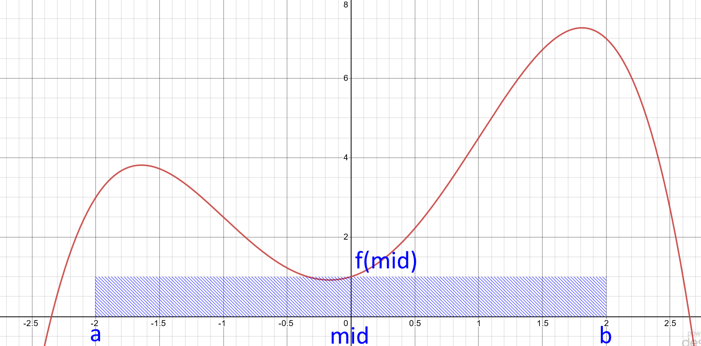
]

$\text{Area} = (2 - (-2)) \times f(\frac{2 + (-2)}{2})$

$= 4 \times f(0) = 4 \times 1 = 4$

---
### Midpoint Rule - Two segments

.image-50[
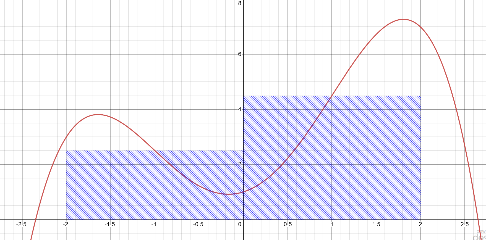
]

$ \text{Area} = (0 - (-2)) * f \left( \frac{0 + (-2)}{2} \right) + (2 - (0)) \times f \left( \frac{2 + 2}{2} \right) $

$ = 2 \times f(-1) + 2 f(1) = 2 \times 2.5 + 2 \times 4.5 = 5 + 9 = 14 $

---
### Midpoint Rule - Four Segments

.image-40[
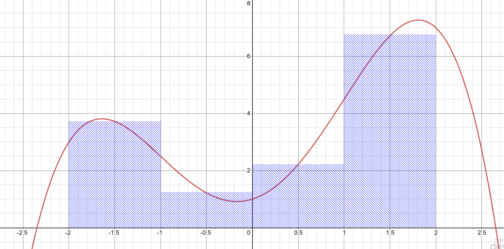
]

$ \text{Area} = (-1 - (-2)) \times f \left( \frac{-1 + (-2)}{2}\right) + (0 - (-1)) \times f \left( \frac{0 + (-1)}{2}\right) + $
$(1 - 0) \times f \left( \frac{1 + 0}{2}\right) + (2 - 1) \times f \left( \frac{2 + 1}{2}\right) $
$ = 1 \times f (-1.5) + 1 \times f (-0.5) + 1 \times f (.5) + 1 \times f (1.5)$
$ = 3.71875 + 1.21875 + 2.21875 + 6.71875 = 13.875$

---
### Midpoint Rule - General Formula

We can think of a generalized formula for this system in terms of $N$ segments, such that:

$$ \text{Area} = \sum\_{i=0}^{N-1} (x\_{i+1}-x\_i) \times f\left(\frac{x\_{i+1}+x\_i}{2}\right) $$

As the widths of each area are consistent, we may factor this out...

$$ \text{Area} = \Delta\_x \sum\_{i=0}^{N-1} f\left(\frac{x\_{i+1}+x\_i}{2}\right) $$

---
### Midpoint Rule - True Error

We may compute the True Absolute Relative Percent Error from the actual integral using the formula:

$\epsilon_t = \lvert\frac{\text{approx} - \text{actual}}{\text{actual}}\rvert \times 100\\%$

For example, for the value we currently have:

$ \epsilon_t = \lvert\frac{13.875 - 13.6}{13.6}\rvert \times 100\\% $

$ \epsilon_t =  2.02 \\% $
---
### Midpoint Rule - More divisions

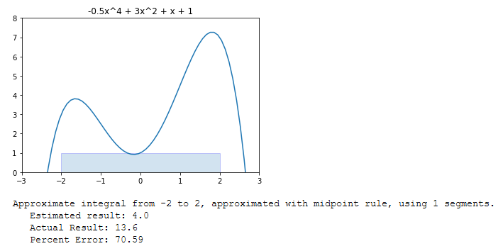

---
### Midpoint Rule - More divisions

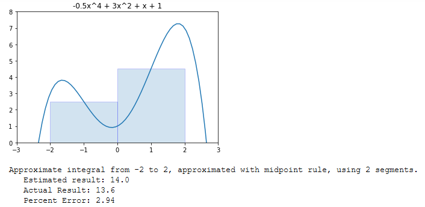

---
### Midpoint Rule - More divisions

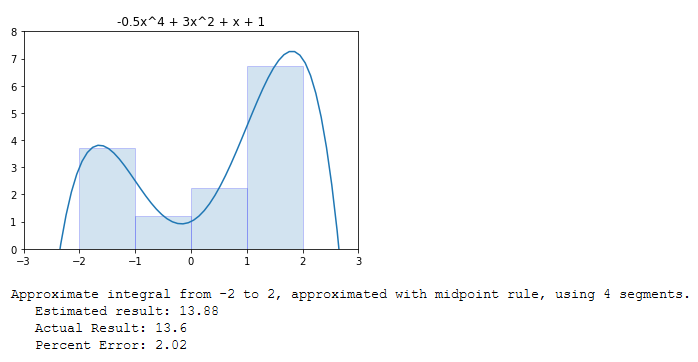

---
### Midpoint Rule - More divisions

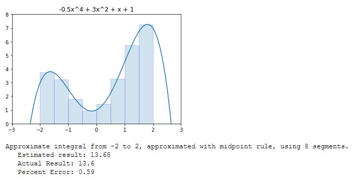

---
### Midpoint Rule - More divisions

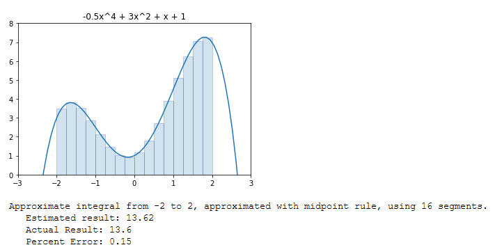

---

## Trapezoid Rule

- For some functions, a better model would use a sloped top, extending between the two function values on the interval bounds. This is called the `Trapezoid Rule`.

.image-60[
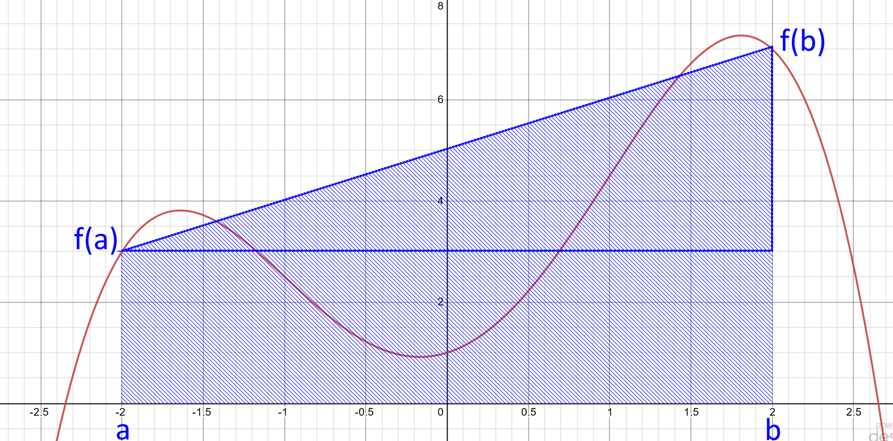
]

---
## Trapezoid Formula Derivation

Using some geometry, we can compute the area under the trapezoid, by summing the rectangle plus the triangle:

$ \text{Area} = (b-a) \times f(a) + \frac{(b-a) \times (f(b) - f(a))}{2} $

Doing some algebra:

$ \text{Area} = (b-a) \times f(a) + \frac{(b-a) \times f(b)}{2} - \frac{(b-a) \times f(a)}{2} $

$ \text{Area} = \frac{(b-a) \times f(b)}{2} + \frac{(b-a) \times f(a)}{2} = (b-a) \times \frac{ f(b) + f(a)}{2} $

---
## Trapezoid Formula Derivation

As before, this can be generalized for N segments as follows:

$$ \text{Area} = \sum\_{i=0}^{N-1} (x\_{i+1}-x\_i) \times \frac{ f(x\_{i+1}) + f(x\_i)}{2} $$

As with the midpoint formula, since the widths of each trapezoid is consistent, we may factor this out...

$$ \text{Area} = \Delta\_x \sum\_{i=0}^{N-1} \frac{ f(x\_{i+1}) + f(x_i)}{2} $$

---
### Trapzoid N=1

Let's compute by hand for N=1 and N=2...

$ \text{Area} = \sum\_{i=0}^{N-1} (x\_{i+1}-x\_i) \times \frac{ f(x\_{i+1}) + f(x\_i)}{2} $

$ \text{Area} = (2-(-2)) * \frac{ f(2) + f(-2)}{2} $

$ \text{Area} = 4 * \frac{ 3 + 7}{2} $

$ \text{Area} = 4 * 5 $

$ \text{Area} = 20 $

---
### Trapzoid N=1
$ \text{Area} = 20 $

.image-60[

]

Too high, a single trapezoid does not account for the cut-out chunk in the middle. Let's try $N=2$...

---
### Trapezoid N=2

.image-50[
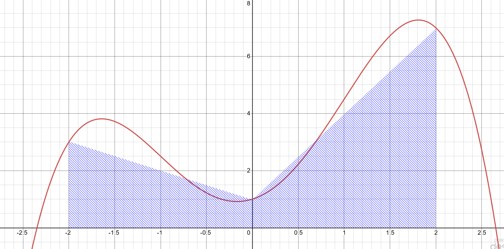
]

$ \text{Area} = \sum\_{i=0}^{N-1} (x\_{i+1}-x\_i) \times \frac{ f(x\_{i+1}) + f(x\_i)}{2} $

$ \text{Area} =(0-(-2)) \times \frac{ f(0) + f(-2)}{2} + (2-(0)) \times \frac{ f(2) + f(0)}{2}$

---
### Trapezoid N=2

$ \text{Area} =2 \times \frac{ 1 + 3}{2} + 2 \times \frac{ 7 + 1}{2}$

$ \text{Area} =2 \times \frac{ 4}{2} + 2 \times \frac{ 8}{2}$

$ \text{Area} = 12$

Not bad. Now we are a bit under, as expected. Let's use Python to see how far we can go:

---
### Trapezoid Rule - More Divisions

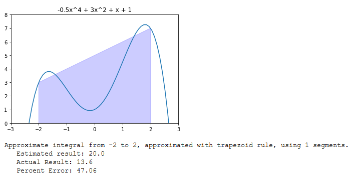

---
### Trapezoid Rule - More Divisions

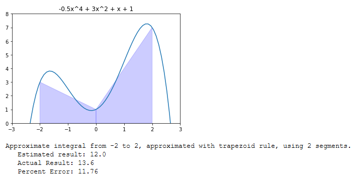

---
### Trapezoid Rule - More Divisions

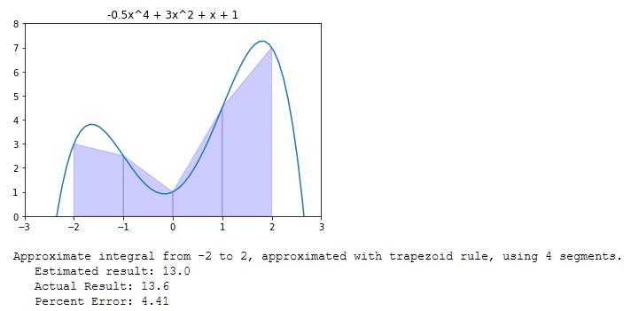

---
### Trapezoid Rule - More Divisions

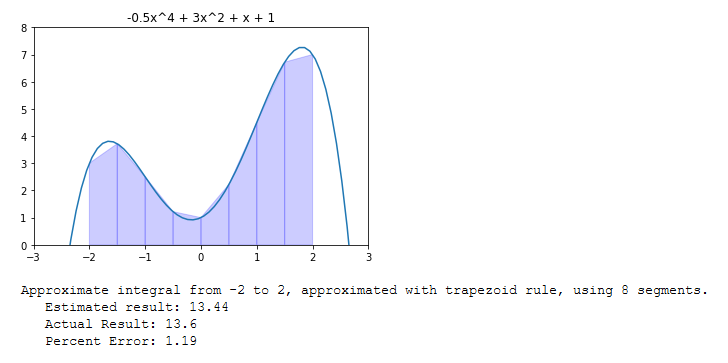

---
### Trapezoid Rule - More Divisions

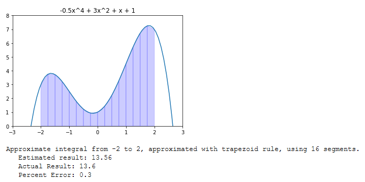

---

### Simpsons 1/3 Rule

We can form an even better approximation for our segments by fitting parabolic segments between the interval bounds. Recall a quadratic is defined by three points, so we can cause our quadratic to pass through the function at the point on each side of the interval, as well as the midpoint.

This process is called `Simpson's 1/3 rule`.

---
### Derivation

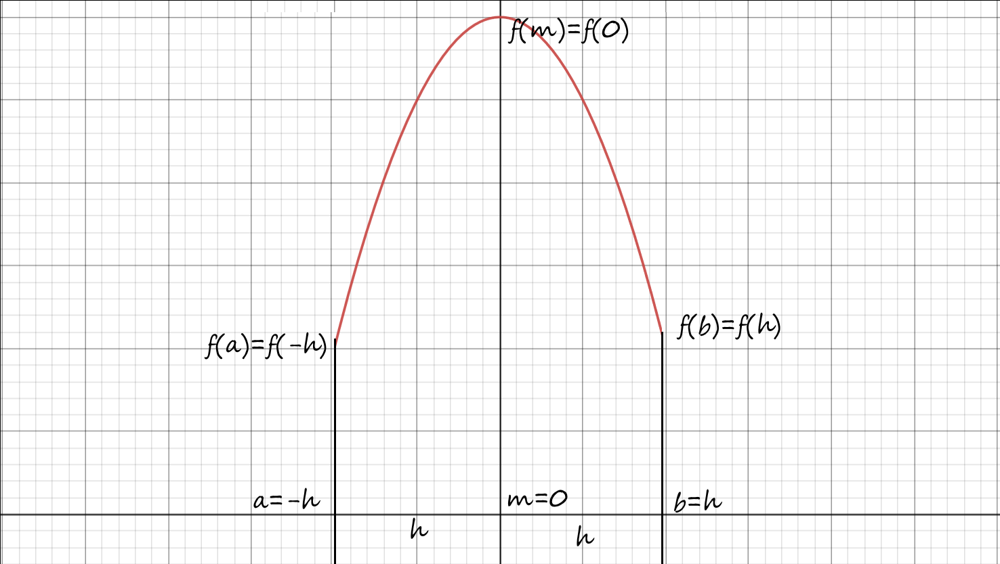

---
### Derivation Continued

$\text{Area} = \int_{a}^{b} Ax^2 + Bx + C \text{ dx}$

$\frac{Ax^3}{3} + \frac{Bx^2}{2} + Cx + D \Big|_a^b$

$\frac{Ax^3}{3} + \frac{Bx^2}{2} + Cx + D \Big|_{-h}^{h}$

$\frac{A(h)^3}{3} + \frac{B(h)^2}{2} + C(h) - \frac{A(-h)^3}{3} - \frac{B(-h)^2}{2} - C(-h)$

$2\frac{Ah^3}{3} + 2Ch = \frac{h}{3}[2Ah^2 + 6C]$

---
### Derivation Continued

$f(a) = A(-h)^2 + B(-h) + C$
$= Ah^2 - Bh + C$

$f(b) = A(h)^2 + B(h) + C$
$= Ah^2 + Bh + C$

$f(m) = A(0)^2 + B(0) + C$
$= C$

The clever observation that makes this work:

$f(a) + 4f(m) + f(b)$
$= 2Ah^2 + 6C$
---
### Derivation Continued 

$\text{Area} = \frac{h}{3}[2Ah^2 + 6c]$

$f(a) + 4f(m) + f(b) = 2Ah^2 + 6C$

$\text{Area} = \frac{h}{3}[f(a) + 4f(m) + f(b)]$

$h = \frac{b-a}{2}$

$m = \frac{a+b}{2}$

$\text{Area} = \frac{b-a}{6}[f(a) + 4f(\frac{a+b}{2}) + f(b)]$

---
### Generalized Form of the Rule

A generalized formula can be written as follows:

$$ \text{Area} = \sum\_{i=0}^{N-1} \frac{(x\_{i+1}-x\_i)}{6} \left( f(x\_i) + 4f \left( \frac{x\_i+x\_{i+1}}{2} \right) + f(x\_{i+1}) \right) $$

$$ \text{Area} = \frac{\Delta\_x}{6} \sum\_{i=0}^{N-1} \left( f(x\_i) + 4f \left( \frac{x\_i+x\_{i+1}}{2} \right) + f(x\_{i+1}) \right) $$

When we chain multiple segments, we see a coefficient pattern emerge `1, 4, 2, 4, ... 2, 4, 1`

---
### Simpsons Rule in Python - More Divisions
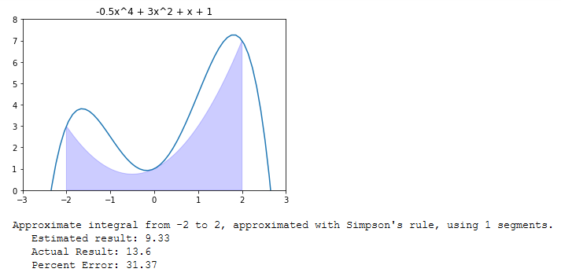

---
### Simpsons Rule in Python - More Divisions

---
### Simpsons Rule in Python - More Divisions
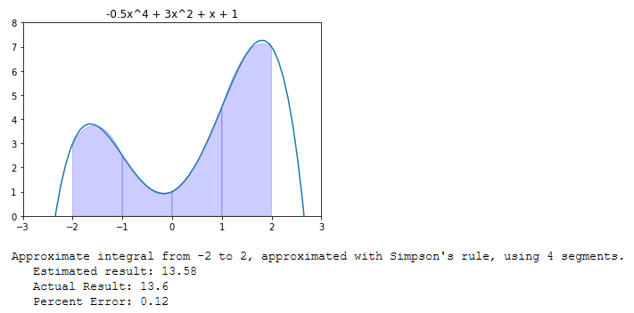

---
### Simpsons Rule in Python - More Divisions
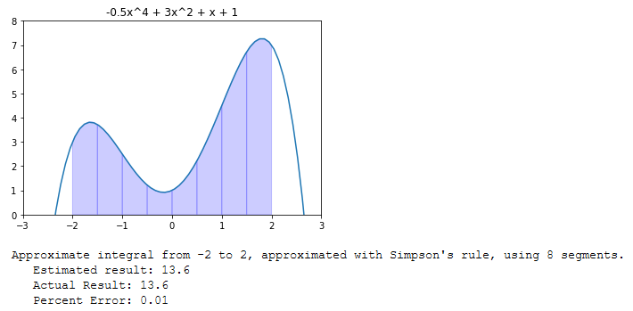

---
### Simpsons Rule in Python - More Divisions
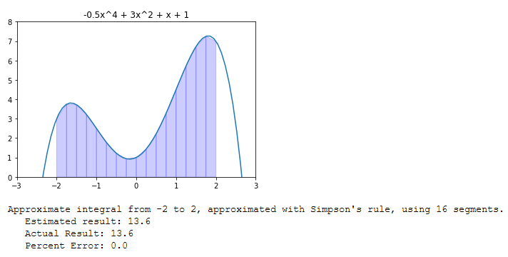

---

### References

- Dr. Abdul Bais's ENSE 350 Slides

- [PatrickJMT's derivation of Simposns Rule is awesome](https://www.youtube.com/watch?v=7MoRzPObRf0)

---

name: inverse
layout: true
class: center, middle, inverse
---
# Questions?
