name: inverse
layout: true
class: center, middle, inverse

---

# ENSE 350: Math for Software Eng.

### Lecture 21: Numerical Differentiation: Iterative Solutions to Initial Value Problems

$\cdot$ Adam Tilson, M.A.Sc., P.Eng

---

layout: false
.left-column[
  ## Agenda
]
.right-column[
1. Notation Reminders
2. Ordinary Differential Equations
3. Initial Value Problems
4. Euler Method
5. Runge-Kutta Method
]

---
### Reminder - Notation Usage - Functions

Recall that some variables are functions of other variables:

$x(t)$ means that the position in the x-direction, $x$, is dependent on the time, $t$.

In this case, $x(t)$ is a more descriptive replacement for the more generic $f(t)$.
---
### Reminder - Notation Usage - Shorthand

Some common shorthand notations you see: 
$\frac{\text{d}x}{\text{d}t} \equiv \frac{\text{d}}{\text{d}t}x(t) \equiv x'(t)$
- Instantaneous change in position $x$, with respect to time $t$

The $\frac{\text{d}x}{\text{d}t}$ notation is useful because we can split the pieces and integrate both sides

$v(t) = \frac{\text{d}}{\text{d}t}x(t)$

$v(t)\text{d}t = \text{d}x(t)$

$\int v(t)\text{d}t =\int \text{d}x(t) = x(t)$

---
### Reminder - Notation Usage - Derivatives

It's also common to see the following usage:

$\frac{\text{d}}{\text{d}t}X(t) = x(t)$

$\frac{\text{d}}{\text{d}t}x(t) = x'(t)$

$\frac{\text{d}}{\text{d}t}x'(t) = x''(t)$
---
### Reminder - Notation Usage - Integrals

It's also common to see the following usage:

$\int{x''(t)}\text{d}t=x'(t)$

$\int{x'(t)}\text{d}t=x(t)$

$\int{x(t)}\text{d}t=X(t)$

---
### Reminder - Mechanics

Finally, recall that we have may have different names for the relationships between the change in some quantities with respect to time.

$x(t) := $ position (in the $x$ direction)

$x'(t) = v_x(t) := $ velocity (in the $x$ direction)

$x''(t) = v_x'(t) = a_x(t) := $ acceleration (in the $x$ direction)
---
## Ordinary Differential Equations

Recall that an `Ordinary Differential Equation` (ODE) is an equation containing one or more functions of ONE independent variable, and the derivative(s) of those functions.
- These types of functions have use in natural sciences, e.g. physics (mechanics)
  - $F = ma$
  - $F(x(t)) = m\dfrac{\text{d}^2}{\text{d}t^2}x(t)$
- We can contrast this with `Partial Differential Equations` which contain functions with respect to two or more independent variables.

---
## Initial Value Problem

Recall that an `Initial Value Problem` (IVP) is an ODE which contains some unknown function, but includes the initial conditions of that ODE.
  - Recall that integrating an ODE, i.e. computing the symbolic anti-derivative, produces some constant value, $c$ which we cannot determine without more information. 
  - The `Initial Value` gives us that information to solve our problem.

---
## Visualizing Solutions to ODEs

Consider the function:

$f'(x) = x$

We know the solution to this ODE is

$f(x) = x^2 + c$

But we don't know what this constant is, meaning we have infinitely many solutions

---
## Visualizing Solutions to ODEs

We can visualize this as a direction field (slope field)
.image-50[
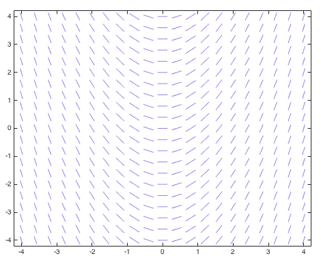
]

---
## Visualizing Solutions to ODEs

Each solution fits into this slope field

.image-50[
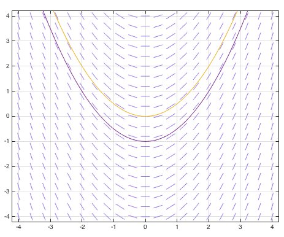
]

---
## Initial Value Problem
- In an initial value problem, you know the starting conditions and typically want to know the value at a given time
- A numerical approach involves taking small steps through the slope field following the slope at that point
- We will look at three methods to do this with different levels of accuracy
- Taking constant steps while following the slope at the current point is called the Euler's Method

---
## Initial Value Problem Visualized

.image-50[
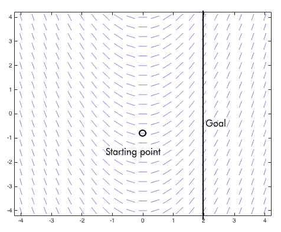
]

---

## Initial Value Problem Visualized

.image-50[
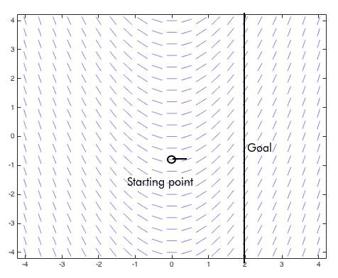
]

---

## Initial Value Problem Visualized

.image-50[
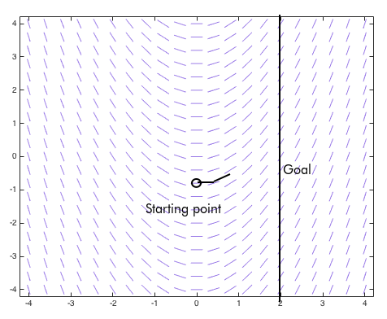
]

---

## Initial Value Problem Visualized

.image-50[
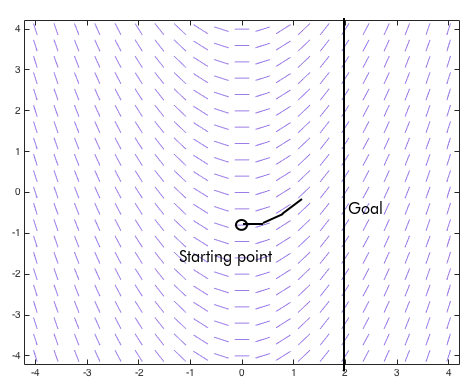
]

---

## Initial Value Problem Visualized

.image-50[
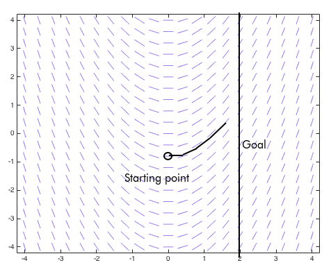
]

---

## Initial Value Problem Visualized

.image-50[
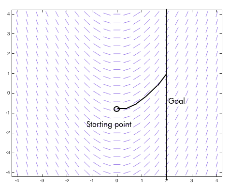
]

---
### IVP Example - Position and Velocity
e.g. Consider a particle with following position function: 
- $x(t) = t - \sin(t) + 30$

What if we didn't know the position function, we only knew the velocity function, that is, the
change of position w.r.t:
- $v\_x (t) = x'(t) = 1 - \cos(t)$

---
### IVP Example - Position and Velocity

If we wished to recover the original position, we could integrate both sides:
- $v_x(t) = x'(t) = 1 - \cos(t)$
- $\int v_x(t) \text{d}t = \int 1 - \cos(t) \text{d}t$
- $x(t) = t - \sin(t) + c$

We have lost information. We do not know the value of the constant term, $c$. 
---
### IVP Example - Position and Velocity
However, if we were provided the initial conditions:
- $x(0) = 30$

We could substitute this in to solve for c:
- $x(0) = 0 - \sin(0) + c = 30$
- $c = 30$

Our original function was:
- $x(t) = t - \sin(t) + 30$

---
### IVP Example - Position and Velocity
We now have enough information that we could evaluate our function at a new point in time.
- e.g. Find $x(30)$
- $x(30) = 30 - \sin(30) + 30 \approx 60.99$

---
### Numerical Methods Motivation
The euler method enables us to solve these initial value problems without taking a symbolic integral.
- Assume we are given 
  - $v\_x (t) = x'(t) = 1 - \cos(t)$
  - $x(0) = 30$
- Find $x(5)$
  
For the purposes of solving this IVP, the original function is unknown, but we know it is $x(t)=t-\sin(t)+30$

---

### Euler's Example
$x'(t)=1-\cos(t). \text{ Find } t=5$. We know our function is one of:
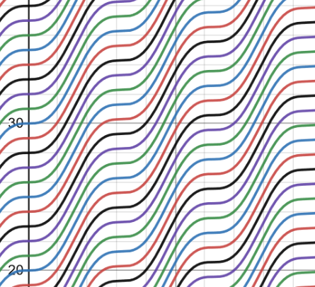

---
By setting $t=0$, we know $x=30$. Thus we know which function.
.image-50[
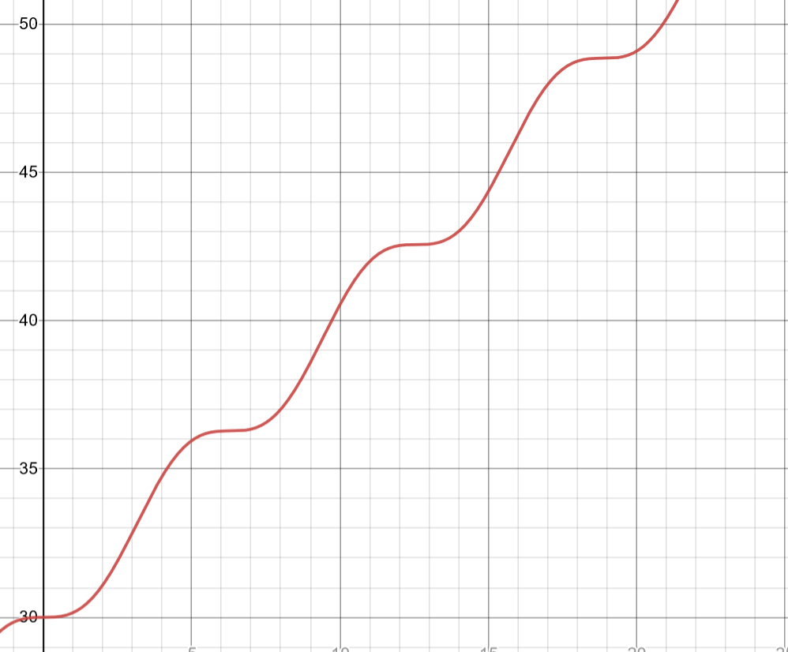
]
(*This is for visualization purposes, in the real world we won't have or need this actual function!)
---
### What we know:
- We know where we are starting ($t=0, x=30$)
- We know our goal ($t=5$)
- We know the function of the first derivative, which corresponds to the instantaneous slope at any given point
- Starting at $t=0$
  - We can determine the slope at that point, $x'(0)$
  - And take a small step in that direction, $\Delta_t$-units
  - We can iterate
- Thus, we can take small steps along the slope and arrive at the goal
---
### Euler Method Graphically

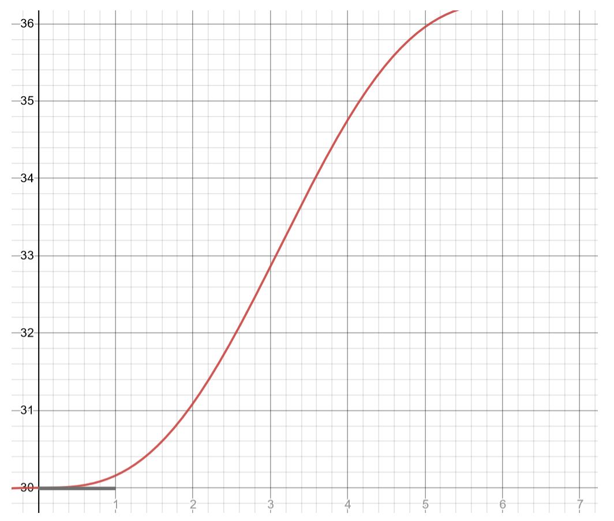
---
### Euler Method Graphically

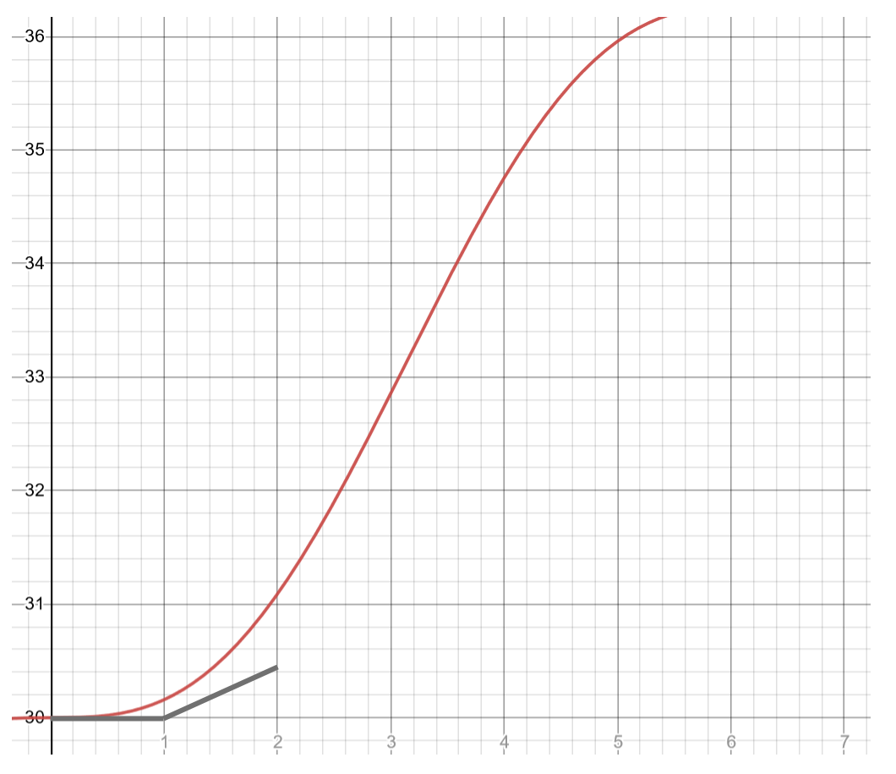
---
### Euler Method Graphically

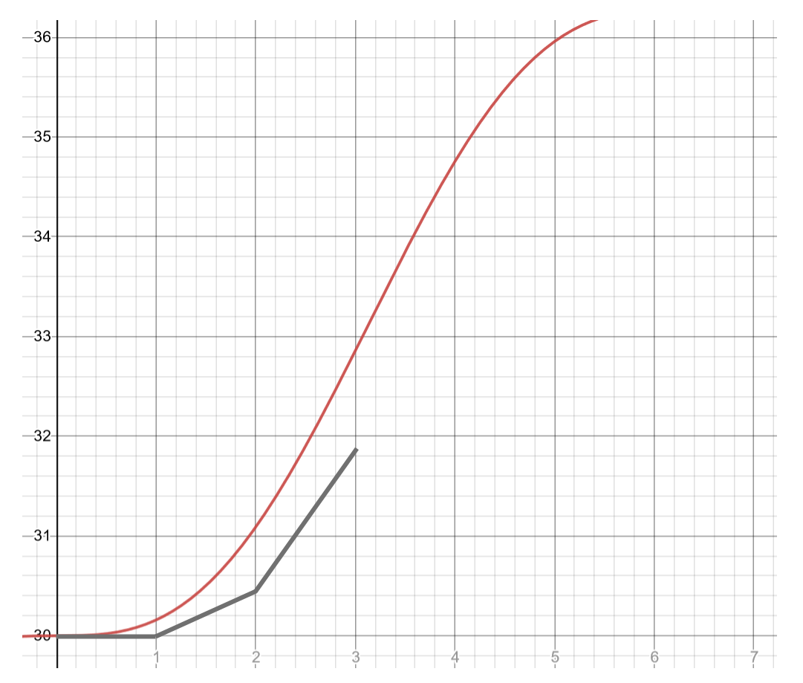
---
### Euler Method Graphically

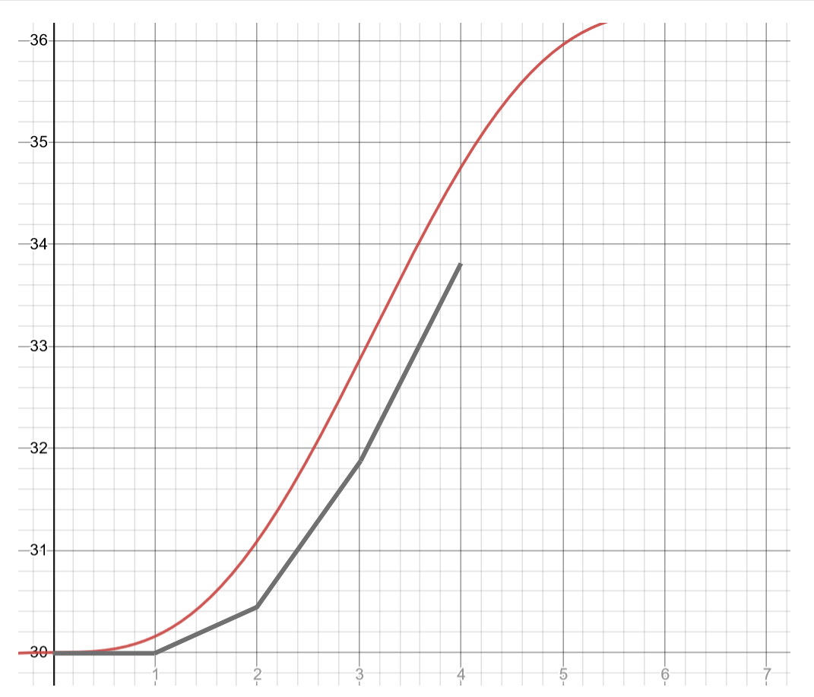
---
### Euler Method Graphically

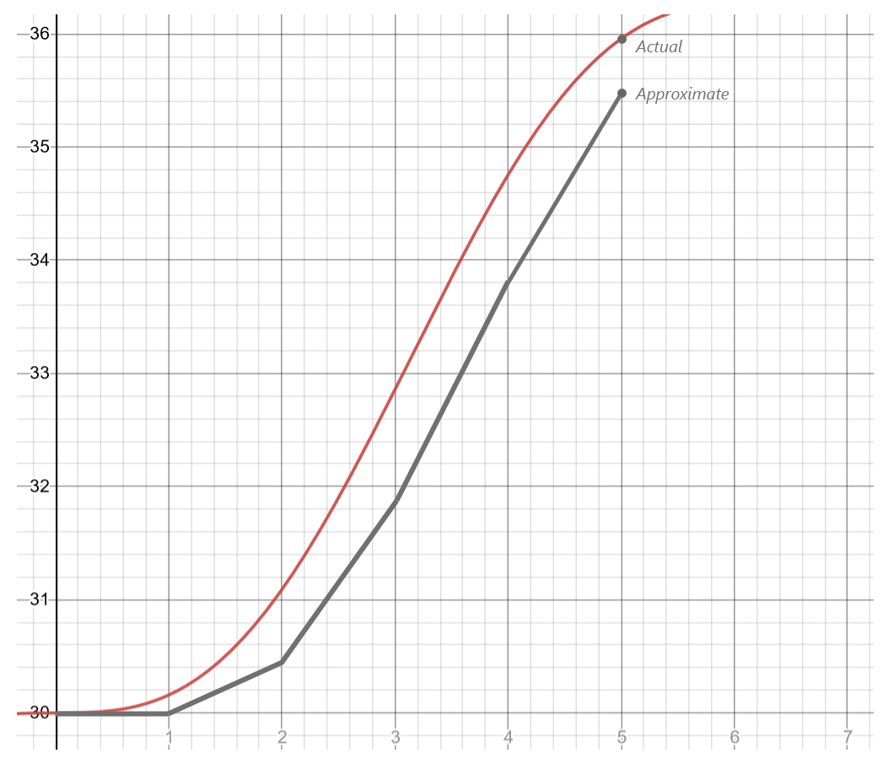

---
### Euler Method Mathematically

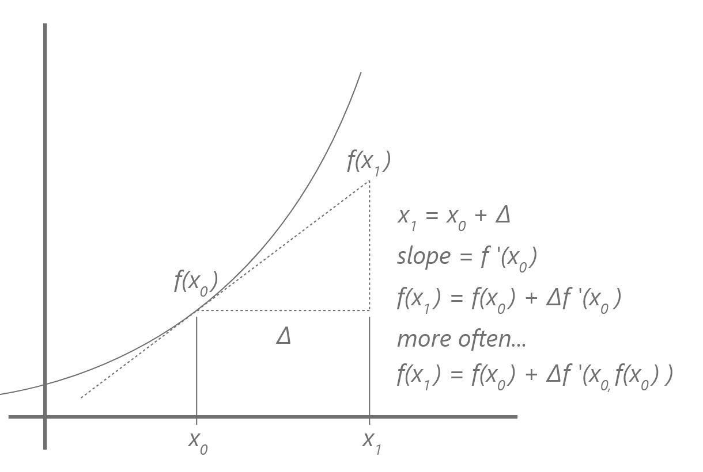
---
### Euler Method Generally

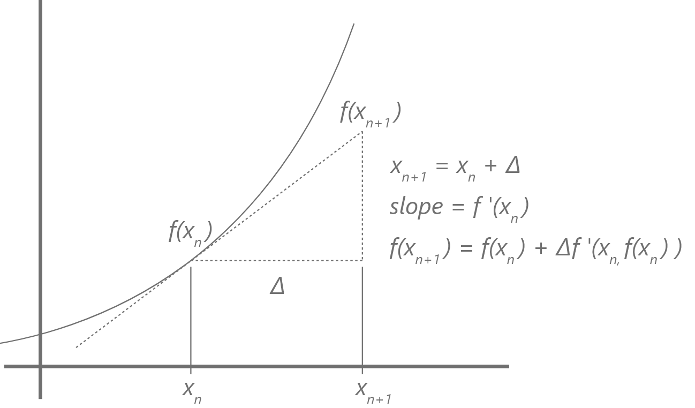

---
### Computing Euler's method
Setup:
- $x'(t) = 1 - \cos(t)$
- $\Delta_t = 1$
- $t_0 = 0$
- $x(0) = 30$
- $x'(0) = 0$

---
### Computing Euler's method

- $t_0 = 0$
- $x(0) = 30$
- $x'(0) = 0$

First iteration:
- $x(t\_1) \approx x(t_0) + \Delta_t \cdot x'(t_0)$
- $= 30 + 1 - \cos(0)$
- $= 30 + 1 - 1 = 30$

---
### Computing Euler's method:

- $t_1 = t_0 + \Delta_t = 0 + 1 = 1$
- $\approx x(1) = 30$
- $x'(1) = 1-\cos(1)$

Second Iteration:
- $x(t\_2) \approx x(1) + \Delta_t \cdot x'(1)$
- $= 30 + 1 - \cos(1)$
- $= 30 + 1 - 0.5403 = 30.4597$

---
### Computing our example mathematically

Third iteration:
- $x(t\_3) \approx x(3) \approx x(2) + \Delta_t \times x'(2)$
- $= 30.4597 + 1 - \cos(2)$
- $= 31.8758$

Fourth iteration:
- $x(t\_4) \approx x(4) \approx x(3) + \Delta_t \times x'(3)$
- $= 31.8758 + 1 - \cos(3)$
- $= 33.8658$

---
### Computing our example mathematically

Fifth iteration:
- $x(t\_5) \approx x(5) \approx x(4) + \Delta_t \times x'(4)$
- $= 33.8658 + 1 - \cos(4)$
- $= 35.5194$

---
### Error

Actual:
- $x(t) = x - \sin(x) + 30$
- $= x(5) = 5 - \sin(5) + 30$
- $= 35.9589$

Absolute Relative Percent True Error:

$=|\frac{35.5197-35.9589}{35.9589}| \times 100\\% = 1.22\\%$

---
### More steps
What if instead we had used step size of $0.5$? $0.25?$

.image-60[
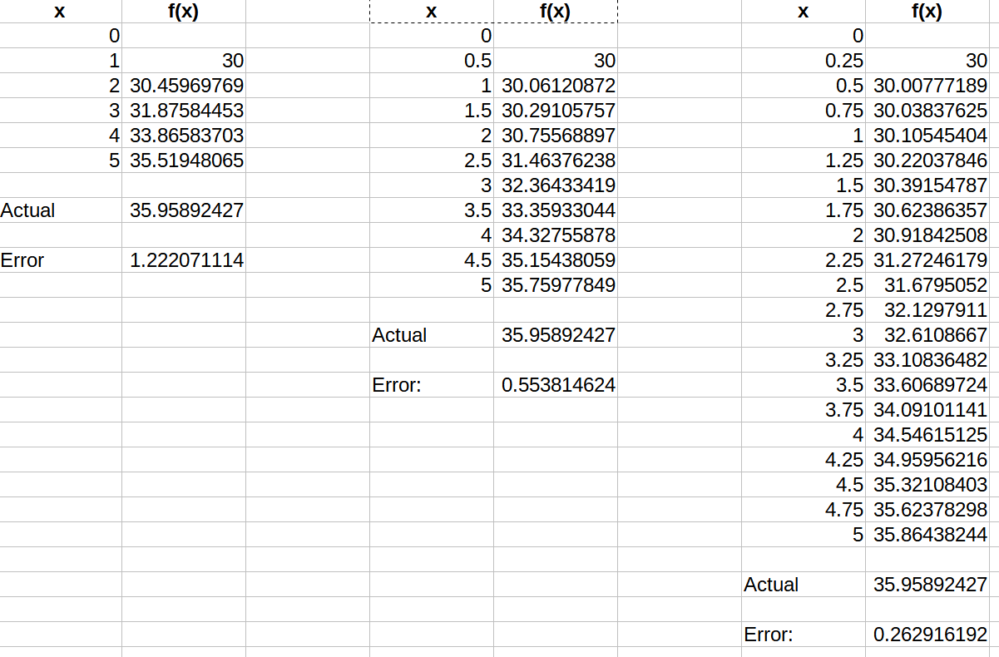
]
---
### Numerical Stability

This is the first method we've investigated which is particularly prone to error
- Step sizes which are too big can drift away from the solution
- Rounding errors may overwhelm solutions for small step sizes
- Truncation error is the error made each step, which accumulates for the entire range of approximation

---
### One more example:

$y' = y + xy$

$(x_0, y_0) = (0,1)$

$N=10$

Find $y_2$

- What is the step size? $(5-0) / 10 = 0.5$.

- $y\_{n+1} = y\_{n} + \Delta_x \times y'(x_n, y_n)$

---
### Second example slope field:

.image-50[
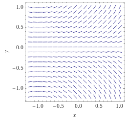
]
---

### Math...

$y(0.2) = 1 + 0.2 (1 + 0*1) = 1.2$

$y(0.4) = 1.2 + 0.2 (1.2 + 0.2 * 1.2) = 1.488$

$y(0.6) = 1.488 + 0.2 (1.488 + 0.4 * 1.488) = 1.905$

$y(0.8) = 1.905 + 0.2 (1.905 + 0.6 * 1.905) = 2.514$

$y(1) = 2.514 + 0.2 (2.514 + 0.8 * 2.514) = 3.419$

---

### More Math...

$y(1.2) = 3.419 + 0.2 (3.419 + 1.0 * 3.419) = 4.787$

$y(1.4) = 4.787 + 0.2 (4.787 + 1.2 * 4.787) = 6.893$

$y(1.6) = 6.893 + 0.2 (6.893 + 1.4 * 6.893) = 10.202$

$y(1.8) = 10.202 + 0.2 (10.202 + 1.6 * 10.202) = 15.507$

$y(2) = 15.507 + 0.2 (15.507 + 1.8 * 15.507) = 24.191$

---

## Function revealed

What even is this thing? We don't actually need to know.
However, it turns out...

$y = e^\frac{x(x+2)}{2}$

Exponential. Euler isn't great at these, very sensitive to the step size.

Actual value: 

$e^\frac{2*4}{2} = e^4 = 54.5982.$

---

## Smaller step size

Let's compare step sizes, with Absolute Relative Percent True Error:

$N = 10: y_2 = 24.191. \epsilon_t=55.687\\%$ 

$N = 100: y_2 = 49.238. \epsilon_t=9.806\\%$

$N = 1000: y_2 = 54.021. \epsilon_t=1.046\\%$

$N = 10000: y_2 = 54.540. \epsilon_t=0.095\\%$

---
### Another Example:

$f'(x) = f(x)$

$f(0) = 1$

$x(5)?$

$\Delta_x = 1$

(We don't know $f(x)$, but we do know it's the function where the derivative is the same as the function? hmm... $f(x) = e^x$)

---
### Steps

$f(0) = 1$

$f(1) = 1 + 1 = 2$

$f(2) = 2 + 2 = 4$

$f(3) = 4 + 4 = 8$

$f(4) = 8 + 8 = 16$

$f(5) = 16 + 16 = 32$

$e^5 = 148.41.$ Wow, big error! 

---
### Examples

However, if:
- $n = 20, f(5) \approx 86.7$
- $n = 40, f(5) \approx 111.2$
- $n = 100, f(5) \approx 131.5$
- $n = 1000, f(5) \approx 146.8$
- It's taking a lot of iterations to get close, but it is possible!

---
### What's going wrong?

- In an exponential function, the slope is changing very quickly, so taking the slope only at the beginning of the line is not an accurate representation of the slope during the entire step

---
### What's going wrong?

- Slope at beginning:

.image-50[
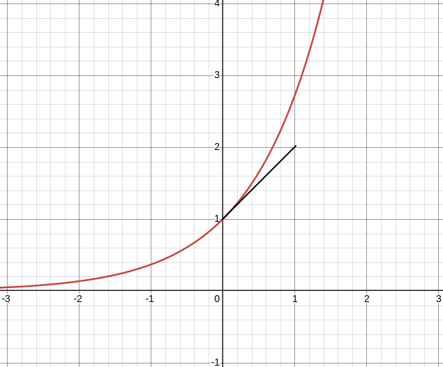
]

---
### What's going wrong?

- Slope at end:

.image-50[
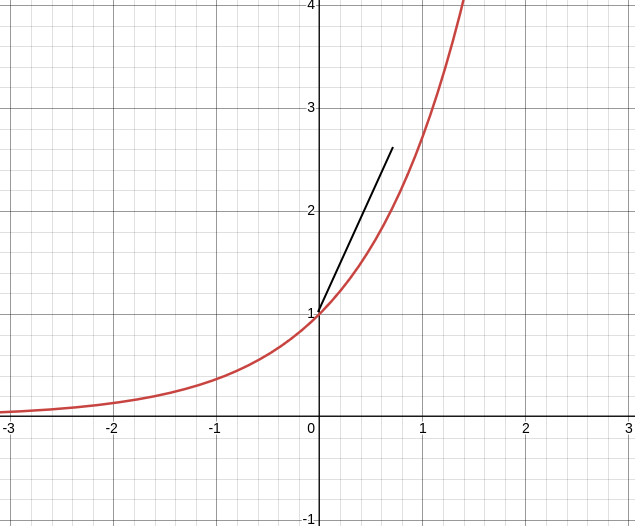
]

---
### What's going wrong?

- We need something in the middle, which the next method will help us find:

.image-50[

]

---

## Method 2: Improved Euler's Method

The improved Euler's Method attempts to get a better approximation of the slope in the overall region by considering the slope at the beginning and the end and averaging them.

`\[
m_i = \frac{f'(x_i, y_i)+f('x_{i+1}, y_{i+1})}{2}
\]`

Subbing this into Euler's Method gives us:

`\[
y_{i+1} = y(x_i) + \frac{\Delta_x}{2}(f'(x_i, y_i)+f'(x_{i+1}, y_{i+1}))
\]`

---

## Improved Euler's Method Continued

Our $y(x_i)$ is our previous estimate, $y_i$

`\[
y_{i+1} = y_i + \frac{\Delta_x}{2}(f'(x_i, y_i)+f'(x_{i+1}, y_{i+1}))
\]`

However, we have a problem: we don't know what our endpoint slope is! We are going to need to estimate this as well, using Euler's Method

`\[
y_{i+1} = y_i + \frac{\Delta_x}{2}(f'(x_i, y_i)+f(x_{i+1}, y_i + \Delta_x f'(x_i, y_i)))
\]`

---

## Improved Euler's Method Complete

`\[
y_{i+1} = y_i + \frac{\Delta_x}{2}(f'(x_i, y_i)+f'(x_{i+1}, y_i + \Delta_x f'(x_i, y_i)))
\]`

However, this forumaltion is a bit cumbersome. To make it easier to calculate, we formulate it as follows

`\[
k_1 = f'(x_i, y_i)
\]`
`\[
k_2 = f'(x_i + \Delta_x, y_i + \Delta_x k_1)
\]`
`\[
y_{i+1} = y_i + \frac{\Delta_x}{2}(k_1 + k_2)
\]`

---
## Comparison: Eulers vs. Improved Eulers

In our comparison for

$y'(x) = y(x)$ i.e. $y(x)=e^x$

to find $x=1$, by starting at $x=0, y(0)=1$

|n|Eulers|Improved Eulers|Actual|
|---|---|---|---|
|12|2.6130|2.7072|2.7183|
|24|2.6637|2.7153|2.7183|
|48|2.6905|2.7175|2.7183|

---
## Runge-Kutta 4th Order (RK4)

We can do even better by by using the Runge-Kutta 4th Order approximation. It is akin to Simpsons's Rule derived using Taylor Polynomials. We will not derive it! It has a formulation similar to the Improved Euler's method, but with additional midpoints included:

$\frac{dy}{dx} = y'(x, y(x))$

$y(x_0) = y_0$

- $x\_{n+1} = x\_n + \Delta_x$
- $y\_{n+1} = y_n + \frac{1}{6} \Delta_x \left(k\_1 + 2k\_2 + 2k\_3 + k\_4 \right)$

---

## Runge-Kutta 4th (RK4)

- $y\_{n+1} = y_n + \frac{1}{6}\Delta_x\left(k\_1 + 2k\_2 + 2k\_3 + k\_4 \right)$
- $k\_1 = \ y'(x\_n, y\_n)$
- $k\_2 = \ y'\left(x\_n + \frac{\Delta_x}{2}, y\_n + \Delta_x\frac{k\_1}{2}\right)$
- $k\_3 = \ y'\left(x\_n + \frac{\Delta_x}{2}, y\_n + \Delta_x\frac{k\_2}{2}\right)$
- $k\_4 = \ y'\left(x\_n + \Delta_x, y\_n + \Delta_x k\_3\right)$

Intuitively, our four terms are: 
- the slope at the beginning of the line,
- the slope at the end of the line, 
- and two midpoint terms which are weighted heavier

---
## Demonstrating equivalency to Simpson's Rule

For RK4, if we integrate our function such that $y'(x) = f(x)$, then the method becomes:

`\(k_1 = f(x_i) \)`
`\(k_2 = f(x_i + \frac{\Delta_x}{2}) \)`
`\(k_3 = f(x_i + \frac{\Delta_x}{2}) \)`
`\(k_4 = f(x_i + \Delta_x) \)`

`\(y_{i + 1} = y_i + \frac{\Delta_x}{6}(k_1 + 2k_2 + 2k_3 + k_4) \)`

`\(= y_i + \frac{\Delta_x}{6}(f(x_i) + 4f(x_i + \frac{\Delta_x}{2}) + f(x_i + \Delta_x)) \)`

Which is the Simpson's 1/3 rule for approximating integrals. Neat!

---
e.g. Runge-Kutta 4th of the exponential:

- $y' = y, y_0 = 1, h=5 $ 
- $k\_1 = 1$
- $k\_2 = 1 + 5\frac{1}{2}$
  - $k\_2 =3.5$
- $k\_3 = 1 + 5\frac{3.5}{2}$
  - $k\_2 =9.75$
- $k\_4 = 1 + 5 \times 9.75$
  - $k\_4 = 49.75$
- $y_1 = 1 + \frac{1}{6}5\left(1 + 2 \times 3.5 + 2 \times 9.75 + 49.75 \right)$
- $y_1 = 65.375$

Way better than Euler for n=1.

---

## Comparison: Eulers vs. Improved Eulers vs. Runge-Kutta

In our comparison for

$y'(x) = y(x)$ i.e. $y(x)=e^x$

to find $x=1$, by starting at $x=0, y(0)=1$

|n|Eulers|Improved Eulers|Runge-Kutta|Actual|
|---|---|---|---|---|
|12|2.613035290|2.707188994|2.718069764|2.7183|
|24|2.663731258|2.715327371|2.718266612|2.7183|
|48|2.690496599|2.717519565|2.718280809|2.7183|

---

### References

- Dr. Abdul Bais's ENSE 350 Slides
- https://mathweb.ucsd.edu/~math20d/Lab2.shtml
- https://math.libretexts.org/Courses/Monroe_Community_College/MTH_225_Differential_Equations/03%3A_Numerical_Methods/3.02%3A_The_Improved_Euler_Method_and_Related_Methods
- https://math.stackexchange.com/questions/3939238/demonstrating-equivalency-between-runge-kutta-and-simpsons-rule
---

name: inverse
layout: true
class: center, middle, inverse
---
# Questions?
