name: inverse
layout: true
class: center, middle, inverse
---
# ENSE 350: Math for Software Eng.

### Problem Set 3

Adam Tilson, M.A.Sc., Engineer-in-Training

---
layout: false
## Part 1: Graph Theory

Q1. a) Use the greedy graph coloring algorithm described in class to color the following graphs (Figure on next slides)
   
 b) Has the greedy algorithm discovered the least number of colors for each of these graphs? How can you tell?

---

.image-50[
    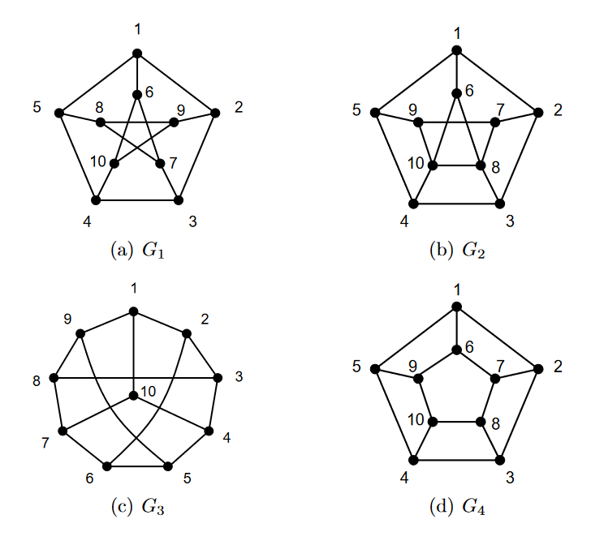
]

---

Q2. A building's network is being retrofitted with fibre optics. Every device needs to be connected. The following graph shows the work stations as vertices, and the estimated costs of connecting two workstations as a weighted edge between them, where that might be feasible. Lower weights are preferable, as higher weights correspond to more obstructions. What is the optimal way to connect the computers? (Figure on next slide)

---

    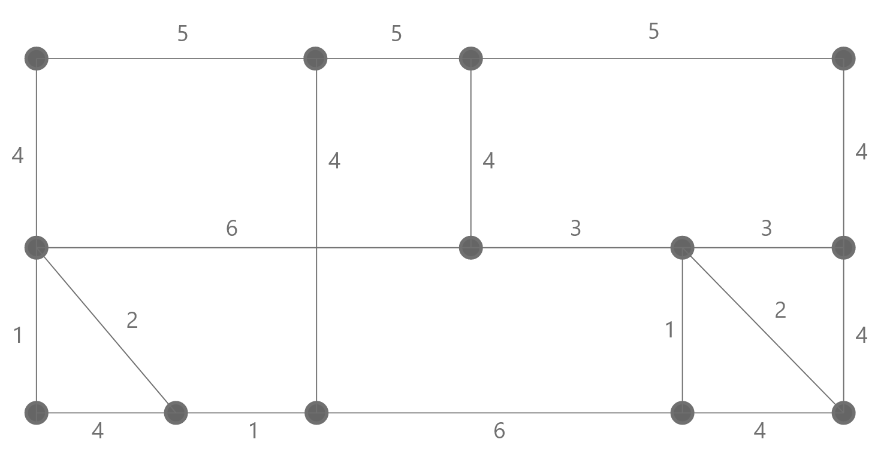
---

## Part 2: Sums

Q3. Derive the closed-form solution of the following expression

$$\sum\_{i=0}^{n}ix^{i+2}$$

Hint: Look for similarities from derivations done in class!

---

Q4. Derive the closed form solution of the following:

$$\sum\_{i=0}^{n}i^2x^{i}$$

Hint: Derivative

---

Q5. Derive the closed-form solution to the following expression

$$\sum\_{i=0}^{n}\frac{1}{2^i}$$

Hint:  $\sum\_{i=0}^{\infty}\frac{1}{2^i}=2$. How could you use this?

---

Q6. Use integral bounds to approximate the sum:
   
$$ \sum_{i=1}^{n} \frac{1}{i^2}$$

---

Q7. Find the closed form solution of the following:

$$\sum\_{i=1}^{n}\sum\_{j=1}^{i}j$$

---

Q8. Asymptotic

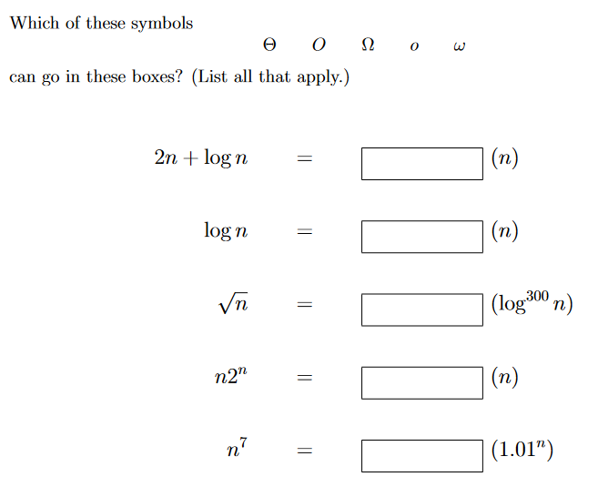

---
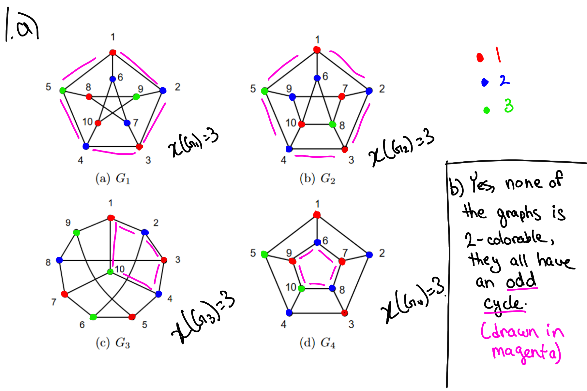
---
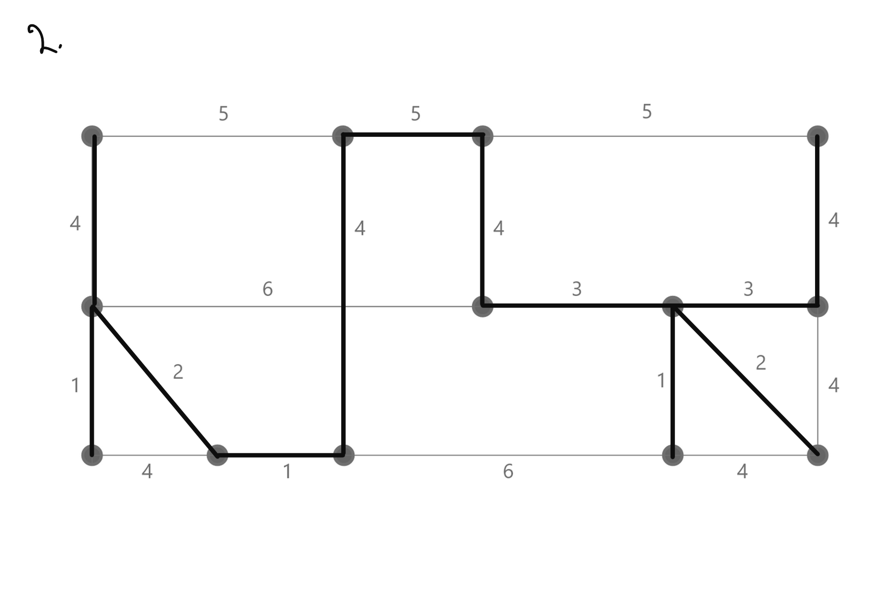
---
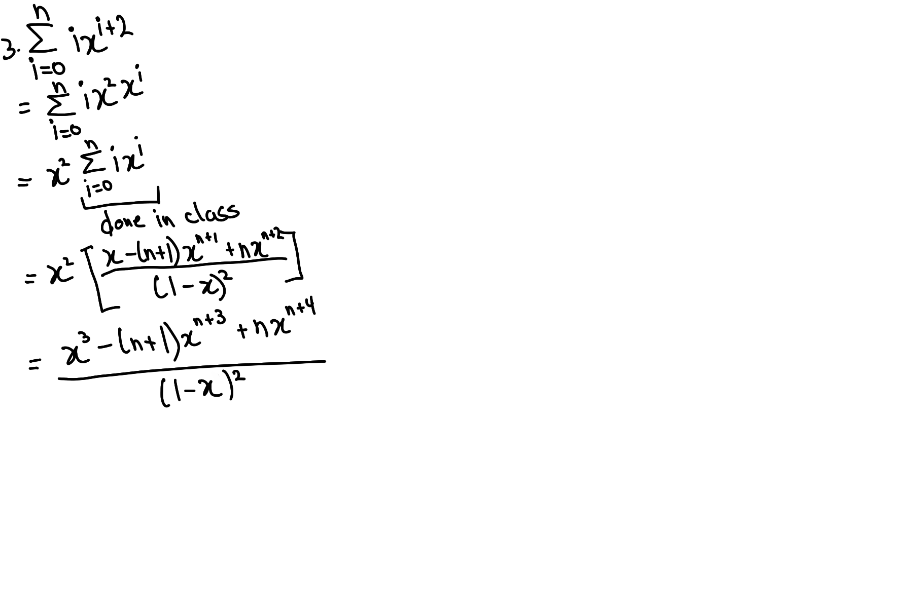
---
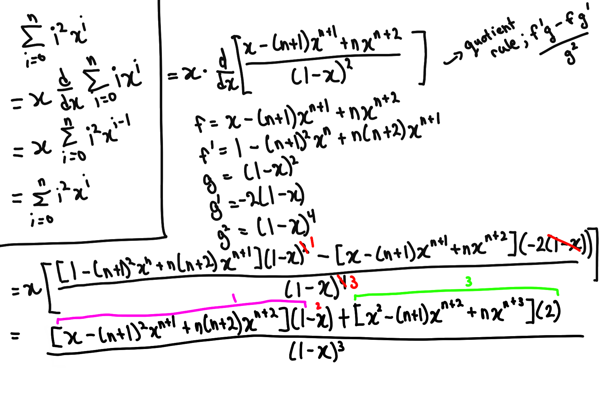
---
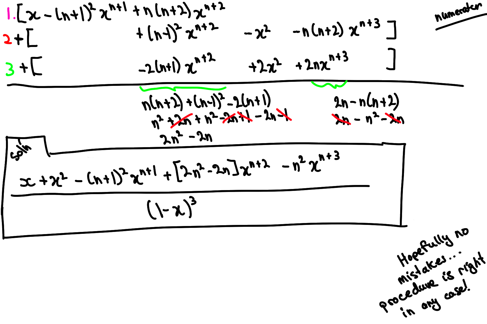
---
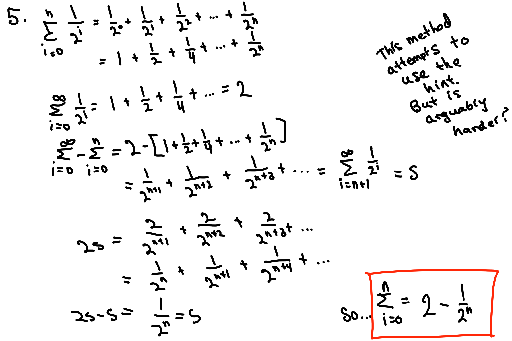
---
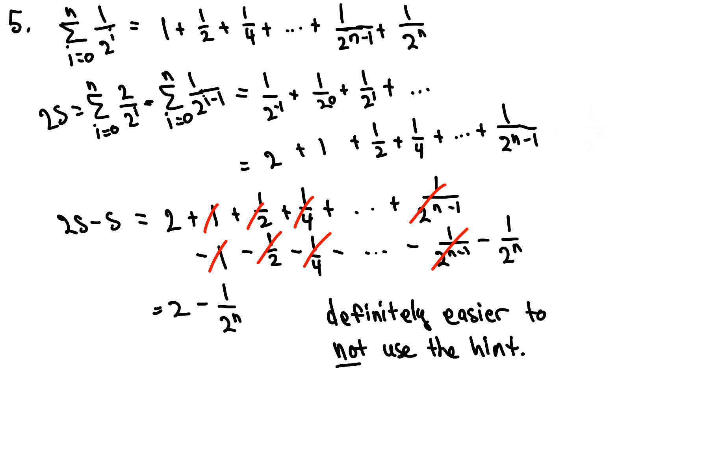
---
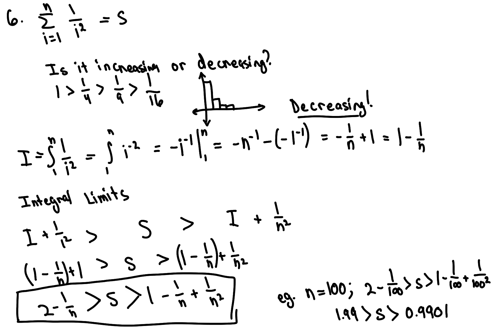
---
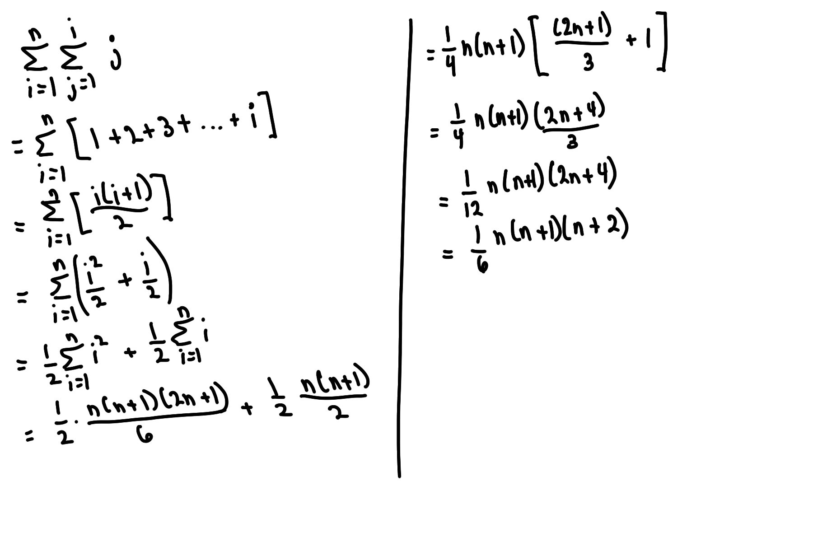
---
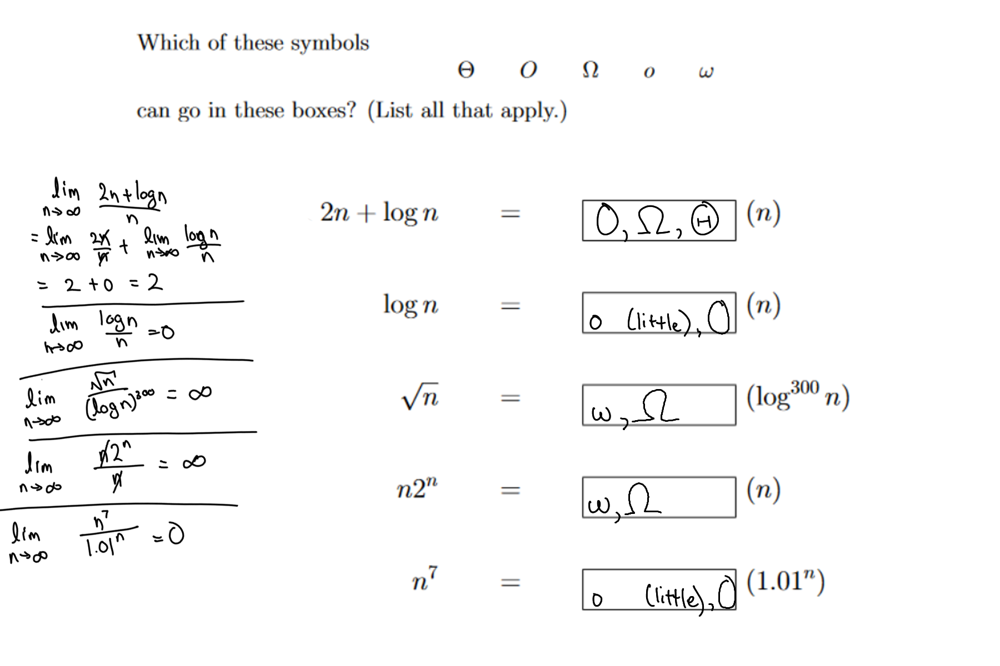

---
### References

These problems from:
Mathematics for Computer Science by Lehman, Leighton, Meyer, 2017
